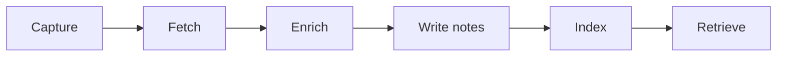
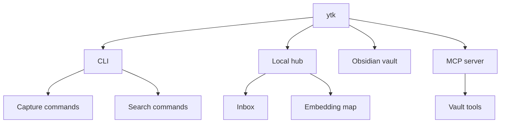

# ytk

Turn videos, articles, posts, and voice notes into a searchable personal
knowledge base.

`ytk` captures the things you watch and read, enriches them with Claude Haiku,
writes plain markdown notes into an Obsidian vault, and indexes everything
locally with ChromaDB. You can search it from the CLI, browse it in a local web
hub, or expose the vault to Claude Code through MCP.

It is built for people who still watch the video. The goal is not to replace
attention with summaries; it is to make the exact tools, commands, names,
timestamps, and personal annotations findable weeks later.

## Why it exists

Most saved links become a graveyard. `ytk` turns each capture into a useful
memory:

- **Save from where you already are**: YouTube, web articles, Instagram,
  TikTok, Pinterest, iMessage, voice memos, and a local inbox.
- **Keep the source inspectable**: transcripts, metadata, thumbnails, extracted
  frames, and timestamped key moments stay linked to the original.
- **Search by meaning, not filenames**: embeddings are stored locally in
  ChromaDB for semantic search across sources and your own notes.
- **Bring your own context**: notes and annotations are embedded alongside the
  source so your reasons for saving something remain searchable.
- **Use normal files**: the long-term store is plain markdown in an Obsidian
  vault, so the data is useful without `ytk`.

## Workflow



## What you get



## Install

Requires Python 3.11+, [uv](https://docs.astral.sh/uv/), and `ffmpeg` for voice
memos, frame extraction, and audio fallbacks.

```bash
git clone https://github.com/pablomoli/ytk
cd ytk
uv sync
uv run ytk --help
```

To install the CLI globally:

```bash
uv tool install .

# after pulling repo changes
uv tool install --reinstall .
```

## Configure

Copy `.env.example` to `.env` and point `ytk` at your vault:

```dotenv
ANTHROPIC_API_KEY=sk-ant-...
OBSIDIAN_VAULT_PATH=/path/to/your/obsidian/vault
CHROMA_PATH=~/.ytk/chroma

# Optional, only for Instagram capture
INSTAGRAM_SESSIONID=
INSTAGRAM_PEER=
```

Runtime settings live in `~/.ytk/config.yaml`, which is created on first run.
It controls ingest filters, source fetch cadence, inbox annotation chips, hub
host and port, map colors, and interest-model settings. The hub also provides a
validated settings editor at `/settings`.

## Quickstart

```bash
# Capture
ytk add https://www.youtube.com/watch?v=VIDEO_ID
ytk add <url> --note "why I saved this"
ytk ingest <article-url>
ytk feed urls.txt
ytk memo

# Retrieve
ytk search "that terminal TV demo"
ytk dive VIDEO_ID "the command he used"
ytk profile
ytk ui
```

`ytk ui` starts the local hub on port `6969`.

## Local hub

The hub is a small local web app for capture, review, and exploration:

- `/` shows recent ingests.
- `/inbox` collects queued links and lets you add annotations before ingest.
- `/tags` helps merge tag variants produced by enrichment.
- `/map` renders a 3D UMAP projection of text embeddings.
- `/settings` edits `~/.ytk/config.yaml` with validation.

On macOS, `ytk ui install` registers the hub as a launchd daemon. Use
`ytk ui status`, `ytk ui restart`, and `ytk ui uninstall` to manage it.

## Claude Code integration

`ytk` ships an MCP server through the `ytk-mcp` entry point. It exposes tools
for vault reads, writes, semantic search, remembering facts, reindexing, and
visual similarity.

```bash
# with the CLI installed globally
claude mcp add --scope user ytk -- ytk-mcp

# or from a checkout
claude mcp add --scope user ytk -- uv run --directory /path/to/ytk ytk-mcp
```

This lets a Claude Code session search everything you have saved and write
decisions or memories back into the vault.

## Commands

Common commands:

| Command | Purpose |
| --- | --- |
| `ytk add <youtube-url>` | Ingest one YouTube video |
| `ytk ingest <url>` | Ingest a web article |
| `ytk feed urls.txt` | Batch ingest URLs |
| `ytk search "query"` | Search the whole vault semantically |
| `ytk dive VIDEO_ID "query"` | Search timestamped video segments |
| `ytk memo` | Record, transcribe, and route a voice memo |
| `ytk profile` | Synthesize an interest profile from saved material |
| `ytk ui` | Start the local hub |

Other commands include `add-instagram`, `add-tiktok`, `add-pinterest`, `reels`,
`triage`, `review`, `graph`, `tags`, `remember`, `reindex`, `gc`, `snap`,
`index`, `dashboard`, `schedule`, `chat`, `visual index`, and `similar`. Run
`ytk --help` for the full list.

## Architecture notes

- YouTube transcripts come from `youtube-transcript-api` first, then `yt-dlp`
  subtitle fallback, then local `faster-whisper` for audio-only cases.
- Enrichment uses `claude-haiku-4-5` to produce a thesis, dense summary, key
  concepts, insights, tags, and timestamped key moments.
- Embeddings are computed locally with `sentence-transformers`.
- Markdown notes and media are written into your Obsidian vault.
- ChromaDB stores the local vector index.
- The only default external AI call is enrichment through the Anthropic API.

## Status and expectations

This is a personal tool that has grown into a portable repo. The core
ingest/search/vault flow should be useful anywhere Python and `ffmpeg` run, but
some features reflect the original setup:

- Instagram capture needs a `sessionid` cookie from a logged-in browser session
  and may be sensitive to platform rate limits.
- `ytk ui install`, `ytk schedule`, macOS notifications, and iMessage ingestion
  are macOS-oriented.
- The default vault conventions assume a `second-brain/` style Obsidian layout,
  but the notes are plain markdown and can be adapted.
- Enrichment has Anthropic API cost; transcription, embeddings, indexing, and
  search run locally.

## Contributing

Issues, docs improvements, and focused pull requests are welcome. The most
useful contributions are usually:

- clearer setup notes for non-macOS environments,
- small bug fixes with tests,
- capture-source improvements,
- examples of vault layouts or workflows that make `ytk` easier to adopt.

## License

MIT. See [LICENSE](LICENSE).
