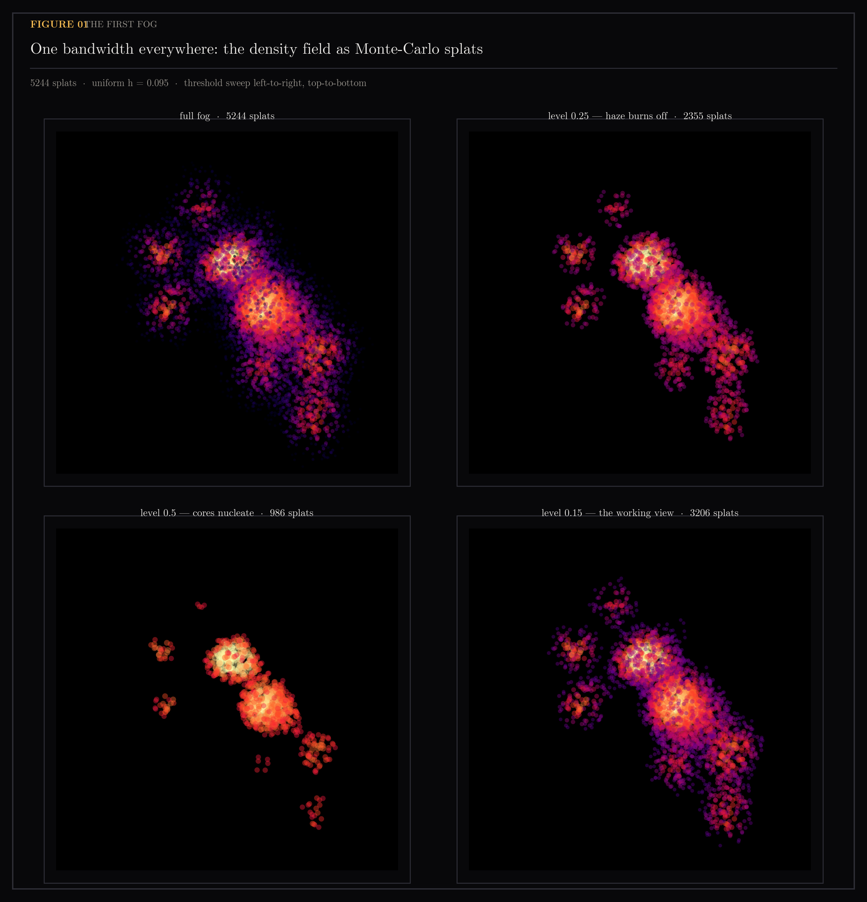
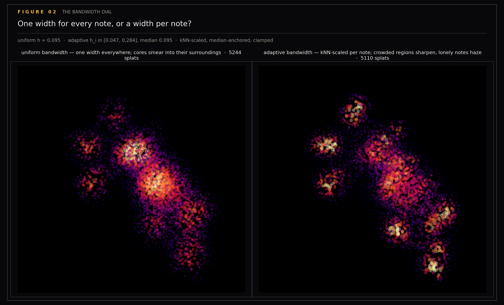
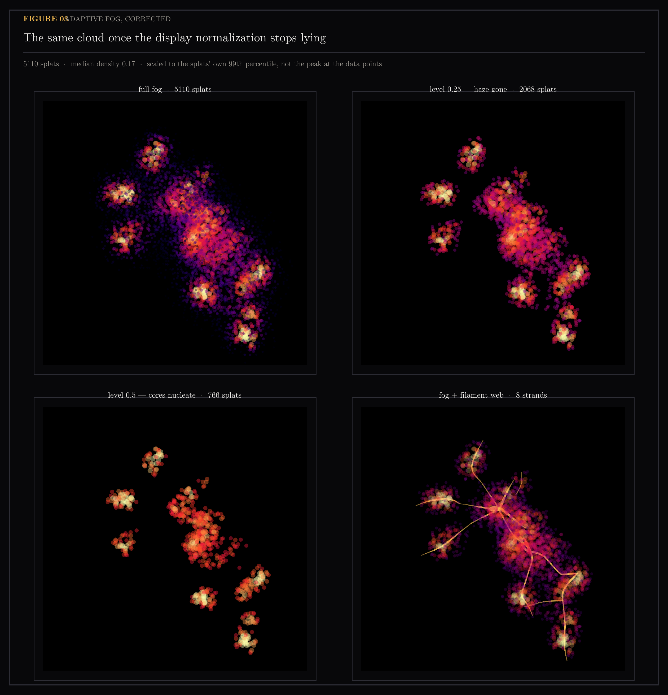
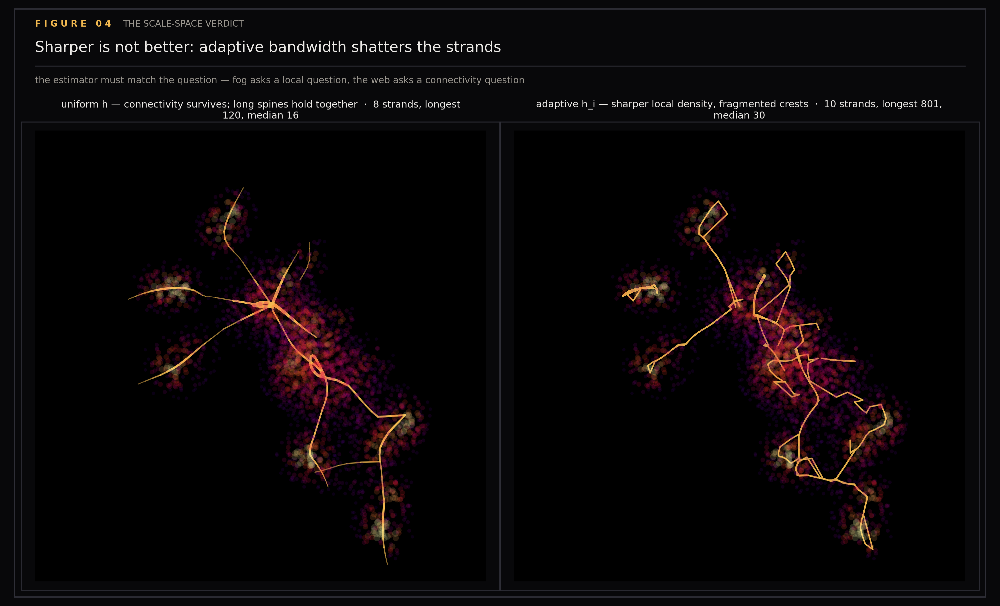
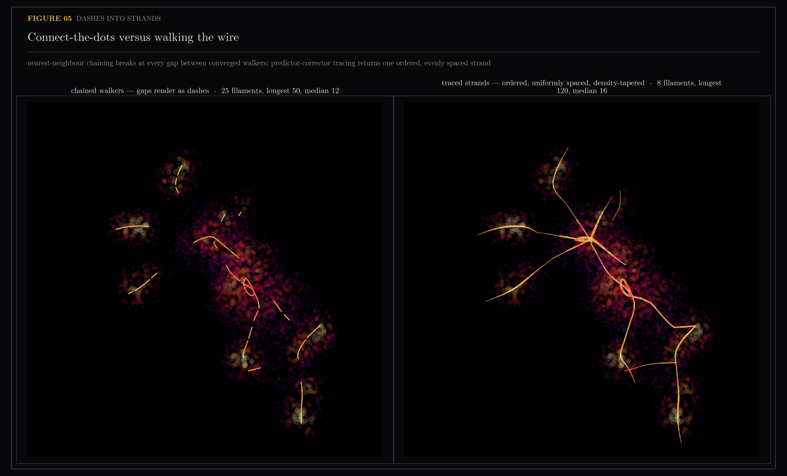
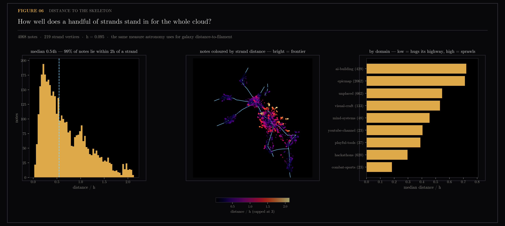
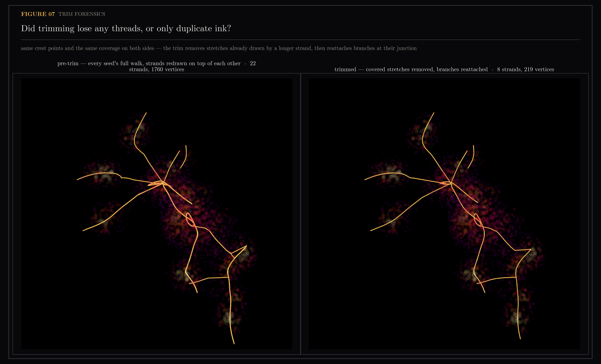
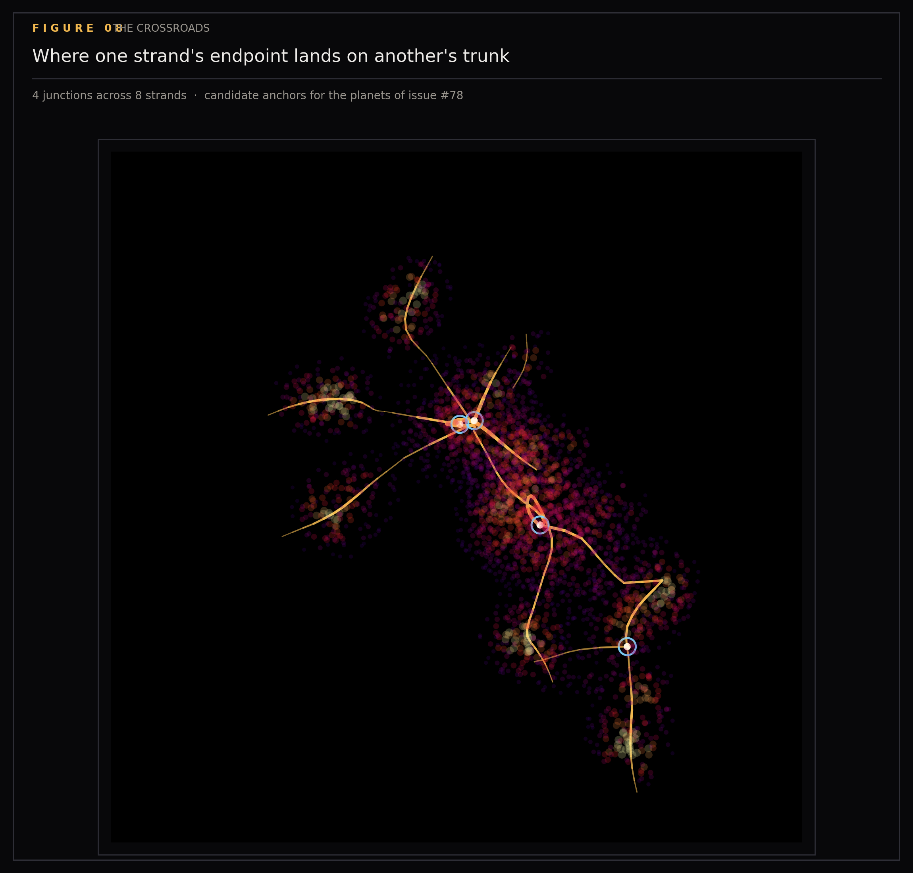
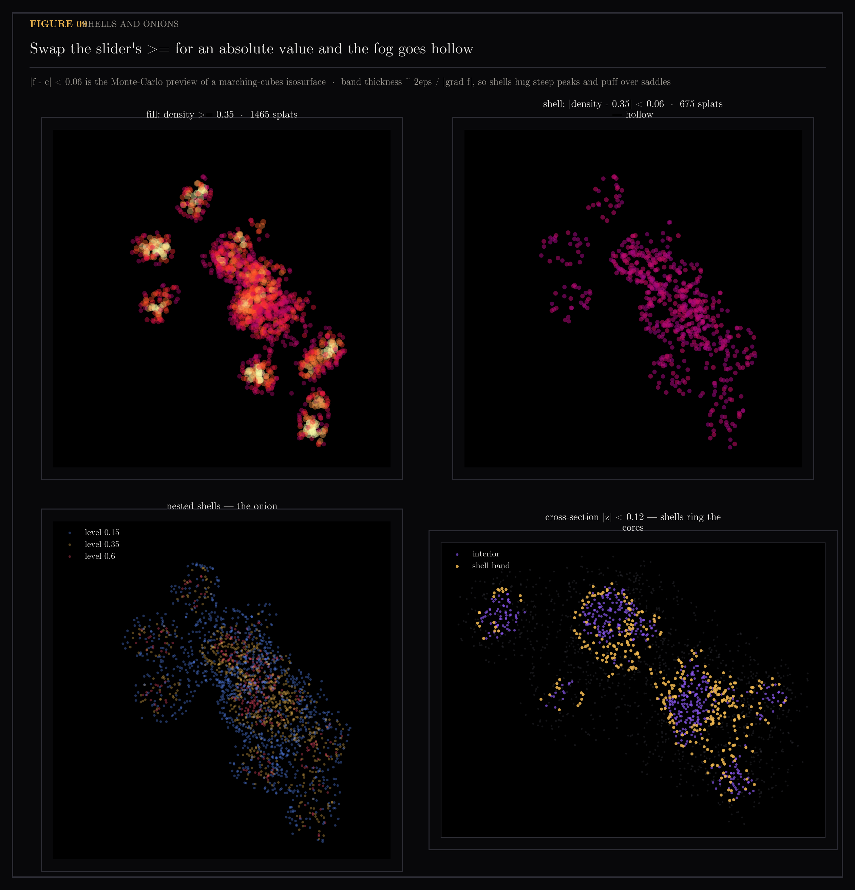

# Fog

`ytk` is my personal knowledge system: it ingests YouTube videos, Instagram posts and web articles into an Obsidian vault, then indexes everything for semantic search. Its knowledge map plots each of those notes as a point in a 3D projection of its embedding. This section asks what shape that cloud actually has — where the density lives, whether the dense regions connect into filaments rather than sitting as isolated blobs, and whether the picture on screen can be trusted at all. A map nobody can verify is decoration.

Figures showing the density field of the knowledge map, the filaments traced through it, and validation of the rendering pipeline. The strand rendering replaces nearest-neighbor chaining of SCMS walkers (subspace-constrained mean shift: sample points slide uphill until they sit on a ridge of the density field) with predictor-corrector ridge tracing — step along the ridge tangent, snap back onto the crest with sideways-only mean-shift iterations, same method astronomers use to trace the cosmic web through galaxy surveys.

Generated by `scripts/plot_assets.py`. Regenerates all nine figures in one pass under a single house style.

```
uv run --with matplotlib python scripts/plot_assets.py            # all
uv run --with matplotlib python scripts/plot_assets.py --only 6   # one
uv run --with matplotlib python scripts/plot_assets.py --refresh  # recompute cache
```

## Figures

### 01-uniform-fog-panels

First cloud render and threshold sweep.

### 02-uniform-vs-adaptive


### 03-adaptive-fog-panels

Final adaptive fog after fixing display-normalization bug.

### 04-filaments-uniform-vs-adaptive

The scale-space verdict: adaptive bandwidth sharpened the fog and shattered filaments — the estimator must match the question (fog = local, web = connectivity).

### 05-chained-vs-traced-filaments

Before (chained walkers, 27 fragments, median 7 vertices) and after (traced strands, 22 strands, median 57 vertices, longest 118). Shows the transition from broken dashes to continuous tapered strands.

### 06-strand-distance

Median note sits 0.55 bandwidths from nearest strand; 98.3% of 4,067 notes within 2h of a 225-vertex skeleton (18x compression). Distances are quoted in units of h, the kernel bandwidth of the density estimate, so they stay comparable across rebuilds. Per-domain medians rank territories from highway-hugging (usf 0.28h, hacklytics 0.28h) to sprawling (epicmap 0.71h). `usf`, `hacklytics` and `epicmap` are my own project folders in the vault; `epicmap` is the work project and by far the largest.

### 07-trim-forensics

Pre-trim vs trimmed: same coverage, 84% less ink. 22 strands / 1,396 vertices down to 9 / 225.

### 08-junctions

The crossroads: endpoint-on-trunk detection with gold beacons.

### 09-shell-band

Fill vs shell mode. A band of width 2eps in density is a slab of width 2eps/|grad f| in space, so shells hug steep peaks and puff out over flat saddles (coarea formula, visible to the naked eye).

## Post material (draft)

## Post material — the knowledge-map math series

Working notes for a future LinkedIn post / blog. Figures 01-06 in this
folder tell the story in order; quotables and numbers below.

### The paragraph (filament tracing, keep verbatim)

> The strand comes out ordered, uniformly spaced, and continuous by
> construction — strand-y because it literally is one. Each traced strand
> then claims the nearby crest points so we don't trace it twice, and
> per-vertex density lets strands taper where the fog thins.

Context: replacing nearest-neighbor chaining of converged SCMS walkers
(gaps render as dashes) with predictor-corrector ridge tracing — step
along the ridge tangent (top Hessian eigenvector), snap back onto the
crest with sideways-only mean-shift iterations. Same method astronomers
use to trace the cosmic web through galaxy surveys. Figure 05 is the
before/after: 27 fragments (median 7 vertices) -> long tapered strands
(22 traced, median 57, longest 118; 9 after the figure-07 trim, median
16). Quote the trimmed pair when describing figure 05 — that is what the
right-hand panel actually renders.

### The distance idea (reader-suggested beat: measure your own map)

Asked mid-build: "is it possible to compute the distance between the
notes and the strand? would that be something cool to plot?" — which is
independently the published methodology: astronomy characterizes
galaxies by distance-to-nearest-filament.

Result (figure 06): median note sits 0.55 bandwidths from its nearest
strand; 98.3% of 4,067 notes lie within 2h of a 225-vertex skeleton — an
18x compression of the map that loses almost nobody. Per-domain medians
rank territories from highway-hugging (usf 0.28h, hacklytics 0.28h) to
sprawling (epicmap 0.71h — the biggest, most alive territory sprawls
widest around its highway, and wider than anything else at its scale;
only two small domains, agentic-coding tooling at 0.91h and config at
0.75h, run wider still). The far tail = frontier notes no highway
reaches.

### Story beats / one-liners

- Your knowledge base rendered like the universe: notes as galaxies,
  interests as filaments, gaps as voids.
- Every formula hand-derived and checked against finite differences —
  the math minor doing production work.
- The matplotlib witness: an independent renderer that caught two
  display-normalization bugs and one dedupe bug before anything shipped.
  Never trust only the renderer you also wrote.
- Scale-space lesson (figure 04): adaptive bandwidth sharpened the fog
  and shattered the filaments — the estimator must match the question
  (fog = local, web = connectivity).
- Cardano's 16th-century cubic formula computes the eigenstructure of a
  2026 knowledge graph's density field. Old math doesn't expire.
- Shells (figure 09): swap the slider's >= for an absolute value and the
  fog becomes an onion — |f - c| < eps is the poor man's isosurface, the
  Monte-Carlo preview of marching cubes. Thickness isn't constant: a band
  of width 2eps in density is a slab of width 2eps/|grad f| in space, so
  shells hug steep peaks and puff out over flat saddles (the coarea
  formula, visible to the naked eye).

### Session snapshot — 2026-07-24 (for the report's closing chapters)

Two sessions ran in parallel this night; both feed the report. Bare `#NNN` references
below are issues in this repository's tracker, and short hexadecimal strings
are commit hashes.

**Main session (map features + planning):**
- Progressive-clustering orbs removed (6ceee76) — they were a placeholder
  for the junction-anchored planets (#78) and hid points at overview zoom.
  Deleting them also deleted a per-frame O(n) allocation and mooted half of
  the perf issue (#101, trimmed accordingly).
- Shell-band fog mode shipped (4255078): a `shell` chip swaps the slider
  from superlevel set to thickened level set |den - level| < 0.06 — the
  Monte-Carlo preview of marching cubes (#100). Asset 09 is its witness;
  eps was measured there before the shader hardcoded it. Report beat: band
  thickness ~ 2eps/|grad f| (coarea formula, visible to the naked eye).
- Map controls moved off the header into an on-canvas widget (8b94ceb).
- Planning: epic #107 (typing gate -> shader arc A-G -> volume -> WebGPU);
  #106 semantic domains — the everything view's grouping axis was
  provenance (path slugs) for 92% of points while positions were semantic;
  content collapsed to 2 buckets. Fix: grove buckets become the map's
  domain axis, gated on #105 (descriptions -> one batched re-embed).
- Discovery for the debug-stories chapter: grove_buckets.yaml's theme
  matchers were ALL stale — a profile re-synthesis renamed every theme and
  nothing noticed. Direction set: centralize theme state (stable IDs, one
  loader, builds fail loudly on stale references — detail on #106).
- Meta-beat worth keeping: I spotted the semantic-vs-label mismatch by eye,
  before any analysis — the intuition the series is supposed to build,
  demonstrably building.

**Graph-tidying session (parallel, flow-pulses worktree — shipped):**
- `scripts/plot_assets.py` now regenerates **all nine** figures (09
  included, so no separate `plot_fog.py --shell` pass is needed) from the
  live map payload under one house style, replacing nine ad-hoc heredocs.
  `--only N` for a single figure, `--refresh` to recompute the cached
  historical geometry (`~/.ytk/fog-assets-cache.json`).
- The dead space had a specific cause worth keeping for the report: every
  panel hardcoded `(-1, 1)` limits while the embedding spans x -1.2..0.8,
  y -0.8..0.7 — the data drew itself into a corner and matplotlib's
  default 3D margin ate the rest. Fix: cube limits centred on the data
  plus `set_box_aspect(zoom=)`. A *proportional* box aspect looks like the
  obvious fix and is a trap — matplotlib shrinks the axes to satisfy it,
  which mattes the sides and reintroduces the gap; the figure must instead
  be proportioned so square cells fit.
- Text clipping (06): titles wrapped, gutters widened, the colourbar moved
  underneath the 3D panel where it had been colliding with the domain
  names, and bar-axis headroom so the longest bar clears its frame.
- Also: frames on every panel + figure, magma with chroma +35% and a gamma
  lift (the fog's median density is 0.17, near-black on the raw ramp),
  dpi 110 -> 200 (figures now 2300-3300px wide).
- `trace_filaments` gained `dedupe=False` so figure 07's pre-trim skeleton
  stays reproducible rather than being lost history — the forensic
  comparison regenerates instead of depending on a vanished snapshot.

### TODO — re-render every figure once #105 and #106 land

All nine figures are generated from the live map payload, so they inherit
whatever the embedding and the grouping axis say at build time. Both are
about to change, and the two changes are **not** equivalent:

- **#106 (semantic domains) recolours, it does not re-shape.** Positions
  come from UMAP over the text embeddings — already semantic. Only the
  *labels* are provenance: `mapdomains.project_from_path` reads the vault
  path, so a note is filed under `epicmap` because of where it lives, not
  what it says. Swapping that axis for grove buckets changes panel
  colours, the per-domain ranking in figure 06, and the majority-vote tint
  of the strands. Fog geometry, strand geometry and junctions are computed
  from positions alone and stay pixel-identical.
- **#105 (descriptions -> one batched re-embed) re-shapes everything.**
  New vectors -> new UMAP -> new density field -> new strands, junctions
  and distances. Every figure went stale the moment it landed. Re-read off
  the 2026-07-24 rebuild rather than copied forward: median 0.548h ->
  0.551h, 98.8% -> 98.3% within 2h, 10 -> 9 strands, 5 -> 7 junctions,
  274 -> 225 skeleton vertices, 16.3x -> 18.1x compression.

  One caveat when quoting the point count: it fell 4,460 -> 4,067 for a
  reason that has nothing to do with the re-embed. 571 first-generation
  flat notes under the root-level `inbox/memories/` layout left the corpus
  at the v2 embedding-epoch cutover on 2026-07-17, a week before this
  work — their `.md` files had already been deleted, so the v2 rebuild did
  not carry the orphaned vectors forward. The store snapshots bracket it:
  `chroma.pre-v2-20260717` holds 571 such records, and
  `chroma.pre-desc-backfill-20260724` holds zero. Current-layout content
  grew over the same window, +181. Do not attribute the drop to #105.
  The recovered notes now live in
  `second-brain/inbox/memories/recovered-2026-04/`.

So: re-render after #105 **and** #106 are both in, in that order, with
`uv run --with matplotlib python scripts/plot_assets.py --refresh`. Keep
the pre-change PNGs — a before/after of the same map under provenance
labels vs semantic buckets is itself a figure, and probably the clearest
illustration in the whole series of why the mismatch mattered.

Worth stating plainly in the post, because it is the counter-intuitive
bit: notes from one project do **not** have to plot together. They cluster
only insofar as they *talk about* similar things. A project spanning auth,
rendering and deploy scatters across three neighbourhoods, while notes
from three different projects that all discuss embeddings land on top of
each other. Evidence already in figure 06: epicmap carries the highest
median strand distance of any large territory (0.71h across 2,062 notes)
— the biggest project is also the most spread out, because "epicmap" is a
filing decision, not a topic. The point sharpens after the #105 rebuild:
the two domains that now sprawl wider than epicmap, agentic-coding tooling
(0.91h) and config (0.75h), are both an order of magnitude smaller, so
this is not simply "bigger territories spread more."

### Figure index

01 uniform fog panels (first cloud + threshold sweep)
02 uniform vs adaptive bandwidth fog
03 adaptive fog final (after display-normalization fix)
04 filaments: uniform vs adaptive bandwidth (the scale-space verdict)
05 filaments: chained vs traced (dashes -> strands)
06 note-to-strand distance (histogram, frontier map, per-domain ranking)
07 trim forensics (pre-trim vs trimmed: same coverage, 84% less ink —
   22 strands / 1,396 vertices down to 9 / 225)
08 junctions (the crossroads: endpoint-on-trunk detection + gold beacons)
09 shell-band (fill vs shell, onion nesting, cross-section rings)

## Files

- `.DS_Store`
- `01-uniform-fog-panels.png`
- `02-uniform-vs-adaptive.png`
- `03-adaptive-fog-panels.png`
- `04-filaments-uniform-vs-adaptive.png`
- `05-chained-vs-traced-filaments.png`
- `06-strand-distance.png`
- `07-trim-forensics.png`
- `08-junctions.png`
- `09-shell-band.png`
- `pre-105-descriptions`
