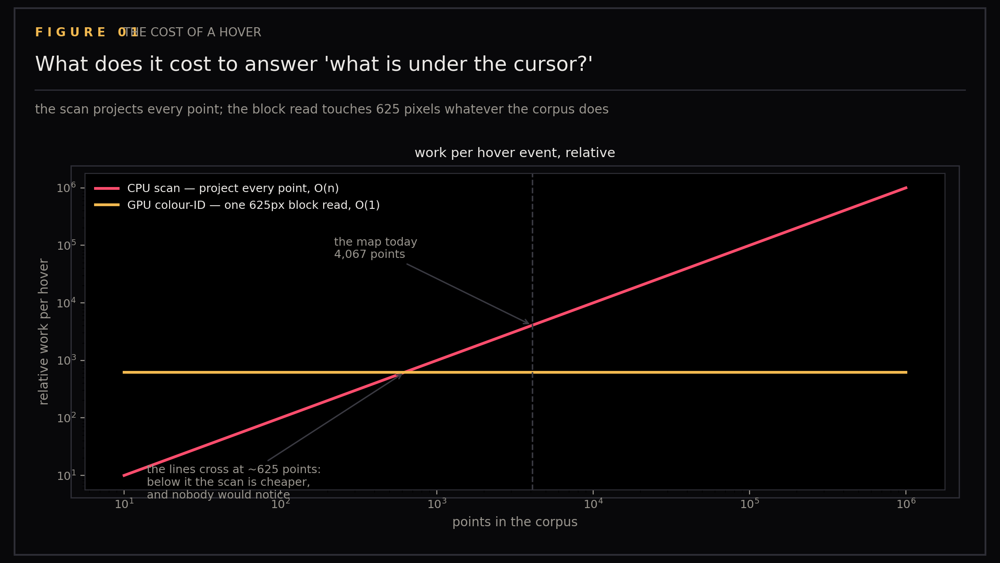
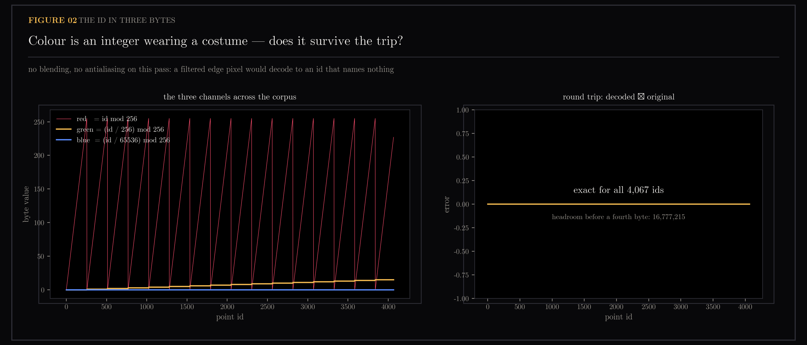
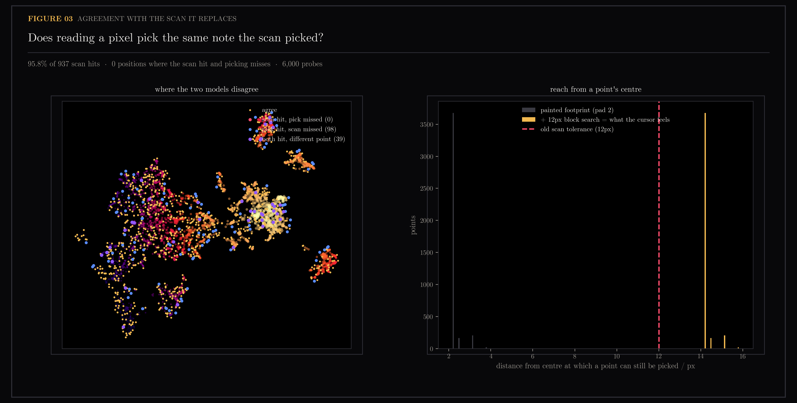
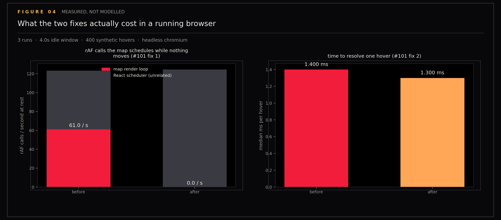

# Picking

Hovering a cursor over a 3D point cloud has to answer "which point is under the mouse?" within a single frame. This section covers replacing a linear scan over every point with GPU colour-ID picking — each point is drawn once into an off-screen buffer in a colour that encodes its index, so the answer becomes one pixel read — and the evidence that the replacement is both correct and faster.

Ground-truth figures for GPU colour-ID picking (issue #101, fix 2). The point cloud is the knowledge map of `ytk`, my personal knowledge system, which ingests YouTube, Instagram and web content into an Obsidian vault and indexes it for semantic search; each point is one note. The matplotlib witness provides an independent reimplementation of what the renderer claims to do, so the claim can be checked against something not written by the same hand as the shader.

Figures 01-03 are models of the picking algorithm. Figure 04 measures real browser performance with headless Chromium before and after the fix.

Generated by `scripts/plot_picking.py` (figures 01-03) and `scripts/measure_picking.py` (figure 04).

```
uv run --with matplotlib --with numpy python scripts/plot_picking.py
uv run --with playwright python scripts/measure_picking.py \
    --before-url http://127.0.0.1:6972 --after-url http://127.0.0.1:6971
```

## Figures

### 01-cost-scaling

Cost scaling: the linear scan against the block read as the corpus grows.

### 02-id-encoding

Encoding: an id surviving the round trip through three bytes.

### 03-scan-agreement

Agreement: where the block read and the old 12px scan disagree. At overview the renderer draws the 2D layout, so the camera reduces to a scale and an offset, and the relative geometry — all the agreement test depends on — is exact.

### 04-measured

Measured: idle frame rate and hover cost from a real browser. Drives the actual bundle with headless Chromium and records what the map does at rest and under the cursor. Compares a baseline build (before the fixes) against the current code.

## Data

### measured.json

Browser performance metrics from real headless Chromium testing. Contains runs and statistics for idle frame rate (FPS) and hover interaction cost (ms) before and after the fixes. Multiple runs average results.

## Files

| File | Description |
|------|-------------|
| 01-cost-scaling.png | Model: linear scan cost |
| 02-id-encoding.png | Model: id encoding round-trip |
| 03-scan-agreement.png | Model: block read vs scan agreement |
| 04-measured.png | Real browser performance before/after |
| measured.json | Browser metrics from headless testing |
