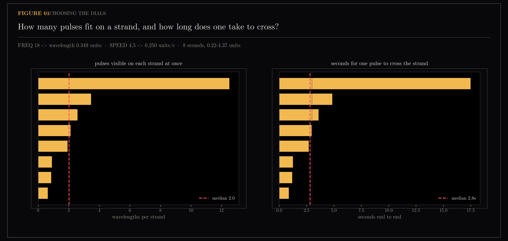
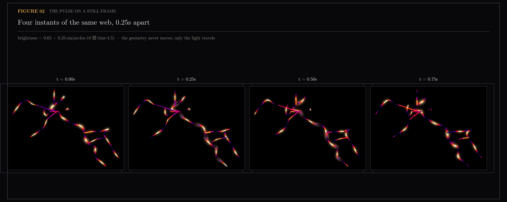
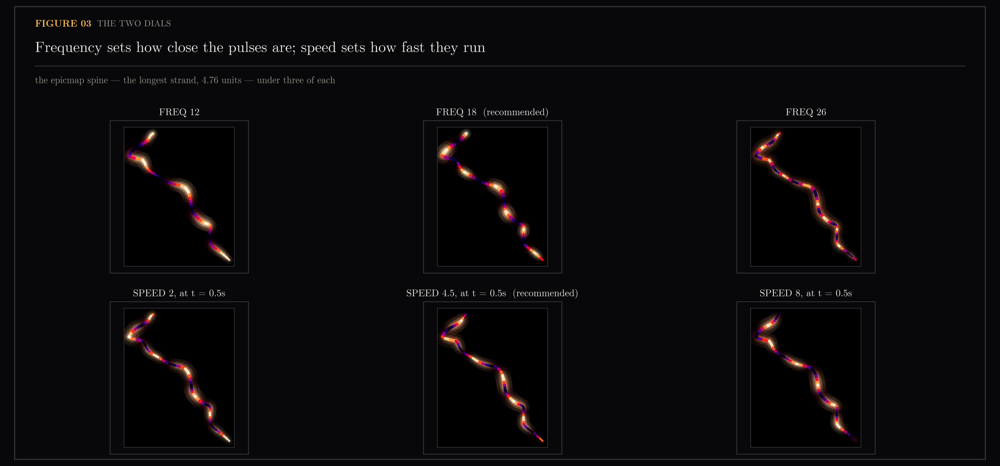
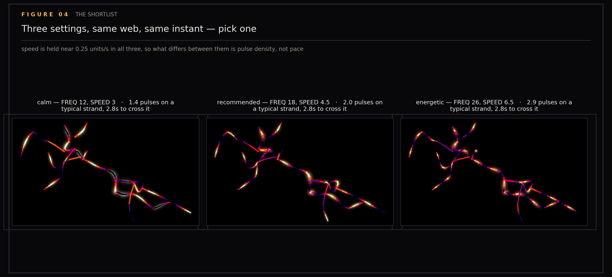
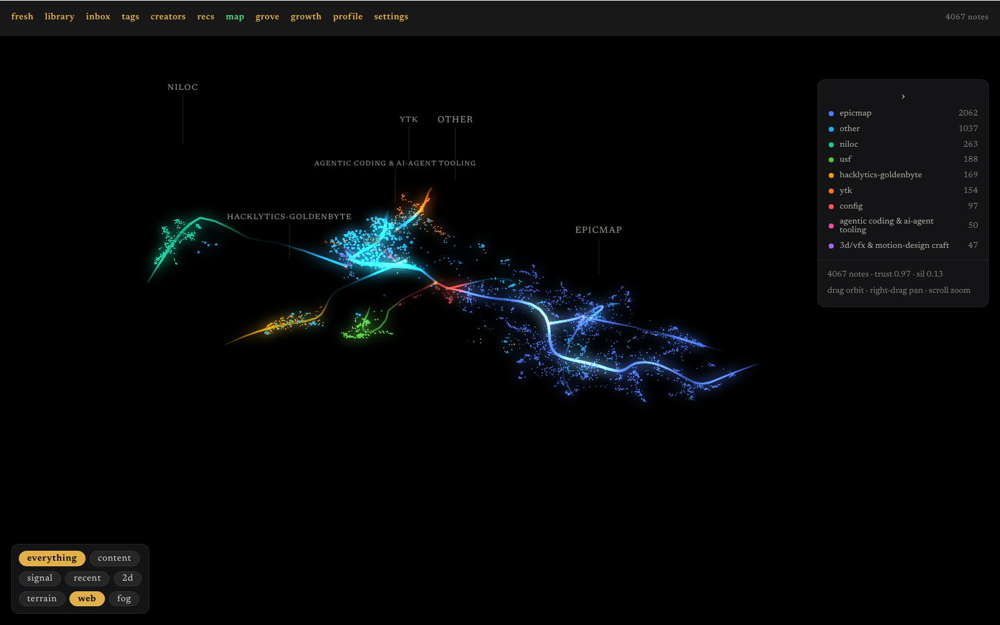
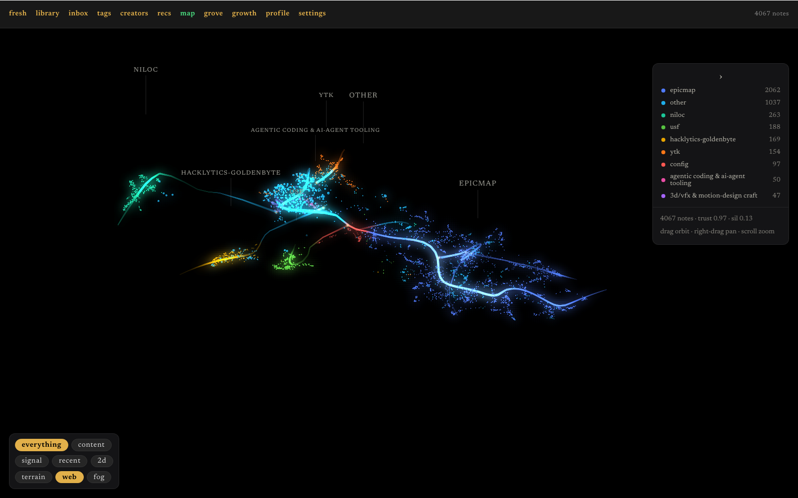
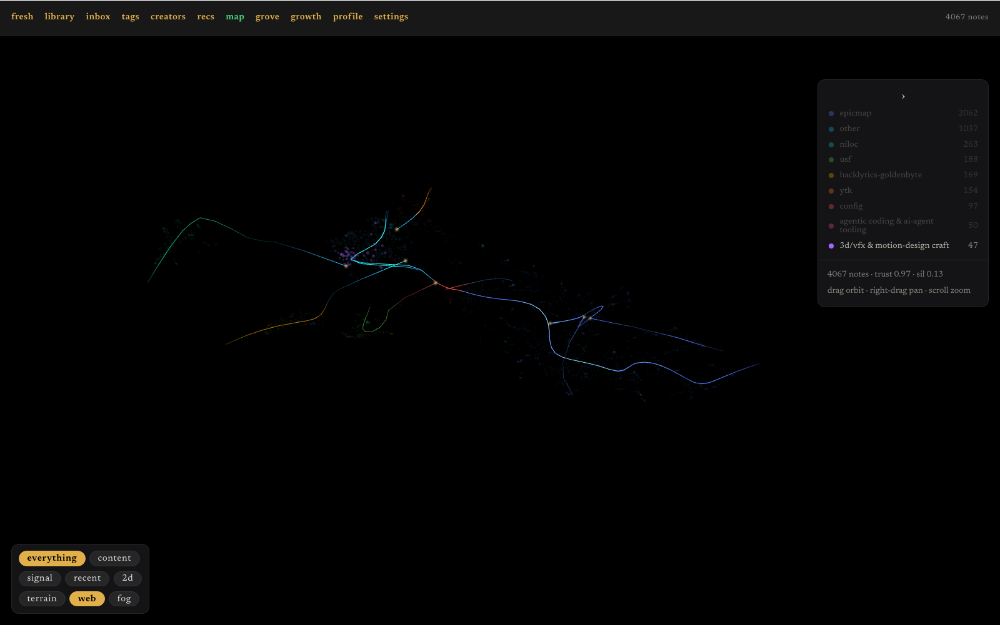

# Flow Pulses

The filaments traced through the knowledge map are static geometry. This section works out how to make them read as *flowing* without moving a single vertex: a travelling brightness wave, computed per-vertex in the shader. The work is choosing its two dials — wavelength and speed — in matplotlib before any shader exists, then proving the shipped shader really moves rather than merely looking busy.

Preview of the flow pulses shader before final implementation (feature A of epic #107 in this repository's tracker). The strands run through the knowledge map of `ytk`, my personal knowledge system, which ingests YouTube, Instagram and web content into an Obsidian vault and indexes it for semantic search. The pulse animates brightness along each strand using one line of arithmetic:

```
brightness = BASE + AMP * sin(arclen * FREQ - time * SPEED)
```

Arclen is computed by walking the strand rather than straight across, ensuring preview and shader compute the ruler identically.

Generated by `scripts/plot_flow_pulses.py` (static figures) and `scripts/shoot_flow_pulses.py` (validation checkpoint).

```
uv run --with matplotlib --with numpy python scripts/plot_flow_pulses.py
uv run --with playwright python scripts/shoot_flow_pulses.py --url http://127.0.0.1:6973
```

## Figures

### 01-wavelength-choice

Wavelength: how many pulses fit on each strand, and how long one takes to traverse.

### 02-pulse-still

Still frame: four instants of the same web with geometry fixed, showing pulses at different phases.

### 03-two-dials

The two dials: frequency and speed varied independently.

### 04-shortlist

Shortlist: the settings worth choosing between, rendered side by side.

### 05-motion-off-a


### 05-motion-off-b


### 05-motion-on-a


### 05-motion-on-b


### 05-shader-frame-a

Shader validation checkpoint: proves the pulse is actually travelling rather than merely present. Two frames a beat apart must differ; with the clock pinned they must not.

### 05-shader-frame-b


## Videos

[FlowPulses.mp4](FlowPulses.mp4) — Animated preview of the flow pulses effect.

[FlowPulses-audio.mp4](FlowPulses-audio.mp4) — Animated preview with audio.

## Files

| File | Description |
|------|-------------|
| 01-wavelength-choice.png | Wavelength parameter exploration |
| 02-pulse-still.png | Still frames at different phases |
| 03-two-dials.png | Frequency and speed matrix |
| 04-shortlist.png | Candidate settings comparison |
| 05-motion-off-a.png | Motion off checkpoint A |
| 05-motion-off-b.png | Motion off checkpoint B |
| 05-motion-on-a.png | Motion on checkpoint A |
| 05-motion-on-b.png | Motion on checkpoint B |
| 05-shader-frame-a.png | Shader validation frame A |
| 05-shader-frame-b.png | Shader validation frame B |
| FlowPulses.mp4 | Animated preview clip |
| FlowPulses-audio.mp4 | Animated preview with audio |
