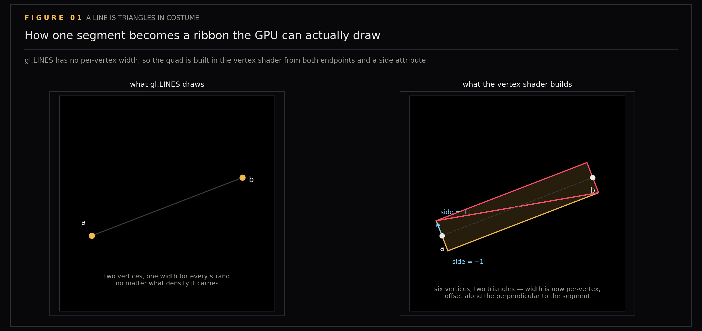
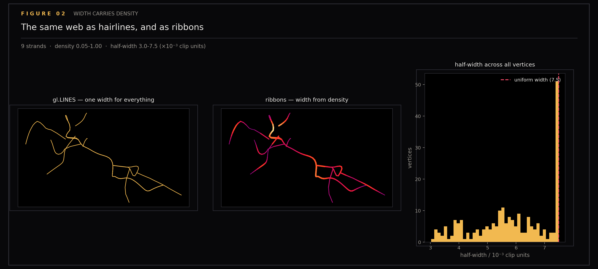

# Ribbons

WebGL will not draw a thick line. That is the whole problem this section solves: the filaments running through my knowledge map need to swell where the notes are dense and thin out where they are sparse, and the one primitive that would do it for free does not exist. The fix is to stop drawing lines and start drawing geometry.

Ground-truth figures for ribbon strands (feature B of epic #107 in this repository's tracker). The strands run through the knowledge map of `ytk`, my personal knowledge system, which ingests YouTube, Instagram and web content into an Obsidian vault and indexes it for semantic search. The claim is geometric: gl.LINES cannot vary width, so each segment is expanded into a quad and widened along the screen-space perpendicular, with the width coming from density. This claim is checkable on paper — the figures recompute the expansion the vertex shader performs and draw the result, so the geometry can be inspected without a GPU in the loop.

Generated by `scripts/plot_ribbons.py`.

```
uv run --with matplotlib --with numpy python scripts/plot_ribbons.py
```

## Figures

### 01-quad-expansion

Expansion: one segment becoming two triangles, and why the screen-space perpendicular is used.

### 02-density-taper

Taper: the real web as hairlines against the same web as ribbons, showing how density controls width.

## Files

| File | Description |
|------|-------------|
| 01-quad-expansion.png | Quad expansion geometry |
| 02-density-taper.png | Width tapering by density |
