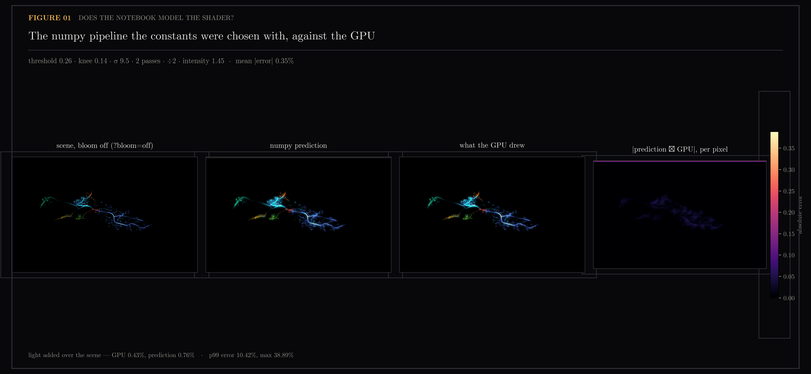
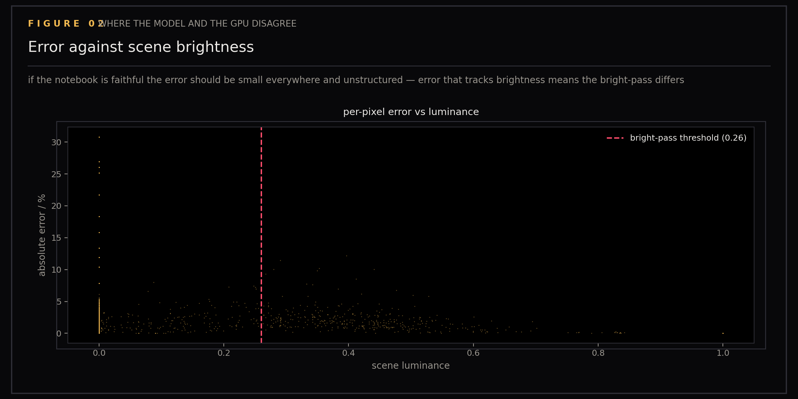
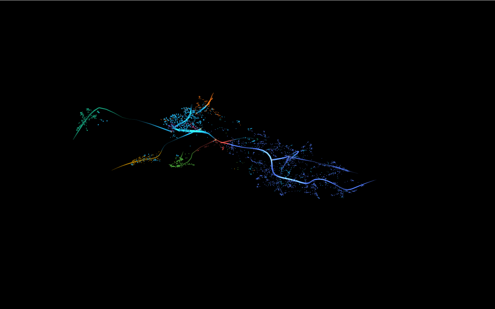
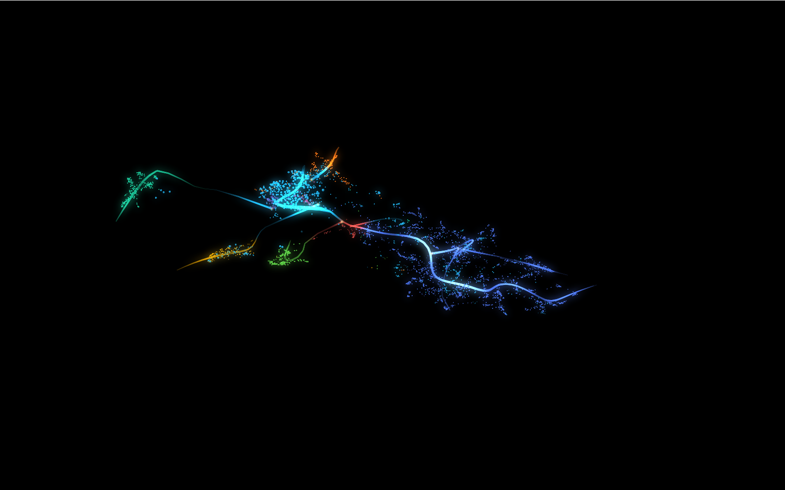

# Bloom

Bloom is the glow that bright pixels bleed into their neighbours. Tuning it on the GPU means recompiling and squinting, so the constants were chosen instead in a numpy model — which is only worth anything if the model is a faithful stand-in for the shader. This section tests that assumption rather than the effect.

Validation checkpoint for bloom (feature C of epic #107 in this repository's tracker), on the knowledge map of `ytk`, my personal knowledge system, which ingests YouTube, Instagram and web content into an Obsidian vault and indexes it for semantic search. Not a before/after. The question this answers is whether the numpy pipeline used for tuning is actually a faithful model of the shader. If it is, tuning in the notebook is trustworthy; if not, every constant chosen there is suspect.

The numpy side deliberately mirrors the shader's approximations — the fixed 9-tap kernel, the same tap spacing, the same downsample — rather than an ideal Gaussian. Comparing against a better blur would measure the wrong thing.

Generated by `scripts/plot_bloom.py` (static comparison) and `scripts/shoot_bloom_pair.py` (GPU captures).

```
uv run --with matplotlib --with numpy --with pillow python scripts/plot_bloom.py
uv run --with playwright python scripts/shoot_bloom_pair.py --url http://127.0.0.1:6973
```

## Figures

### 01-model-vs-gpu

Model vs GPU: run the notebook's arithmetic over an un-bloomed scene capture and compare against what the GPU produced from that same scene.

### 02-error-structure

Error structure: how the numpy model diverges from GPU output across the frame.

### scene-raw

Un-bloomed scene captured from the running map (`?bloom=off`), used as input to the numpy validation pipeline.

### scene-bloomed

GPU output with bloom enabled. Compared against the numpy model's result to validate the shader constants.

## Files

| File | Description |
|------|-------------|
| 01-model-vs-gpu.png | Numpy model vs GPU comparison |
| 02-error-structure.png | Error distribution |
| scene-raw.png | Unbloomed scene input |
| scene-bloomed.png | GPU bloom output |
