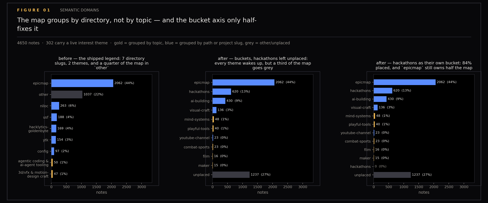
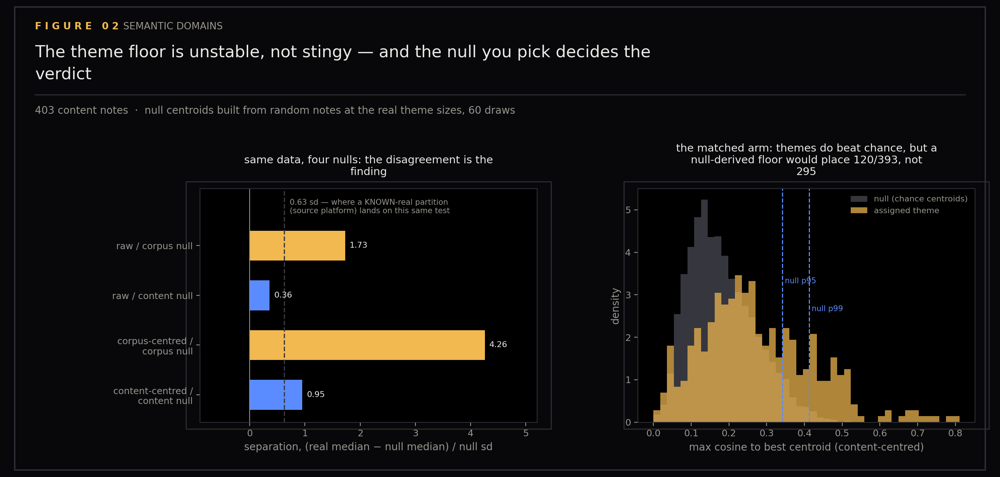
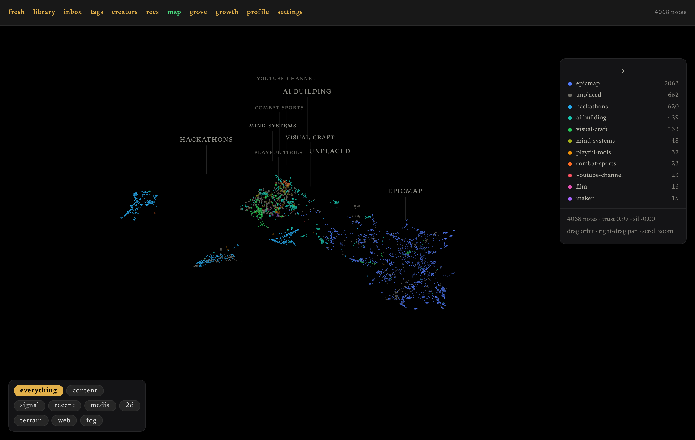

# Semantic Domains

A map coloured by folder name looks semantic and is not. The points on my knowledge map are positioned by meaning — a projection of text embeddings — but the colours came from where each note happens to live on disk. This section measures how much of the supposedly semantic grouping was really a directory listing, and what a genuinely content-derived grouping puts in each bucket instead.

Ground-truth figures for semantic domains (issue #106 in this repository's tracker), on the knowledge map of `ytk`, my personal knowledge system, which ingests YouTube, Instagram and web content into an Obsidian vault and indexes it for semantic search. The witness for the label axis, in the same role matplotlib plays for the fog and picking series: an independent count of what each candidate grouping rule actually places, so the decision is made on measured mass rather than on how the bucket names read.

The claim under test is that the map's grouping axis is a directory axis wearing two semantic labels. Figures show the shift from provenance-based categorization (path slugs — which folder a note sits in) to semantic categorization (grove buckets — hand-authored topic groups matched against each note's content).

Generated by `scripts/plot_domains.py`.

```
uv run --with matplotlib --with numpy python scripts/plot_domains.py
uv run --with matplotlib --with numpy python scripts/plot_domains.py --refresh
```

## Figures

### 01-before-after-histogram

Before/after: the shipped hybrid axis (provenance + theme) against the semantic bucket axis (grove buckets).

### 02-theme-floor-null

Theme floor null: measures of separation between grouping candidates and their null models.

### 03-legend-live

Legend: live bucket distribution across the map.

## Data

### counts.json

Document counts by category and bucket. Contains total document count, theme count, category breakdowns (memory, instagram, youtube, etc.), and comparative statistics for before/after/bucketed groupings. Also includes null hypothesis separation measurements.

## Videos

[SemanticDomains.mp4](SemanticDomains.mp4) — Animated visualization of semantic domain clustering.

## Files

| File | Description |
|------|-------------|
| 01-before-after-histogram.png | Provenance vs semantic grouping |
| 02-theme-floor-null.png | Null hypothesis separation |
| 03-legend-live.png | Bucket legend and distribution |
| counts.json | Document counts and statistics |
| SemanticDomains.mp4 | Animated domain visualization |
