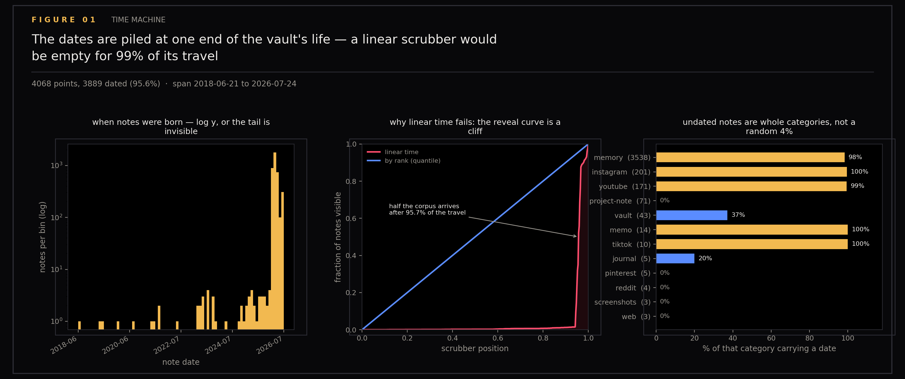
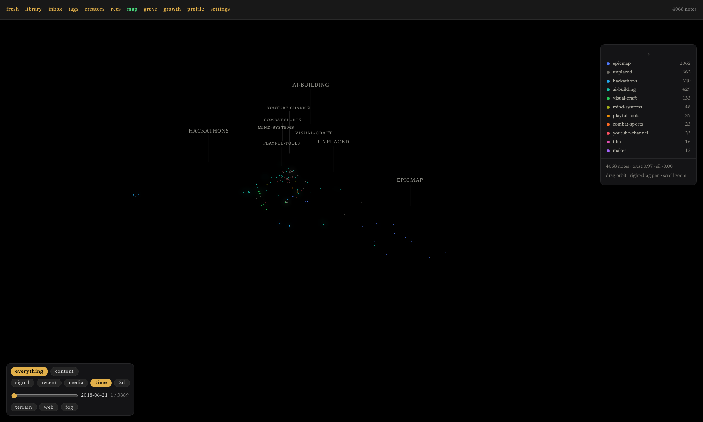
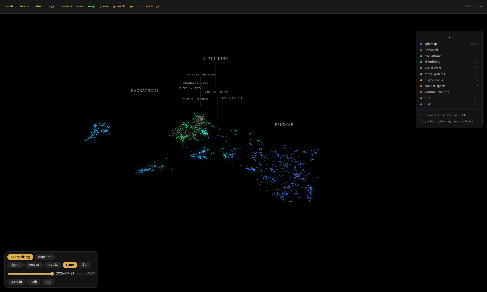
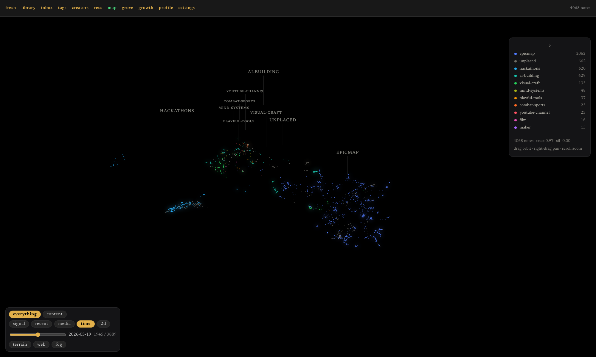
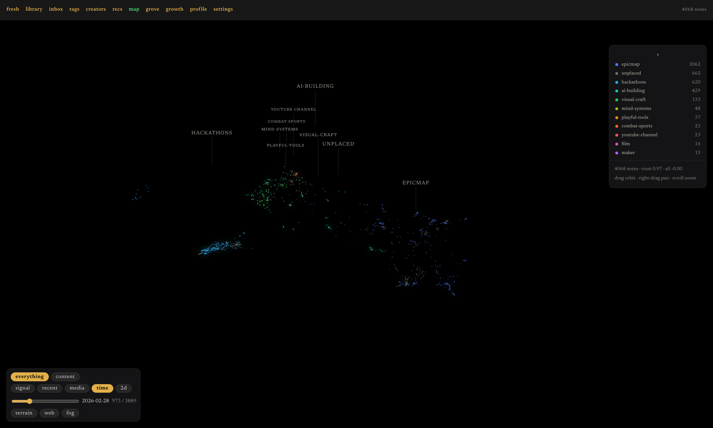

# Time Machine

A timeline scrubber over a knowledge base is an appealing idea: drag left, watch the notes disappear back to the beginning. This section checks the idea against the data before building it, and the data says no — the design that seems obvious would spend most of its slider travel showing nothing move.

Ground-truth figures for the time machine (feature D of epic #107 in this repository's tracker). Feature D sweeps notes onto the map by birth date instead of by the intro animation's fixed timer. The notes belong to `ytk`, my personal knowledge system, which ingests YouTube, Instagram and web content into an Obsidian vault — the vault being the on-disk folder of markdown notes, and the corpus the set of those notes the map draws. Before writing a shader against the dates, this asks what the dates actually look like, because a scrubber is a mapping from slider position to corpus, and that mapping is only as good as the distribution underneath it.

The distribution vetoes the obvious design: the dates are not spread across the vault's life, they are piled at one end of it.

Generated by `scripts/plot_timemachine.py`.

```
uv run --with matplotlib --with numpy python scripts/plot_timemachine.py
```

## Figures

### 01-date-distribution

Date distribution: shows that dates are not spread across the vault's life but piled at one end.

### 02-scrub-earliest

Scrub earliest: map state at the earliest date.

### 02-scrub-latest

Scrub latest: map state at the most recent date.

### 02-scrub-mid

Scrub mid: map state at the midpoint of the timeline.

### 02-scrub-quarter

Scrub quarter: map state at the 25% point of the timeline.

## Files

| File | Description |
|------|-------------|
| 01-date-distribution.png | Note date distribution histogram |
| 02-scrub-earliest.png | Map at earliest date |
| 02-scrub-latest.png | Map at latest date |
| 02-scrub-mid.png | Map at midpoint |
| 02-scrub-quarter.png | Map at 25% point |
