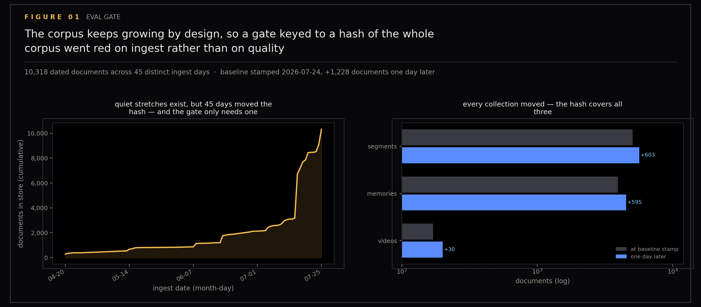
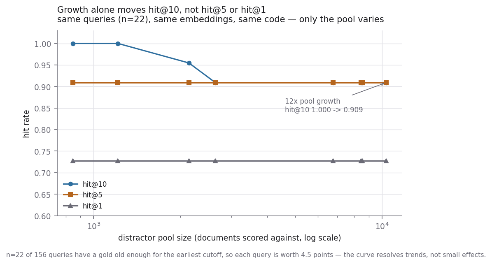
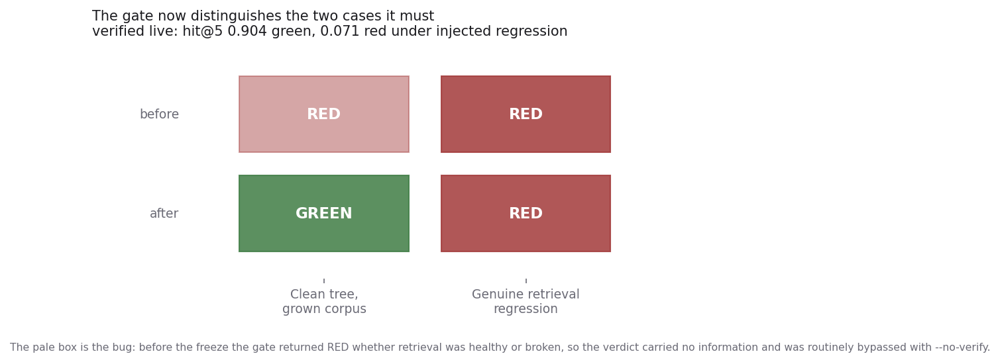

# Retrieval-Gate Corpus Freeze

Semantic search breaks quietly. A ranking change can pass every spot check and still bury the one document that mattered, and nobody notices for a month. The gate is the automated guard against that: a frozen set of known-item queries, each with exactly one correct document, re-scored through the production search paths on every change to retrieval code, red if accuracy drops. This section is about the day the gate started going red for the wrong reason — the corpus kept growing, so every ingest enlarged the haystack and looked like a regression. The fix was to freeze which documents get scored, without freezing the store itself.

Figures for the retrieval-gate corpus freeze (issue #111 in this repository's tracker). The corpus is the note collection of `ytk`, my personal knowledge system, which ingests YouTube, Instagram and web content into an Obsidian vault and indexes it for semantic search. Scores are reported as hit@k: the fraction of queries whose correct document lands in the top k results. Every number is measured against the live store; nothing here is illustrative.

A retroactive annotation, added once section 24 had put this gate to work judging a sparse autoencoder (SAE — a network trained to re-express each embedding as a short list of interpretable features) rebuild of the index:

> **Later:** section 24 rebuilt this gate's ranking as an independent numpy
> mirror and reproduced `eval/retrieval/baseline.json` exactly — hit@1 .7115,
> hit@5 .9038, hit@10 .9423 and every per-bucket cell — then used it to reject
> an SAE-reconstructed index at every config tried (Δhit@5 −0.026 to −0.081
> against the gate's 0.02 tolerance). The freeze held and the gate did its job.

Generated by `scripts/plot_eval_gate.py`. Run with `uv run --with matplotlib python scripts/plot_eval_gate.py` or `uv run --with matplotlib python scripts/plot_eval_gate.py --only 2`.

## Figures

### Corpus Growth

### Growth Drift Curve

### Gate Verdicts

## Notes

House style is imported from plot_assets and sits in the same visual system as the fog, domain, and time-machine figures — [section 1](../01-fog/README.md), [section 6](../06-semantic-domains/README.md) and [section 7](../07-time-machine/README.md).

The two payloads are committed next to the figures so they regenerate without a store or an encoder:

- `drift.json` — retrospective pool sweep: historical corpus states rebuilt from ingested_at, same embeddings and same code, only the distractor pool varied
- `verdicts.json` — the green/red acceptance run: frozen scoring on the grown corpus, and the same run with a deliberate regression injected into the searchers

## Files

- `01-corpus-growth.png` — figure
- `02-growth-drift-curve.png` — figure
- `03-gate-verdicts.png` — figure
- `drift.json` — retrospective pool sweep data
- `verdicts.json` — acceptance run verdicts
