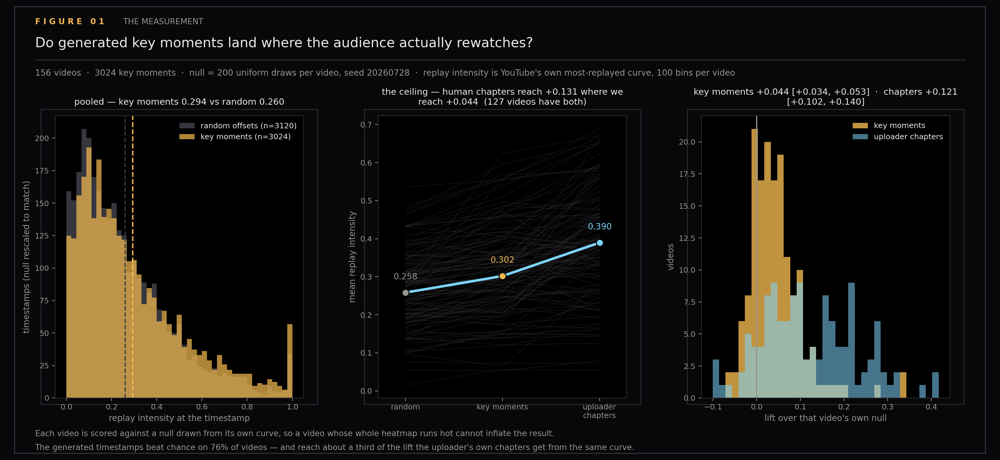
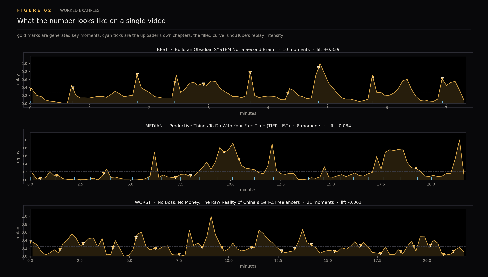
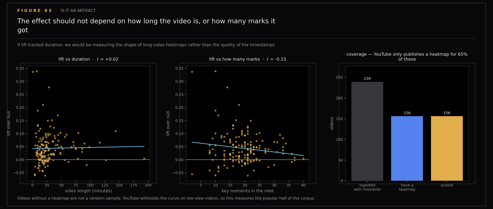

# Measuring the Timestamps Against the Crowd

An AI that writes "the good bit is at 14:32" is making a claim nobody usually checks. This section checks it, using a reference that was sitting in the download all along: YouTube publishes a replay heatmap in the yt-dlp info dict — 100 uniform bins of normalized replay intensity, the curve that draws the squiggle on the scrubber — which is a free, crowd-sourced attention signal on exactly the axis that generated key moments claim to mark. The experiment measures whether Claude-generated key moments land where people actually rewatch, against a null model and against the uploader's own chapter marks.

Generated by `scripts/heatmap_experiment.py` and `scripts/plot_heatmap_key_moments.py`. Run with `uv run --with matplotlib --with numpy python scripts/plot_heatmap_key_moments.py`.

## Figures

### Key Moments vs Null

The measurement: pooled distributions, the three-way per-video comparison, both effect sizes on one axis.

### Worked Examples

Best, median, and worst videos showing the curve with the marks on it.

### Artifact Checks

Lift against duration, lift against mark count, and coverage analysis.

## Working notes

## Post material — measuring the timestamps against the crowd

Working notes for a post. Figures 01–03 tell the story in order; numbers and
quotables below. Everything here is reproducible from `raw.json` via
`scripts/heatmap_experiment.py` and `scripts/plot_heatmap_key_moments.py`.

### The setup

`ytk` is my personal knowledge system: it ingests YouTube videos, Instagram
posts and web articles into an Obsidian vault and indexes the lot for semantic
search. On every video it pays Claude to generate a `## Key Moments` section —
timestamped marks meant to be findable from memory later. Nobody had ever
checked whether they were any good, because there was nothing to check them
against.

There is. YouTube publishes a **heatmap** in the yt-dlp info dict: 100 uniform
bins of normalized replay intensity, the same curve that draws the squiggle on
the scrubber. ytk has been fetching it on every single ingest since the
beginning and throwing it away.

That is a free, crowd-sourced attention signal on exactly the axis the generated
timestamps claim to mark. So the question stops being "do these look right" and
becomes a measurement.

### The result

| | mean replay intensity | lift over null | 95% CI |
|---|---|---|---|
| random offsets | 0.258 | — | |
| **generated key moments** | **0.302** | **+0.044** | [+0.034, +0.053] |
| uploader's own chapters | 0.390 | +0.121 | [+0.102, +0.140] |

156 videos with a heatmap, 3,024 key moments, null = 200 uniform draws per
video against that video's own curve (seed 20260728).

Both intervals exclude zero, and they do not overlap each other — so "the
timestamps beat chance" and "chapters beat the timestamps" are both real, not
artifacts of a noisy mean. The win rate is 119/156 (76.3%), a sign test at
z = 6.6.

**The timestamps are better than chance, on 76% of videos, and they reach about
a third of the lift a human uploader gets from the same curve.**

Both halves of that sentence matter. The first says the feature works — these
are not random marks. The second says it works considerably less well than a
person doing the same job by hand, which is the part that would never have
surfaced without a reference point.

### Quotables

> The null model is the whole experiment. "Key moments average 0.30 replay
> intensity" means nothing. 0.30 against a null of 0.26 drawn from the same
> curve means something, and 0.30 against a human's 0.39 on that same curve
> means something else again — it turns a pass/fail into a distance from a
> ceiling.

> Each video is scored against a null drawn from its own heatmap, so a video
> whose whole curve runs hot cannot inflate the result.

> I had been paying a model to approximate a signal I was already
> downloading and discarding.

### The finding I nearly published, and why it did not survive

Figure 03 was built to kill the result, not support it — if lift tracked video
duration, the experiment would be measuring the shape of long-video heatmaps
rather than timestamp quality. It survived that (**r = +0.02**, flat).

On the way it turned up **lift falling as mark count rises, r = −0.15**, which
came with a ready-made story: forty marks on a 78-minute video is a mark every
two minutes, approaching uniform coverage, and uniform coverage cannot beat a
uniform null by construction. Figure 02 seemed to show it — the best video has
10 moments, the worst has 21.

**It does not hold.** Checked properly:

- r = −0.1496, **p = 0.060**. At n = 156, |r| must exceed **0.156** for p < 0.05.
  It lands just under the bar.
- n_moments alone explains **2.2%** of the variance in lift.
- A regression on n_moments + duration + heatmap peakiness reaches **R² = 0.040**.
  Four percent. Essentially nothing is being explained.
- Duration quartiles are non-monotone: +0.047, +0.022, +0.054, +0.051.
- And the sign flips under the obvious reparameterization — marks **per minute**
  correlates **+0.14**, the opposite direction. If dilution were the mechanism,
  density is exactly the variable that should have carried it.

The dilution story was plausible, had a mechanism, and had a worked example. It
was still noise. Figure 03 now draws both fits dashed and states the noise floor
on the panel, so the picture cannot imply a finding the arithmetic does not
support.

### The real find in the same territory

Separately, and not statistical: `CLAUDE.md` claimed enrichment emits "up to 8
timestamped moments." The live prompt in `ytk/enrich.py` says the opposite —
*"Include as many as the content warrants; scale to length"* — with no cap
anywhere. Notes in the corpus carry 40.

That is documentation drift, worth fixing on its own terms. It is **not**
evidence that a cap would help; this experiment cannot distinguish "fewer marks"
from "better-chosen marks," and random subsampling could not either, since the
expected mean of a random subset equals the mean of the full set. Testing a cap
means generating new enrichments under a capped prompt and re-scoring — a real
A/B, not a reanalysis of this data.

### The caveat that belongs in the post

Videos without a heatmap are **not** a random sample. YouTube withholds the curve
on low-view videos, so 83 of 239 (35%) dropped out, and they dropped out for a
reason correlated with popularity. This measures the timestamps on the popular
half of the corpus. Whether generated moments are better or worse on obscure
videos is untested and unknowable by this method.

### What it argues for, in ytk

1. **Persist the heatmap** (issue #144 in this repository's tracker). It is
   already fetched, already free, and it is demonstrably a better attention
   signal than what ytk generates.
2. **Persist chapters** (#144). Currently fetched, fed to the enrichment prompt,
   rendered in the terminal, and never written to the note — they only survive
   when an uploader happens to duplicate their timestamps into the description.
   They are the strongest signal measured here.
3. **Fix the stale cap in the docs**, and decide deliberately whether the prompt
   should have one. The data does not settle it — see above.
4. A heatmap in the note also makes this experiment rerunnable per-video, which
   turns key-moment quality into something the enrichment eval can regress on
   rather than a one-off study. That is also what would make a capped-prompt A/B
   cheap enough to actually run.

### Figures

- `01-key-moments-vs-null.png` — the measurement: pooled distributions, the
  three-way per-video comparison, both effect sizes on one axis
- `02-worked-examples.png` — best / median / worst, the curve with the marks on it
- `03-artifact-checks.png` — lift vs duration, lift vs mark count, and coverage

### Sidecars

- `raw.json` — one record per video: heatmap values, key-moment offsets,
  chapters, duration, view count
- `results.json` — per-video scores and the pooled draws behind figure 01

## Files

- `01-key-moments-vs-null.png`
- `02-worked-examples.png`
- `03-artifact-checks.png`
- `raw.json`
- `results.json`
