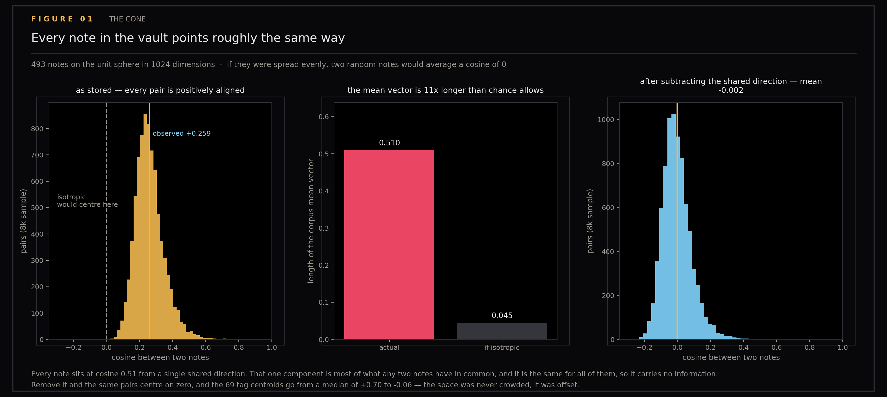
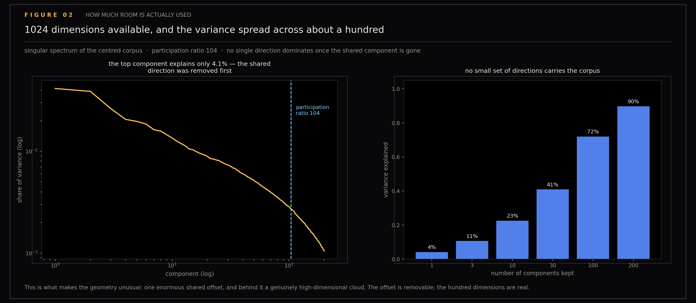
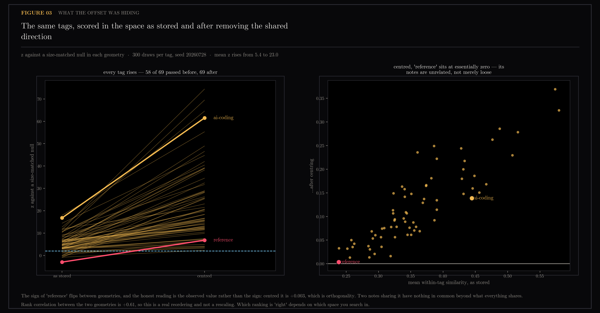
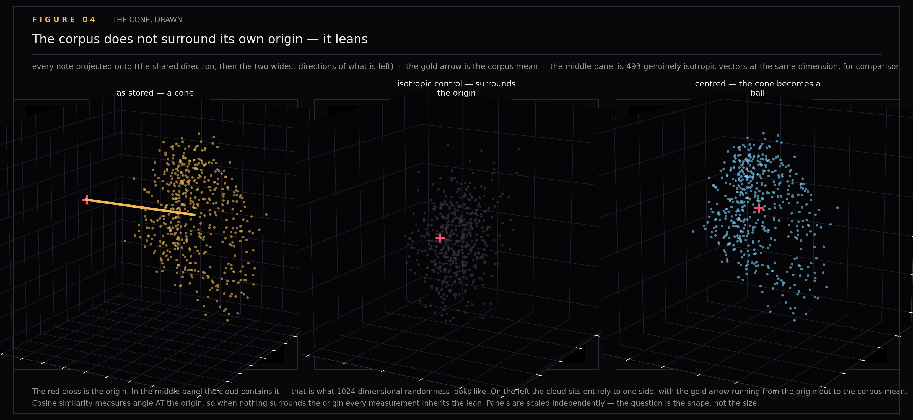
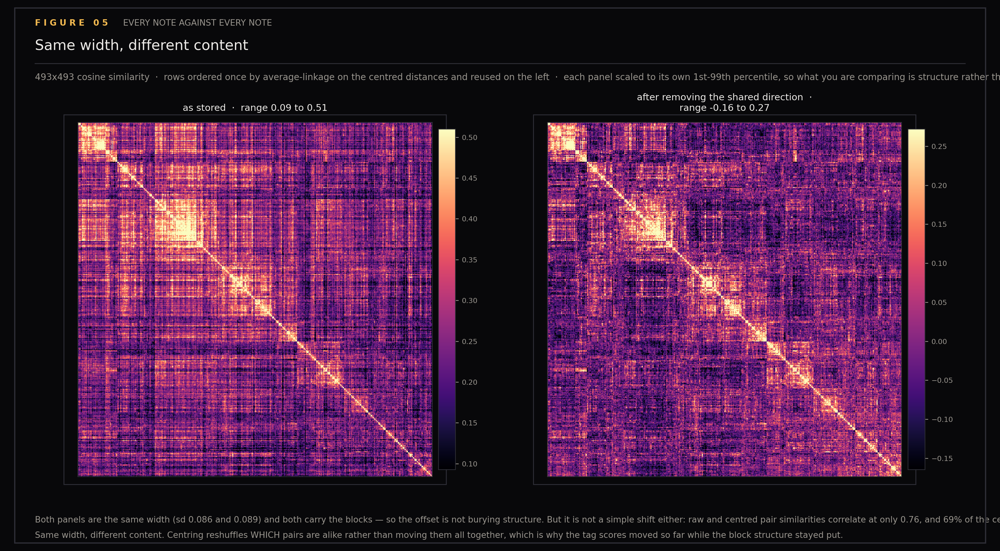
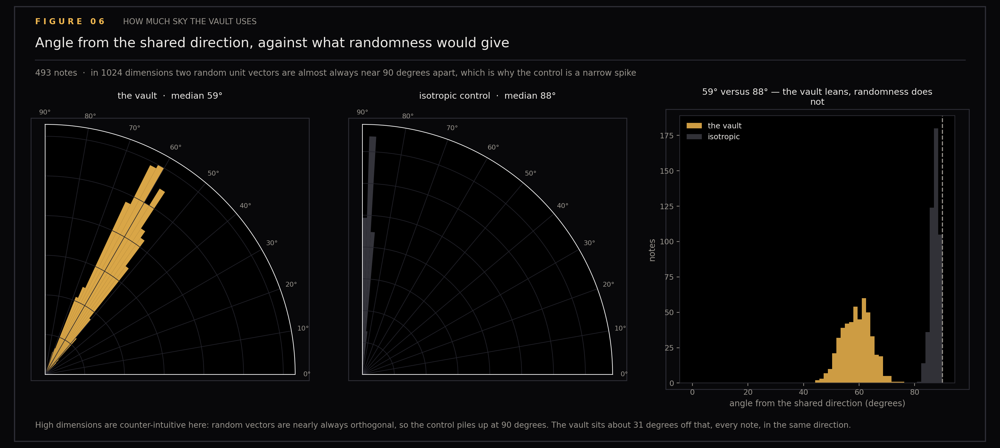

# The Vault's Embedding Space Is a Cone, Not a Ball

Text embeddings are usually pictured as points scattered over a sphere, with cosine similarity reading as "how related are these two things". In my vault — the folder of markdown notes behind `ytk`, my personal knowledge system, which ingests YouTube, Instagram and web content and indexes it for semantic search — that picture is wrong in a way that quietly distorts every similarity number computed from it. The notes do not fill the sphere. They occupy a narrow cone off to one side of it, all leaning in the same direction, and that shared lean gets counted as similarity.

The tag-coherence experiment in [section 10](../10-tag-coherence/README.md) found the median cosine between any two tag centroids at 0.70, suggesting the space is crowded. This experiment shows the space is actually offset: one enormous shared direction carries most of the apparent similarity, and removing it reveals a space that is genuinely high-dimensional, in which unrelated tags turn out to be orthogonal.

Generated by `scripts/embedding_geometry.py`. Run with `uv run --with matplotlib python scripts/embedding_geometry.py`.

## Figures

### The Cone

The corpus does not fill its sphere; the mean vector is 11x longer than chance allows.

### Spectrum

Participation ratio 104 of 1024, no small set of directions carries the corpus.

### Dynamic Range

Every tag's z before and after centring, and the observed similarities behind it.

### The Cone Drawn

The geometry itself: the corpus, an isotropic control, and the centred corpus, with the origin marked in each.

### Gram Matrix

All 493 notes against each other, one ordering, two geometries.

### Angular

Angle from the shared direction, against what randomness gives.

## Working notes

## Post material — the vault's embedding space is a cone, not a ball

Working notes. Figures 01–06. Reproducible from the frozen `vectors.npz` in
`../10-tag-coherence/` via `scripts/embedding_geometry.py`.

Read-only: reads a frozen array. Touches neither the vault nor Chroma.

### The question

*Toy Models of Superposition* (Anthropic, 2022) asks what a network does when it
has more features than dimensions. This asks the inverse of the vault's own
space: **69 tag concepts live in 1024 dimensions.** They could all be mutually
orthogonal with enormous room to spare. Are they?

The number that prompted it: in the tag-coherence experiment, the median cosine
between any two tag centroids was **0.70**. That looks like a space so crowded
that every concept overlaps every other one.

### The finding

It isn't crowded. It's **offset**.

| | as stored | after centring |
|---|---|---|
| mean cosine between two notes | **+0.259** | −0.002 |
| median cosine between two tag centroids | **+0.699** | **−0.057** |
| length of the corpus mean vector | **0.510** | — |
| …if the notes were spread evenly | 0.045 | — |

Every note sits at cosine **0.51** from a single shared direction. That one
component is most of what any two notes have in common — and it is the same for
all of them, so it carries no information at all. Subtract it and the tag
centroids are essentially orthogonal.

> The space was never crowded. There was one enormous shared offset sitting on
> top of it, and everything else was measured through that.

This is the anisotropy that Ethayarajh and Mu & Viswanath describe in language
model embeddings, showing up in a personal vault at full strength.

### What is behind the offset

Removing the shared direction does **not** leave a low-dimensional remnant:

- **participation ratio 104** of 1024 dimensions — the participation ratio is an
  effective-dimension count, roughly "how many directions the cloud really uses"
  once the variance spectrum is taken into account
- the top component explains only **4.1%**
- 30 components reach 41%, 100 reach 72%

So: one enormous removable offset, and behind it a genuinely high-dimensional
cloud using roughly a hundred effective directions. The offset is an artifact.
The hundred dimensions are real.

> **Later:** section 17 showed 104 is not an encoder ceiling but an n-limit.
> 75 more notes bought 2.3 effective dimensions (104.4 → 106.7), the PR-vs-n
> curve is decelerating but not flat, and at matched n = 493 the grown corpus
> measures 103.6 — the freeze value replicates exactly, so the gap is pure
> sample size. The same section found ‖mean‖ flat in n from 256 onward
> (0.5104 → 0.5106, axis rotated 2.3 degrees): the offset is a property of the
> encoder and the content mix, not of this sample.

### What the offset was hiding

Scoring every tag against a size-matched null **in each geometry**:

| | as stored | centred |
|---|---|---|
| mean z | 5.4 | **23.0** |
| median z | 4.9 | 16.7 |
| tags passing z > 2 | 58 of 69 | **69 of 69** |

`ai-coding` goes from +17 to +61; `creative-coding` from +12 to +74. Note this
is *not* the shared component compressing a range — see below; it reshuffles.

**This is an actionable retrieval result.** Centring the stored vectors — a
subtraction, no retraining — would sharply increase how well tags separate.
Whether it improves *search* is the obvious next test, and the retrieval eval
gate is the instrument for it: a frozen set of known-item queries, each with one
correct document, scored through the production search paths and red on
regression. [Section 8](../08-eval-gate-freeze/README.md) describes it.

> **Later:** section 19 got the first measurement on a retrieval-shaped task.
> On tag-match@10, centring is the only gain anywhere (cosine 82.0 → 83.3,
> +1.2 points against a permuted floor of 41.4), and every rank metric loses
> to cosine. That did not clear the registered 2-point bar, so Phase B was not
> earned and production search stays cosine. Section 19 keeps the centring
> question explicitly open: it "belongs to the eval gate on its own merits,
> not through this door."

Note that stripping the leading principal components as well (all-but-the-top)
makes things **worse**, not better: mean z falls back to 5.9. The common mean is
the problem; the top components are signal.

### The correction this forces

The tag-coherence write-up reported "the 16 most redundant label pairs" with
values above 0.97. Those were measured on **uncentred** vectors, where every
pair starts at 0.70.

Recomputed after centring, the list mostly survives — `ai-coding + ai-agents`,
`ai-agents + claude-code`, `neuroscience + cognitive-science`, `diy + gizmo` all
stay in the top ten — but the values drop to ~0.93 and the order shifts.
`mma + combat-sports` rises from #7 to #1. `education + learning` falls out
entirely, precisely because both are generic tags sitting near the corpus mean,
which is what inflated them.

So: merge-these conclusion holds, the numbers were inflated.

### And it complicates the `reference` headline

`reference` scored z = −3.4 as stored — *anti*-coherent, notes sharing it less
alike than random. After centring it scores **positive**.

The honest reading is the observed value, not the sign:

    as stored   reference +0.239   vs a null of +0.259
    centred     reference +0.003   vs ai-coding +0.139

Centred, notes sharing `reference` sit at **+0.003 — orthogonality**. They have
nothing in common beyond what the whole corpus shares. Both geometries agree on
the substance; they disagree on the sign, because centring forces a slightly
negative null.

> A tag that fails is not one that clusters badly. It is one whose notes are
> unrelated to each other.

### Caveats

- **Rank correlation between the two geometries is only +0.61.** This is a real
  reordering, not a rescaling. Which ranking is "right" depends on which space
  you search in — and ytk searches the stored one, so the uncentred numbers are
  the operationally relevant ones today.
- **`reference`'s centred z is unstable across RNG seeds** (2.3 in one run, 7 in
  another) because at n=125 the null's standard deviation is tiny and z divides
  by it. The observed similarity is stable at +0.003; prefer it.
- **One corpus, one encoder.** Specific to the v2 Qwen3/1024d epoch.
- **Centring is measured here on tag separation, not on retrieval.** They are
  related but not the same thing, and only the eval gate settles the second.

### Same width, different content

Figure 05 killed two of my own claims in a row, which is the best argument for
drawing the thing.

**First claim:** the shared direction buries the block structure. It does not —
both panels carry the same blocks, and the spans are near-identical (raw 0.09 to
0.51, centred −0.16 to 0.27; sd 0.086 and 0.089).

**Second claim, made to explain the first:** then it must be a pure translation,
adding a constant to every pair. That is also wrong, and the z-scores are what
give it away — *a constant shift cannot move a z-score*, because it moves the
observed value and the null by the same amount. The z-scores moved from 5.4 to
23.0.

Measured directly:

| | |
|---|---|
| correlation, raw vs centred pair similarity | **0.759** (a translation gives 1.000) |
| sd ratio, centred / raw | 1.028 |
| centred variation *not* explained by a constant shift | **68.6%** |

So the honest statement is **same width, different content**. Centring
reshuffles which pairs are alike rather than sliding them all together. The
block structure survives because clustering is ordinal and the coarse ordering
holds; the tag scores move because they are absolute comparisons against a null,
and the fine-grained pair relationships genuinely change.

That also explains the rank correlation of +0.61 between the two geometries: a
real reordering, exactly as this predicts.

### Figures

- `01-the-cone.png` — the corpus does not fill its sphere; the mean vector is 11x longer than chance allows
- `02-spectrum.png` — participation ratio 104 of 1024, no small set of directions carries the corpus
- `03-dynamic-range.png` — every tag's z before and after centring, and the observed similarities behind it
- `04-the-cone-drawn.png` — the geometry itself: the corpus, an isotropic control, and the centred corpus, with the origin marked in each
- `05-gram-matrix.png` — all 493 notes against each other, one ordering, two geometries
- `06-angular.png` — angle from the shared direction, against what randomness gives

### Sidecar

- `results.json` — isotropy stats, the spectrum, centroid similarities in both geometries, and per-tag observed/null/z for each

## Files

- `01-the-cone.png`
- `02-spectrum.png`
- `03-dynamic-range.png`
- `04-the-cone-drawn.png`
- `05-gram-matrix.png`
- `06-angular.png`
- `results.json`
