# Garden Allometry

The garden is a second view onto the same knowledge base as the map: instead of a point cloud, each topic bucket is drawn as a tree, and the notes inside it become branches and leaves. Making that read as a plant rather than as clip-art means borrowing the rules real trees obey — how girth relates to the load above it, how a limb narrows at each fork, how branches lean toward the light. Allometry is the study of exactly those relationships, how a body's parts scale with its overall size. This section is the measurement work behind those rules.

The buckets come from `ytk`, my personal knowledge system, which ingests YouTube, Instagram and web content into an Obsidian vault and indexes it for semantic search; a bucket is one topic group of notes, and it becomes one tree.

Eight experiments on the structure and scale of the garden visualization, measured against the real vault buckets and the renderer's implementation.

Generated by multiple scripts in `scripts/`. Key generators:
- `scripts/plot_garden_allometry.py` — trunk radius against bucket size
- `scripts/plot_garden_branching.py` — branching geometry from skeleton dump
- `scripts/plot_garden_branching_compare.py` — before/after branching changes
- `scripts/plot_garden_persistence.py` — persistence normalization across clusters
- `scripts/plot_garden_roots.py` — root system before/after
- `scripts/plot_garden_scale.py` — height scaling and trunk-to-crown balance
- `scripts/plot_garden_taper.py` — limb taper under different girth schemes
- `scripts/plot_garden_tropism.py` — tropism axes isolated

## Figures

### 01-limb-taper.png
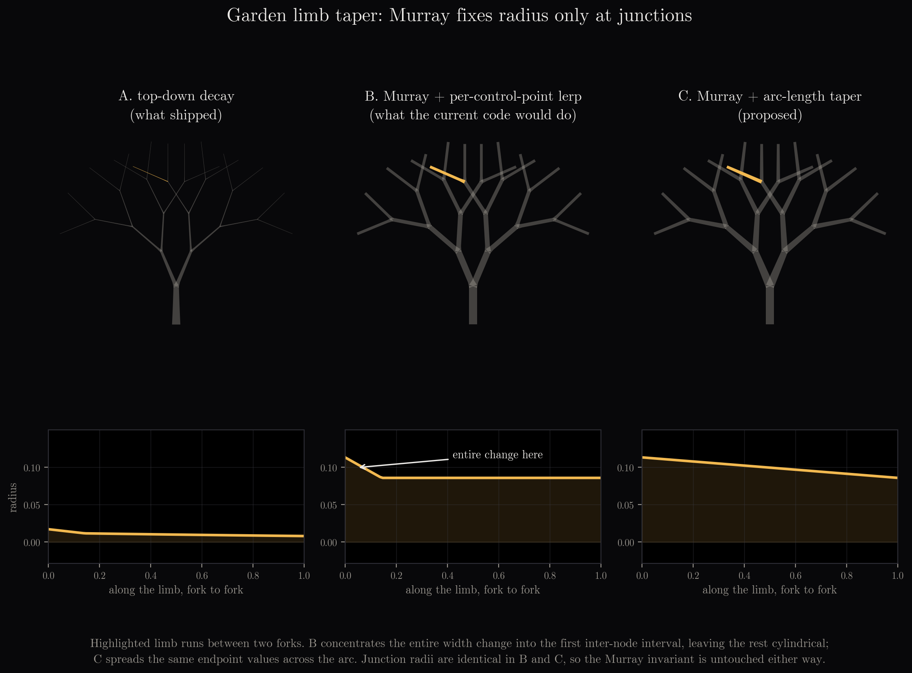

### 02-trunk-allometry.png
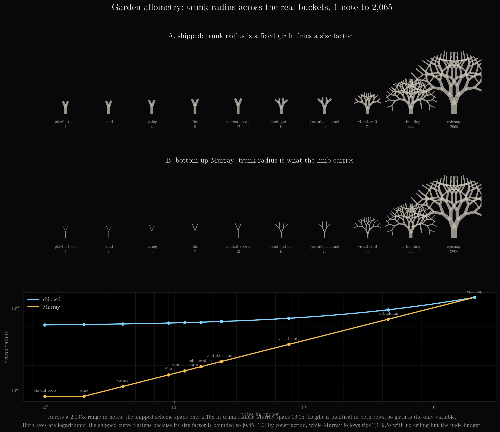

### 03-tropism-axes.png
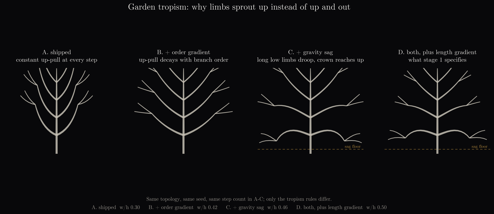

### 04-first-render.png
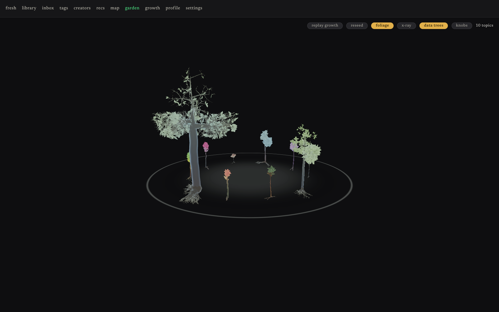

### 05-scale-and-girth.png
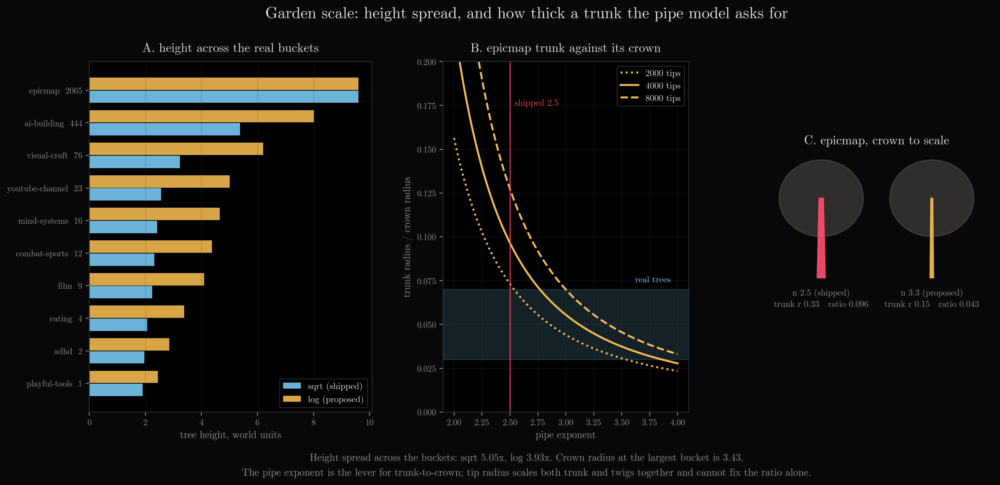

### 06-structure-fixed.png
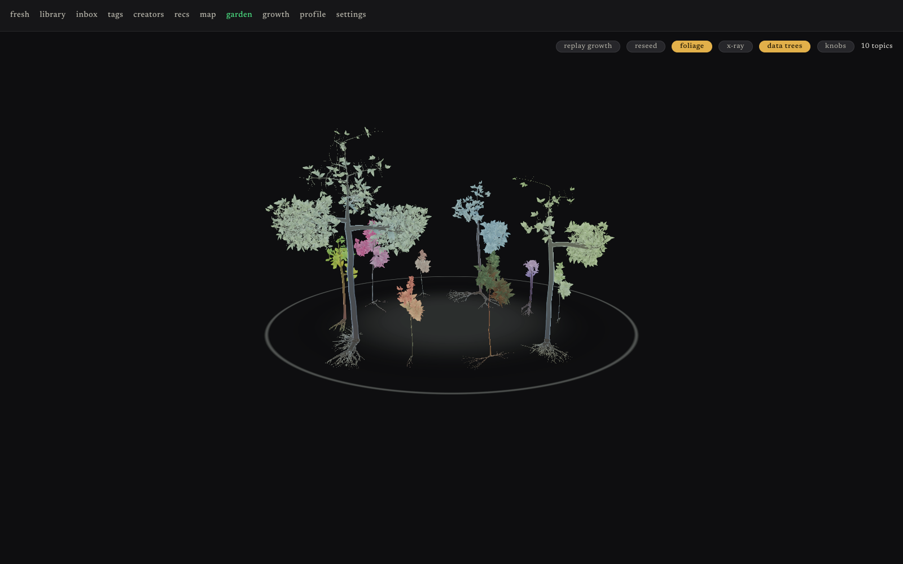

### 07-persistence-normalisation.png
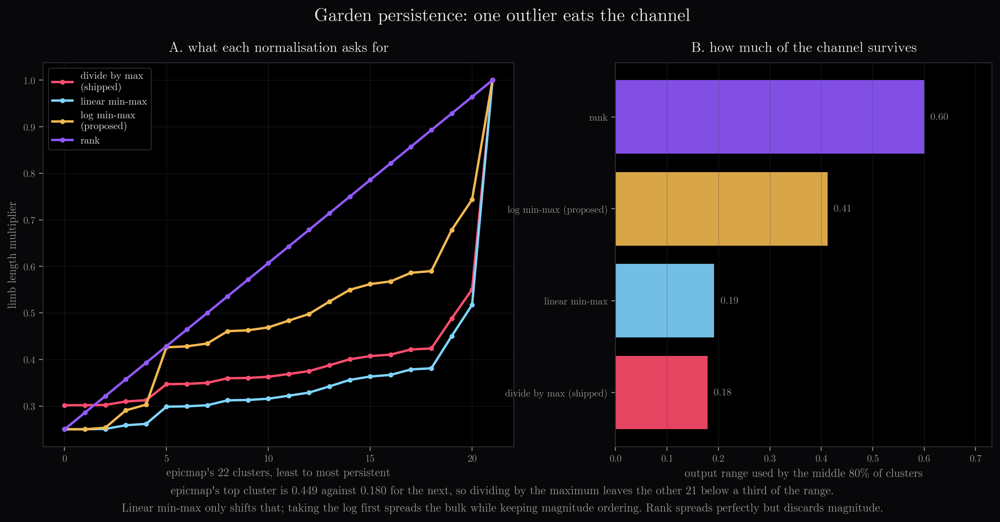
`epicmap` is one of my own project folders in the vault — a work project, and the largest bucket in the corpus.

### 08-crown-integrated.png
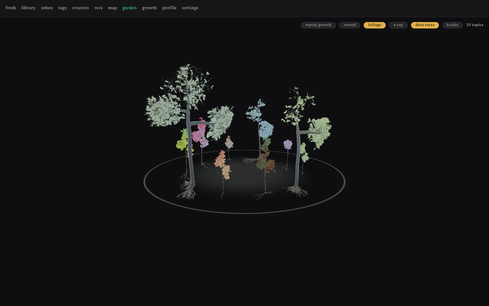

### 09-branching-geometry.png
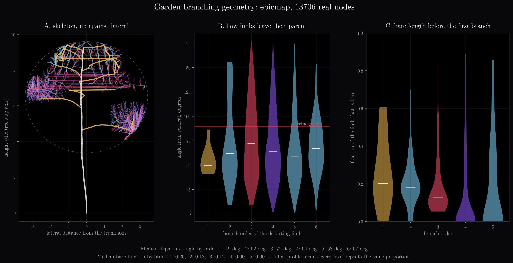

### 10-branching-before-after.png
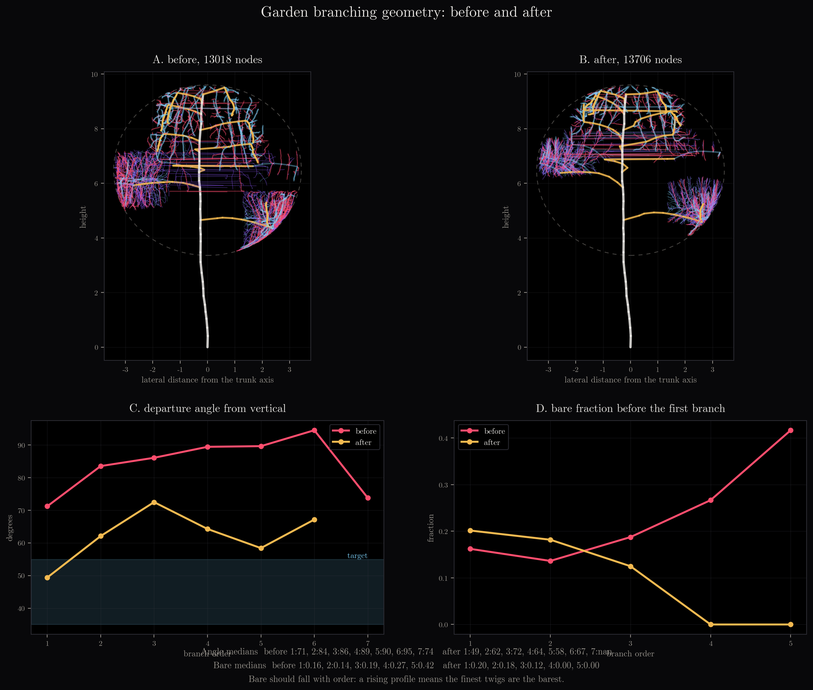

### 11-branching-render.png
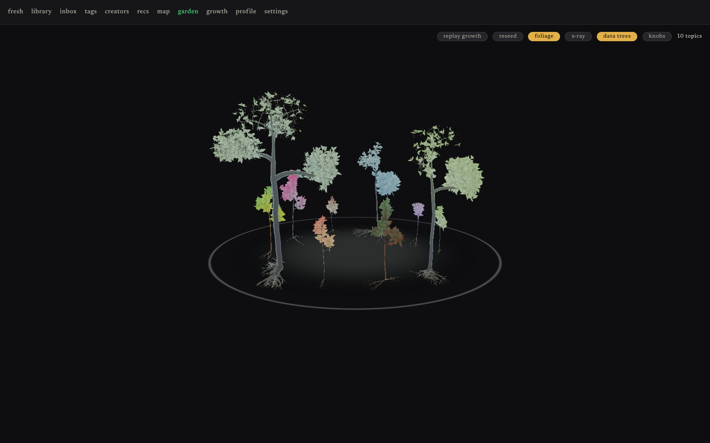

### 12-roots-before-after.png
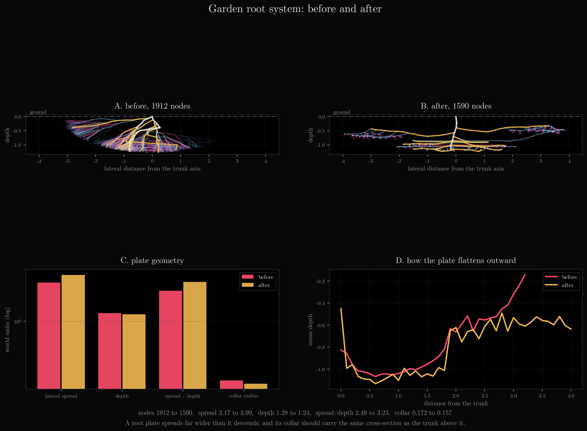

### 13-roots-render.png
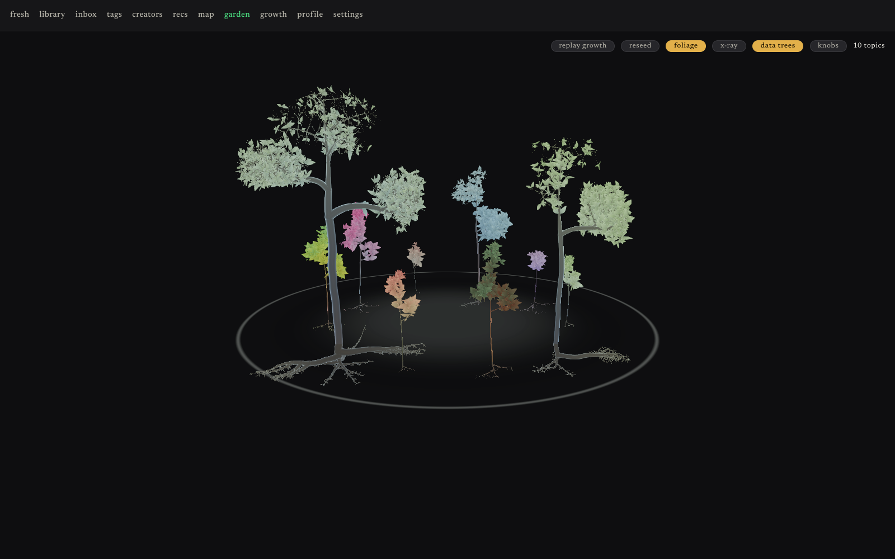

### Garden growth video (audio track)
[14-garden-growth-audio.mp4](14-garden-growth-audio.mp4)

### Garden growth video
[14-garden-growth.mp4](14-garden-growth.mp4)

## Files

- `01-limb-taper.png` — Murray radius taper profiles under three schemes
- `02-trunk-allometry.png` — trunk radius vs bucket size
- `03-tropism-axes.png` — branch-order and height tropism components
- `04-first-render.png` — initial garden render
- `05-scale-and-girth.png` — height scaling and girth balance across buckets
- `06-structure-fixed.png` — structure fix visualization
- `07-persistence-normalisation.png` — normalization strategies for persistence values
- `08-crown-integrated.png` — crown-integrated visualization
- `09-branching-geometry.png` — branching angles and fork structure
- `10-branching-before-after.png` — branching changes before/after
- `11-branching-render.png` — branching rendered in 3D
- `12-roots-before-after.png` — root system changes
- `13-roots-render.png` — roots rendered in 3D
- `14-garden-growth-audio.mp4` — time-lapse of garden construction (5.6 MB)
- `14-garden-growth.mp4` — time-lapse of garden construction (5.6 MB)
