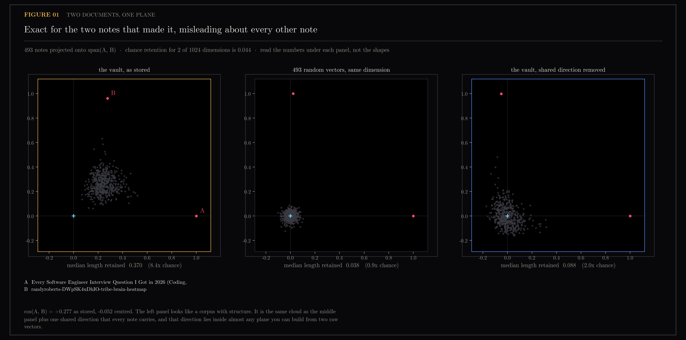
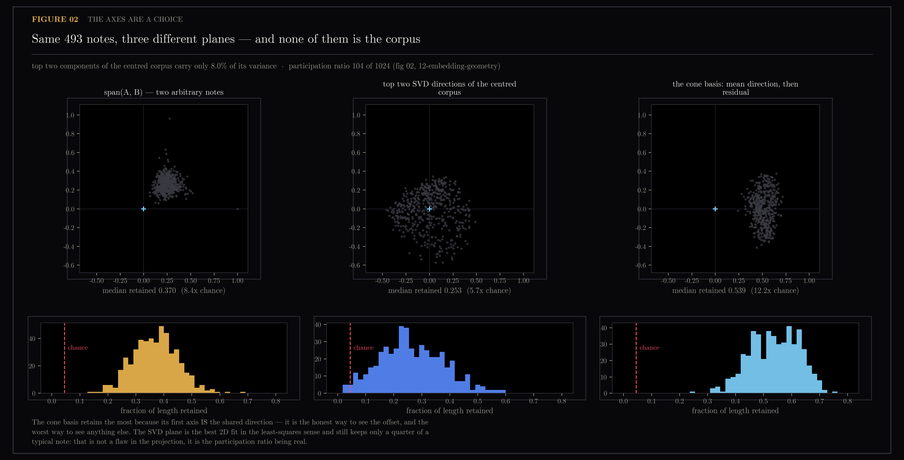
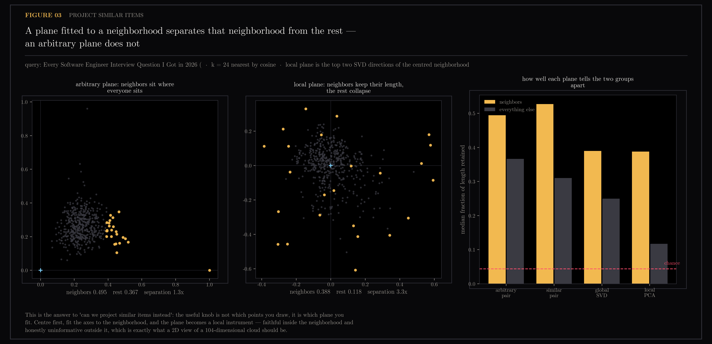
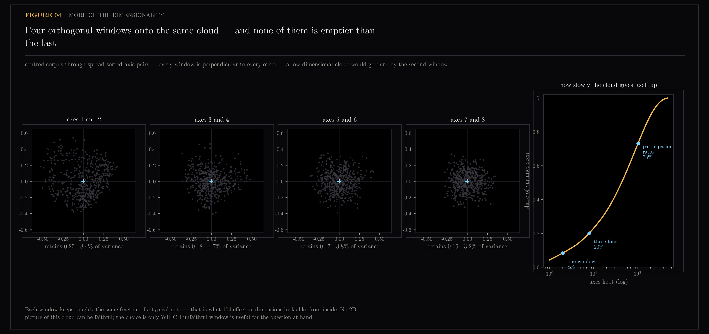
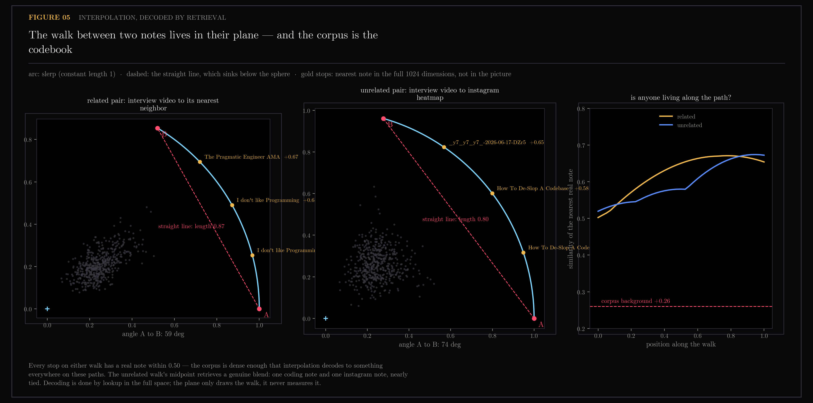

# A Plane Through Two Documents Shows You the Offset, Not the Corpus

Pick any two documents, take the flat plane their two embedding vectors span, and project the rest of the collection onto it. The picture that comes out looks like a meaningful map of the corpus. It is not one, and this section measures how badly it misleads.

The cause is the cone measured in [section 12](../12-embedding-geometry/README.md): in my vault — the note collection behind `ytk`, my personal knowledge system, which ingests YouTube, Instagram and web content and indexes it for semantic search — every note leans in the same shared direction, and an arbitrary pair-plane inherits that direction whether it wants to or not. So every unrelated note casts a shadow on it that is 8.4x longer than chance. The plane looks informative and is not.

Generated by `scripts/plot_plane.py`. Reproducible from the frozen `vectors.npz` in `../10-tag-coherence/` via:
```bash
uv run --with matplotlib python scripts/plot_plane.py
uv run --with manim manim -qm --media_dir /tmp/manim scripts/manim/plane.py ShadowPlane
cp /tmp/manim/videos/plane/720p30/ShadowPlane.mp4 docs/assets/15-plane-geometry/
```

Read-only: reads a frozen array. Touches neither the vault nor Chroma.

## Figures

### 01-the-plane.png


### 02-choosing-the-axes.png


### 03-project-similar.png


### 04-more-windows.png


### 05-interpolation.png


- [ShadowPlane.mp4](ShadowPlane.mp4) — animation

## Working notes

## Post material — a plane through two documents shows you the offset, not the corpus

Working notes. Figures 01–03 plus `ShadowPlane.mp4`. Reproducible from the
frozen `vectors.npz` in `../10-tag-coherence/` via `scripts/plot_plane.py`.

Read-only: reads a frozen array. Touches neither the vault nor Chroma.

### The question

Two documents are two vectors in R^1024. They span a plane. Can you draw it, and
is the drawing worth anything?

The first half is trivially yes — Gram-Schmidt, four lines. The second half is
the interesting one, and it is a direct consequence of the cone measured in
[section 12 (embedding geometry)](../12-embedding-geometry/README.md): the corpus
sits in a narrow cone rather than filling its sphere, with every note at cosine
0.51 from one shared direction.

### The finding

**An arbitrary pair-plane inherits the shared offset direction**, so every
unrelated note casts a shadow on it that is 8.4x longer than chance. The plane
looks informative and is not.

| plane | median length retained | vs chance |
|---|---|---|
| chance for 2 of 1024 dims | 0.044 | 1.0x |
| 493 isotropic controls, arbitrary pair | 0.038 | 0.9x |
| **the vault, arbitrary pair** | **0.370** | **8.4x** |
| the vault, centred first | 0.088 | 2.0x |
| top two SVD directions of the centred corpus | 0.253 | 5.7x |
| the cone basis (mean direction + residual) | 0.539 | 12.2x |

The isotropic control is the load-bearing row: same n, same dimension, same
construction, and it lands exactly on chance. So the 8.4x is not a property of
projecting from 1024 to 2 — it is a property of *this* cloud.

### Choosing the plane beats choosing the points

The question that prompted this was "instead of blindly projecting, could we
project similar items?" Measured on the 24 nearest neighbors of one note:

| plane | neighbors | everything else | separation |
|---|---|---|---|
| arbitrary pair | 0.495 | 0.367 | 1.3x |
| a *similar* pair (note + its nearest neighbor) | 0.527 | 0.310 | 1.7x |
| global SVD top 2 (centred) | 0.390 | 0.250 | 1.6x |
| **local PCA on the centred neighborhood** | **0.388** | **0.118** | **3.3x** |

Picking two similar documents helps a little. Fitting the axes *to the
neighborhood* helps three times as much, and it is the same amount of work.
The knob is the basis, not the point set.

Note what the winning row does **not** claim: the neighbors still keep only
0.388 of their length. A local plane is not a lossless view of a
104-effective-dimension cloud (the effective-dimension count measured in
[section 12](../12-embedding-geometry/README.md)), and no 2D view can be. What it is is a view whose
losses are *informative* — near-zero for things unlike the query.

### Caveats

- **One corpus, one encoder.** Specific to the v2 Qwen3/1024d epoch — an epoch
  being one generation of embedding model and the index built from it.
- **k = 24 is unfitted.** The separation ratio will move with k and nobody has
  swept it. It is a demonstration, not a tuned recommendation.
- **Retained length is not retrieval quality.** It measures how much of a vector
  survives a projection, which is the right question for *drawing*. Whether
  centring helps *search* is still open and belongs to the eval gate — the
  frozen known-item query set that scores every change to retrieval code — see
  [section 12](../12-embedding-geometry/README.md) and
  [section 8](../08-eval-gate-freeze/README.md).
- **The pair in figures 01–02 was chosen to be unrelated** (a coding-interview
  video and an Instagram heatmap, cos +0.277 as stored, −0.052 centred) so that
  any apparent structure in their plane is the geometry, not the topic.

### Figures

- `01-the-plane.png` — the plane of two notes, against an isotropic control and against centring
- `02-choosing-the-axes.png` — three planes over the same 493 notes, with the retention distribution under each
- `03-project-similar.png` — an arbitrary plane vs one fitted to a neighborhood
- `ShadowPlane.mp4` — the same construction with the camera orbiting: shadows onto the plane, before and after the offset is removed

### Sidecar

- `results.json` — in-plane coordinates and per-note retained length for all seven bases
- `../../scripts/manim/plane3d.json` — 3D cone-basis coordinates for the animation

### Render

```bash
uv run --with matplotlib python scripts/plot_plane.py
uv run --with manim manim -qm --media_dir /tmp/manim scripts/manim/plane.py ShadowPlane
cp /tmp/manim/videos/plane/720p30/ShadowPlane.mp4 docs/assets/15-plane-geometry/
```

## Files

- `01-the-plane.png`
- `02-choosing-the-axes.png`
- `03-project-similar.png`
- `04-more-windows.png`
- `05-interpolation.png`
- `ShadowPlane.mp4`
- `results.json`
