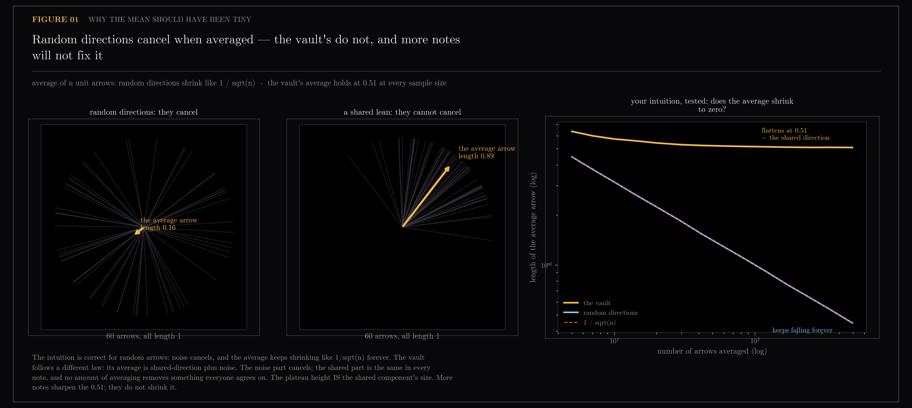
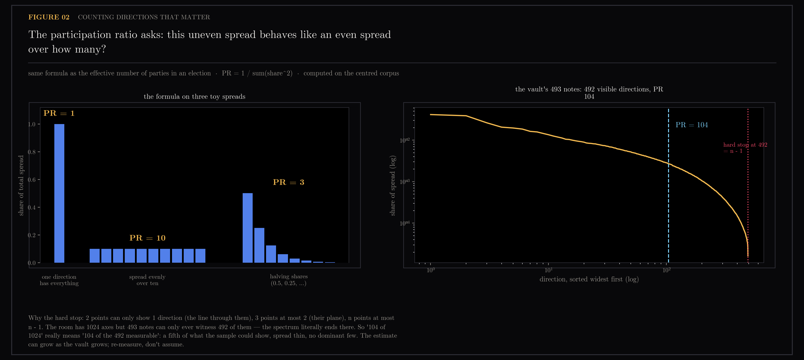
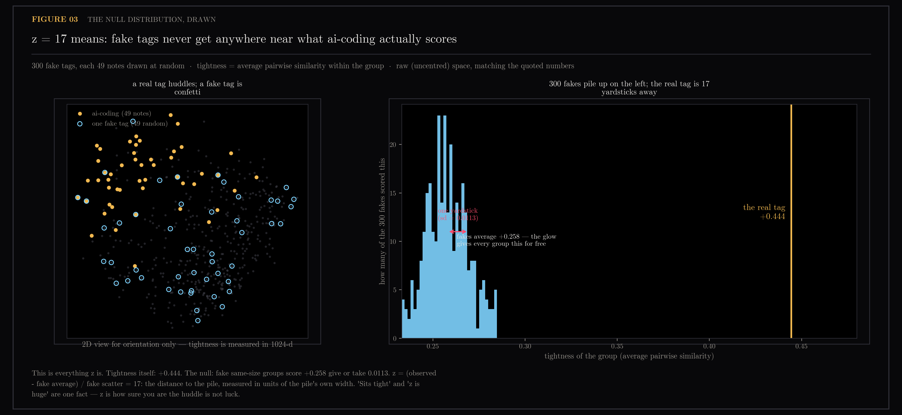

# Corpus-Shape Primer

Three of the load-bearing ideas in the embedding-geometry work are the kind that everyone nods along to and few people can actually picture: why sums of random high-dimensional vectors cancel, what an "effective dimension" count is counting, and what a z-score of 17 looks like when it is drawn instead of quoted. These figures draw them, one concept each, using the real corpus rather than a toy.

Pedagogical companions to [section 12 (embedding geometry)](../12-embedding-geometry/README.md) and [section 15 (plane geometry)](../15-plane-geometry/README.md), one concept per figure, each answering a question raised while reading the embedding-geometry results. The corpus is the note collection of `ytk`, my personal knowledge system, which ingests YouTube, Instagram and web content into an Obsidian vault and indexes it for semantic search.

Generated by `scripts/plot_primer.py`. Read-only: reads the frozen vectors.npz captured by `scripts/tag_coherence.py`. Touches neither the vault nor Chroma.

```bash
uv run --with matplotlib python scripts/plot_primer.py
```

No written notes exist for this section; the figures and the generating script are the record.

## Figures

### 01-cancellation.png


Demonstrates the concept of cancellation in high-dimensional spaces and the failure mode that creates the shared offset.

### 02-participation-ratio.png


Illustrates the participation ratio metric: what it measures and the n-limit ceiling on effective dimensionality.

### 03-null-and-z.png


Shows null distribution construction and the interpretation of high z-scores in the measured corpus statistics.

## Files

- `01-cancellation.png` — cancellation in high dimensions and cone formation
- `02-participation-ratio.png` — participation ratio metric and n-limit ceiling
- `03-null-and-z.png` — null distribution and z-score visualization
