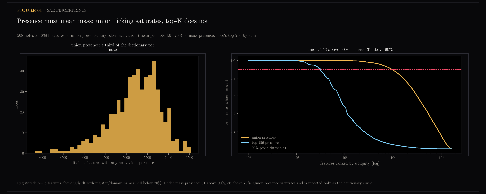
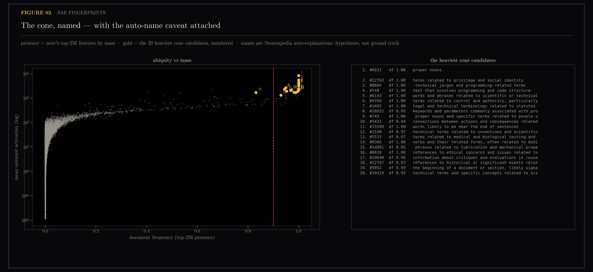
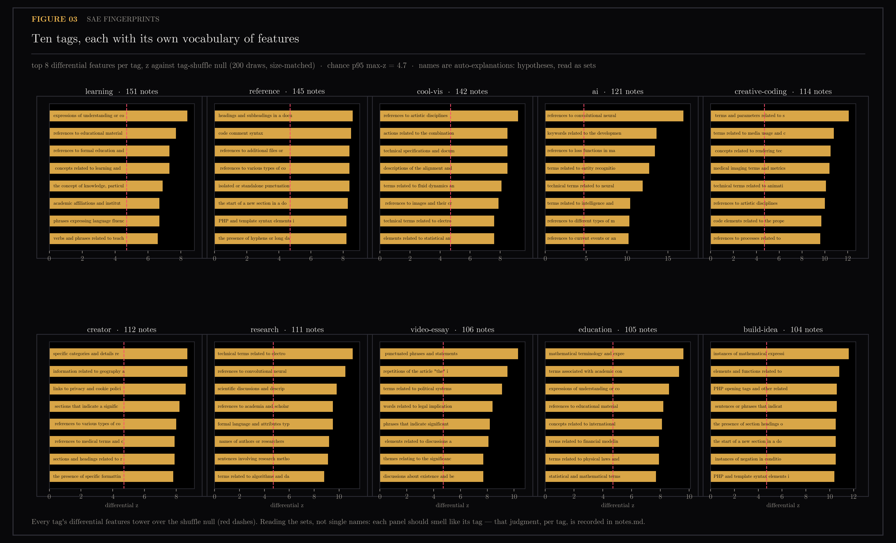
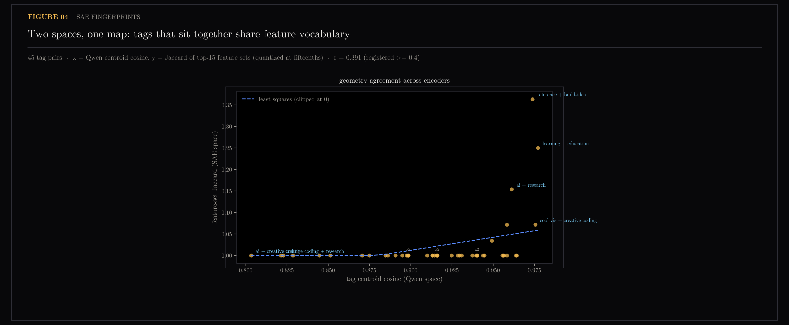
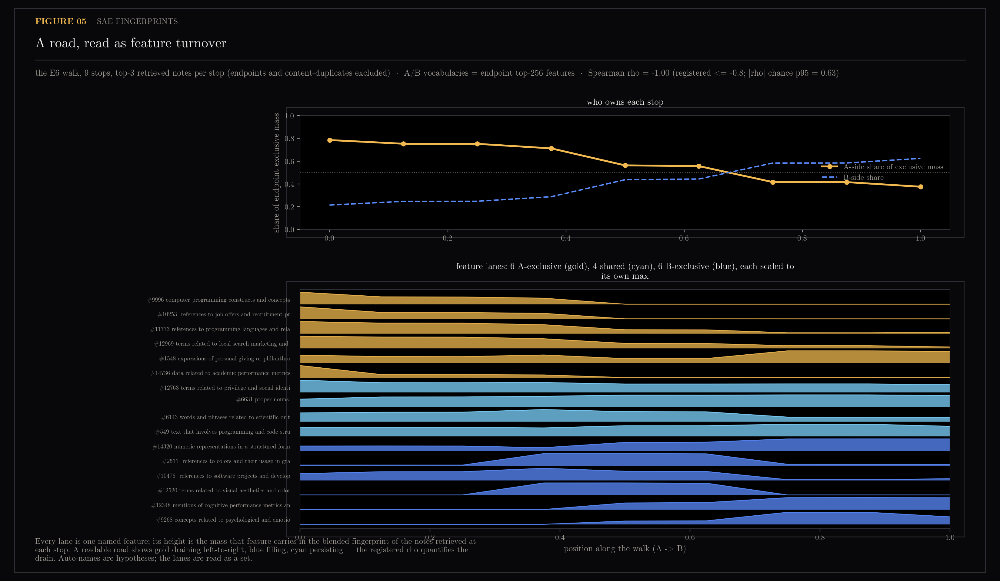

# SAE Feature Fingerprints — The Gemma Instrument

An embedding is a list of a thousand numbers with no labels on any of them. A sparse autoencoder (SAE) is a network trained to re-express that list as a short set of active entries drawn from a much larger dictionary — and because a public project has already attached human-readable names to those dictionary entries, the output is a description of a document in words instead of coordinates. This section borrows such an SAE (Gemma Scope, over Google's Gemma 2 2B) and runs an entire personal note collection through it, to ask three things: whether the shared direction every note leans in can be read as named features, whether tags correspond to coherent feature vocabularies, and whether walking between two notes reads as one vocabulary handing over to another.

The notes come from `ytk`, my personal knowledge system, which ingests YouTube videos, Instagram posts and web articles into an Obsidian vault and indexes them for semantic search. "The cone" is that shared direction, measured in [section 12](../12-embedding-geometry/README.md): every note sits at cosine 0.51 from one common axis, so much of any two notes' apparent similarity is something the whole collection shares. Sub-numbers below (18.0, 18.1, and so on) are individual pre-registered experiments inside this section; references like 19.1 or 21.2 point at experiments in [section 19 (rank metrics)](../19-rank-metrics/README.md) and [section 21 (road-network geometry)](../21-geometry/README.md).

Computing sparse-autoencoder feature fingerprints for 568 vault notes (~100-300 tokens each, thesis+summary) so that (a) the shared cone direction can be read as named features, (b) tag regions can be checked against feature sets, and (c) interpolation paths become named-feature diffs.

> **Later:** section 22 partitioned the same corpus in this fingerprint space
> and in the production Qwen space and found they measure different things —
> the SAE clusters are 0.949 source-pure (against 0.718 for Qwen themes and a
> 0.605 majority baseline), so this instrument sorts by register and medium
> where production sorts by subject matter. Read sections 18-21 as a voice
> lens: "the corpus voice" of 18.3 turns out to be literal. Section 24 supplies
> the complement — a top-k SAE trained natively on the Qwen space reads subject
> matter instead, at a finer grain than the theme partition reaches.

Generated by `scripts/sae_rig.py`, `scripts/sae_batch.py`, `scripts/sae_cone.py`, `scripts/sae_tags.py`, `scripts/sae_road.py`, and `scripts/sae_smoke.py`.


> **Privacy note:** third-party social handles and post ids in this section are pseudonymised (`creator-a`, `post-a1`, ...). The mapping is consistent, so identity relations the findings depend on — the same creator or the same post appearing twice — are preserved. Machine-readable sidecars keep the original identifiers because scripts index into the live vault by them.

## Figures

### 01-fingerprint-stats.png

L0 is the count of features a text switches on out of the dictionary's 16,384 — the sparsity of the fingerprint.

### 02-cone-features.png


### 03-tag-regions.png


### 04-tag-geometry.png


### 05-road-diffs.png


## Conclusions — the formal ledger

## The Gemma instrument — formal conclusions (sections 18-21)

What running Gemma 2 2B + Gemma-Scope SAE fingerprints over the corpus
bought, what it did not, and how the backlog moves. Verdict-level detail
lives in the working notes and pre-registration below, and in
`../21-geometry/README.md`;
this is the ledger.

### Gained — validated facts

1. **The cone is nameable.** The shared offset every note carries
   (norm 0.51 in Qwen space) reads as 31 always-on SAE features: technical
   register, code structure, proper nouns, discourse scaffolding (18.3).
   The corpus-wide anisotropy is not noise; it is the shared voice of the
   collection, and it now has a feature-level inventory.
2. **The cone has internal geometry.** Six antipodal decoder pairs put
   twelve of those 31 features exactly on the 1/2-dimensionality plateau —
   the toy-model digon, in production decoders (21.2, against the
   registered skeptical prediction). Hypothesis on record: always-on
   antipodal pairs are signed axes, so the cone may carry ~6 bidirectional
   dimensions rather than 31 independent ones.
3. **Tags are feature vocabularies.** 9 of 10 large tags have coherent
   differential feature sets (18.4); the tag-pair z-vector cosines track
   Qwen centroid cosines only weakly and the shuffle control took back the
   headline correlation (18.4b) — recorded as the honest boundary of the
   claim.
4. **Roads read as vocabulary handover.** Perfectly monotone on both
   registered roads (rho = -1.0; 18.5, 20.1); the single-crossing premise
   does not generalize to all 45 tag pairs (21.4 kill), so handover is a
   per-road readout, not a universal law.
5. **Instrument discipline, earned twice.** Auto-names are unreliable until
   token-probed (drug-usage/privilege mislabels); comparisons must be
   pool-matched (the 18.1 false kill); sum pooling and top-256 mass
   presence are the recorded conventions.

### Gathered — artifacts now on disk

- `fingerprints.npz`: 568 x 16384, sum + max pooling, fp16, sha256-stamped
  manifest; full-corpus coverage against the live store after the #164 fix.
- `cone-features.json`, `tag-regions.json`, `road-diffs.json`,
  `../21-geometry/cone-decoder.npz` (the 31 decoder rows), plus the
  validated local rig (`sae_rig.py`, `sae_batch.py`) and figures for every
  claim.
- A working Neuronpedia API playbook (search-all needs sortIndexes; feature
  batch naming; token-level activation probes) in the landscape section below.

> **Later:** the coverage warning at the bottom of this ledger came true.
> Sections 22-25 all run on 532 of 604 themed notes (88%) because the npz is
> still frozen at the 2026-08-02 batch, and section 25 records why: a
> corpus-wide rebatch "was attempted twice overnight and failed twice — a
> wedged MPS process after machine sleep, with no intermediate checkpointing."
> `sae_batch.py` is now checkpointed and resumable, so rerunning it retires the
> limit.

### Unlocked — possible now, not yet built

- **Feature lanes on the road itinerary**: name what changes along a path
  (18.5's verdict: lanes name the change, narration says what it means).
  Blocked only on serving a fingerprints sidecar — the wheel does not ship
  the npz.
- **Corpus-quality scanning by feature**: rank notes on the cookie-policy
  feature to find boilerplate contamination retroactively (#167); the
  fingerprint matrix doubles as a data-quality instrument.
- **Signed-axis probing**: token-level tests of the six antipodal pairs —
  the cheapest next interpretability experiment with a real payoff for
  understanding what the corpus voice is made of.

### What it did NOT change

- **Production search is untouched.** The 19.1 gate — a registered
  requirement that some non-cosine metric win by at least 2 points before
  anything ships — was not met; cosine stays; the retrieval eval baseline was
  never re-stamped. No Gemma-derived signal is in any ranking path.
- **The hub shipped nothing Gemma-dependent.** The /map road layer runs
  entirely on Qwen embeddings.

### Backlog deltas

- **#166 (duplicate audit)** — strengthened: content-identity dedup is now
  a measured necessity (19.3), and the ingest-time guard has a concrete
  mechanism.
- **#167 (boilerplate)** — strengthened: gains a retroactive detector, not
  just an ingest-time strip.
- **#168 (tag consolidation)** — strengthened: near-synonym evidence now
  comes from two independent instruments (centroid cosine + feature-set
  coherence).
- **#164 (two-store fork)** — unchanged, still gate-gated; the incident it
  caused (127 skipped rows) is why the batch has a manifest.
- **New, unfiled, deliberate**: fingerprints sidecar serving (decide when
  lanes are wanted); antipodal-pair probing (research, no issue needed);
  re-batch cadence for new notes (the npz freezes at 568 — an incremental
  append using the manifest hashes is the obvious design).
- **Parked by evidence**: any roundabout-style UI construct (21.4 kill);
  tag-level road overlays without interchange dedup (21.3: 19 notes answer
  everything).

### Which existing features improve or get worse

- **Improved (evidence, not code)**: triage of corpus hygiene now has
  ranked, mechanical detectors; road narration has a validated
  complementary readout waiting on serving; tag cleanup has a defensible
  merge list source.
- **Unchanged**: search, dive, feed, profile, quiz — by design, since the
  eval gate said no.
- **Worse: nothing in product.** The costs are operational: a full
  fingerprint refresh is ~2.5h on MPS for the current corpus, coverage
  freezes at batch time, and every conclusion above is stamped to the 568
  notes and the v2 Qwen epoch — growth silently ages the instrument until
  a re-batch.

## Working notes

## SAE feature fingerprints — working notes

Pre-registered predictions: the pre-registration section below (commit ea2315b,
before any measurement). Landscape and API facts: the landscape section below.
This file records
results in experiment order, including failed predictions, verbatim against
what was registered.

### 18.0 — API smoke test (2026-08-02)

**Instrument findings first.** `POST /api/search-all` returns HTTP 500 —
not a validation message — when `sortIndexes` is omitted; the field is
required in practice. With the full body the endpoint works anonymously.
Measured latency ~8s per call for a 1546-char note (the number the
landscape flagged as unpublished): 568 notes ≈ 75 min sequential via API,
which strengthens the local-rig plan for the batch. Raw request/response
JSON in `smoke/`.

**Pre-registered prediction: FAILED as operationalized.** Registered: ">= 6
of the top 10 features have names recognizably related to the note's
content"; kill at < 3. Note: the De-Slop codebase video. Result under the
naive operationalization (top-10 by `maxValue`, the API's own ordering):
**1 of 10** — nine are token-level spike features ("forms of the verb
walk", "references to the name John", "repetition of the word every").
Below the kill threshold as written.

**Diagnosis before invoking the kill.** Sorting by peak single-token
activation structurally selects features that spike once on one token.
Re-ranking the same response by summed activation across tokens (recorded
as an instrument amendment, not a prediction edit): **3 of 10** topical —
"technical jargon and programming-related terms" (#8684) becomes rank 1
with 41 of ~350 tokens active, plus "deep learning" (#6906) and "skills or
skill sets" (#11299) — but function-word features ("a", "the",
punctuation, "to") hold ranks 2-5 because they are dense in all English
text. 3/10 sits exactly at the kill boundary and still under the
registered 6/10.

**What was learned (not assumed).** A single note cannot rank its own
features: without each feature's corpus-wide baseline frequency there is
no way to separate content features from generic-English scaffolding —
the same correction tf-idf applies to words, and the same operation
18.4's tag diffing was already designed to do. Two consequences carried
forward:

1. Fingerprints aggregate by **sum over tokens** (peak-token ranking is
   structurally misleading); the mean-vs-max question from prior art is
   answered for ranking purposes before the batch ran.
2. All feature *reading* happens on baseline-corrected scores
   (note-vs-corpus or tag-vs-corpus differentials), never on raw
   single-note rankings. Step 18.3's cone candidates are, by this same
   logic, expected to be exactly the scaffolding features that polluted
   this list — the smoke test previewed the cone rather than refuting the
   pilot.

**Verdict:** not a kill (>= 3 under the amended instrument), but the 6/10
prediction failed and is reported as failed. The pilot proceeds with the
two instrument rules above; if baseline-corrected reading in 18.3/18.4
still surfaces garbage, that is the real kill.

### 18.1 — local rig cross-validation (2026-08-02)

**Prediction: CONFIRMED, with one instrument correction en route.** The
first scoring pass compared local top-10-by-sum over all 16k features
against the API's top-10 — but the API only returns its top-100 features
by peak activation, so the two sides ranked over different candidate
pools. Unrestricted overlap (2.0/10 mean) exactly equals the count of
local winners present in the API pool at all, and median relative
activation difference on shared features was already ~2% — values agreed,
pools did not. Pool-matched scoring (rank both sides inside the API's
candidate set): **10/10 on all five notes, mean relative activation
difference 0.4-2.3%**, against the registered >= 7/10 and <= 10%.

The rig — unsloth-mirror Gemma 2 2B bf16 on CPU, hook
`blocks.20.hook_resid_post`, SAE `gemma-scope-2b-pt-res /
layer_20/width_16k/average_l0_71` — is validated as an instrument. The
mirror-vs-official weight question is closed by the same numbers.

Carried forward:

1. **The API's 100-feature cap is a real ceiling**, not a nuisance: most
   of a note's high-mass (dense) features fall outside its top-100 by
   peak. Corpus statistics computed from API responses would be silently
   truncated — the batch must be local. (`rig-validation.json` keeps both
   overlap numbers.)
2. **Measured throughput: 25-43s/note on CPU** (~330-530 tokens each),
   so the full batch is ~4.5 CPU-hours. An MPS run is only admissible if
   it passes this same validation procedure against the now-trusted CPU
   reference.

### 18.2 — the batch, and the two-store incident (2026-08-03)

MPS passed its admissibility gate 10/10 against the CPU reference, then the
first full batch silently ran against a stale database: `runtime_config()`
picks the live HTTP server only when CHROMA_URL is set, and that env var is
an import side effect of `ytk.vault` — a bare `from ytk import store`
opens the embedded legacy fork (videos_v2 = 200 vs 289 live) with no
error. Caught because 127 notes had no text and the number refused to make
sense; filed as #164 (mechanism fix in store.py, gate-gated). The batch
was re-run in full against the live store: **568/568 fingerprinted, 0
skipped, 0 zero-fingerprints**, 93 min on MPS, per-row text sha256 now in
the manifest so store drift is diffable instead of forensic.

The registered acceptance check ("mean per-note L0 within 2x of 71") was
itself misspecified: 71 is the SAE's per-token L0; the union of features
across a 300-500-token note is a different quantity (measured mean 5209).
Reported as a miswritten check, not waved through.

### 18.3 — the cone, named (2026-08-03)

**Prediction: CONFIRMED — after the presence notion earned its third
instrument lesson.** Under union presence (any activation on any token),
953 features exceed 90% document frequency: a third of the dictionary
ticks somewhere in every note, so ubiquity is an artifact. Under mass
presence (note's top-256 features by summed activation), the curve
separates cleanly: **31 features above 90% df, 56 above 70%** — against
the registered >= 5, with the kill floor (nothing above 70%) nowhere in
sight.

The heaviest cone features read as register and domain, exactly as
predicted: programming jargon (#8684), programming/code structure (#549),
programming keywords and parameters (#10931), scientific/technical
process vocabulary (#6143), proper nouns (#6631, the single heaviest —
titles and names), sentence-position scaffolding (#15509), document-start
markers (#5052). The Qwen cone's likely composition — technical register
+ explanatory prose + name-dense summaries — now has named, checkable
constituents.

**Auto-names are hypotheses, not ground truth — measured twice.** #4932
("drug usage and its effects", df 1.0 under union) fires on ' session',
' repo', ' mode', ' skill' in a coding note; #12763 ("privilege and
social identity", cone rank 2) fires on subword fragments ('cock' from
cockpit, 'offs' from trade-offs) and glue tokens. Rule carried into
18.4/18.5: read differential feature *sets*; never conclude from a single
auto-name, and probe any load-bearing feature at token level via
`/api/activation/new` before quoting it.

### 18.4 — tag regions as feature sets (2026-08-03)

**Primary prediction: CONFIRMED, 9 of 10 tags coherent** (registered >= 7,
kill < 4). Judged set-wise per panel (fig 03): `ai` (CNNs, loss functions,
entity recognition), `creative-coding` (shader parameters, rendering,
animation), `research` (scientific discussion, academia, author names,
methods), `reference` (headings, code-comment syntax, file references),
`learning`/`education` (understanding, educational material, math and
academic vocabulary), `cool-vis` (artistic disciplines, images, fluid
dynamics), `build-idea` (math expressions, functions, PHP/template
syntax, section structure), `video-essay` (coherent as register:
punctuated essayistic prose, article density, plus politics/legal
topics). The failure is `creator`: geography, cookie-policy links,
medical terms — diffuse, no readable signature. Every tag's top features
stand far above the tag-shuffle null (real z 7-17 vs chance p95 4.7), so
the control behaves.

**Quantitative companion: FAILED, marginally.** Registered: top-15
feature-set Jaccard vs Qwen centroid cosine at r >= 0.4. Measured:
r = 0.391. An earlier unregistered top-8 operationalization gave 0.420
and is not the number of record. The relationship is visibly real
(fig 04: reference+build-idea 0.36, learning+education 0.25, ai+research
0.15 sit exactly where Qwen puts them) but Jaccard on 15-element sets is
quantized at fifteenths and mostly zero, so the correlation rides on four
points. A follow-up with a continuous set-overlap measure (rank-biased or
weighted) belongs in the next round — as a new registered experiment,
not a retrofit.

### 18.5 — roads as feature turnover (2026-08-03)

**Prediction: CONFIRMED, maximally.** A-side share of endpoint-exclusive
mass falls perfectly monotonically across all 9 stops: Spearman rho =
-1.000 against the registered <= -0.8, with shuffled-order chance |rho|
p95 = 0.63. Vocabularies all non-empty: 183 A-only, 73 shared, 183
B-only. The share curve (fig 05) crosses at t ~ 0.65, not 0.5 — the
tech-heavy corpus keeps middle stops speaking A's vocabulary longer.
The lanes read: gold drains (programming constructs, job
offers/recruitment, programming languages), blue fills (colors in
graphics, visual aesthetics, cognitive performance, psychological
concepts), cyan persists (proper nouns, technical register — the cone).
The content-dedup rule from E6 is applied by shortcode marker, not row
index.

Side-by-side verdict vs the E6 Haiku narration (blend-demo.md in
17-corpus-growth): the feature readout names *what changes*; the
narration says *what it means*. They are complements, not substitutes —
the road interface should show lanes and let narration be the optional
gloss, which also makes most road renders free of any model call.

> **Later:** section 21.4 asked whether the monotone-handover result
> generalizes and it does not. Only 31 of 45 tag roads cross the 0.5 share
> line exactly once — 13 never cross because they start B-dominant at t = 0,
> one crosses twice — against a registered floor of 35, which killed the
> roundabout construct. Monotone handover survives as a per-road readout on
> the two measured roads, not as a law of the corpus.

### Section verdict

Five experiments, five pre-registered predictions: 18.0 failed (fixed
the ranking instrument), 18.1 confirmed after a pool-matching
correction, 18.3 confirmed (31-feature cone, named), 18.4 primary
confirmed 9/10 with the quantitative companion failed at r = 0.391 vs
0.4, 18.5 confirmed at rho = -1.0. The SAE-fingerprint layer earns its
place: the cone is readable, tags have vocabularies, roads have named
turnover. Everything downstream inherits four instrument rules: sum over
tokens, mass presence, pool-matched comparisons, and auto-names as
hypotheses probed at token level when load-bearing.

## Pre-registration

## Pre-registration — sections 18 (SAE fingerprints), 19 (rank metrics), 20 (query spaces)

Committed before any measurement in these sections runs. Each experiment
states its question, a falsifiable prediction, the control it is judged
against, and the kill criterion that stops the line. Results that contradict
a prediction are reported as such; predictions are never edited after the
fact. Landscape facts and API details: `landscape.md` (verified 2026-08-02).

### Section 18 — SAE feature fingerprints

SAE: `gemma-scope-2b-pt-res`, layer 20, width 16k, average L0 71 (the
Neuronpedia-named configuration). Texts: thesis + summary per note, the same
content the Qwen3 embeddings encode. Both mean- and max-pooled fingerprints
kept throughout (prior art max-pools; unsettled for 100-300-token notes).

#### 18.0 — API smoke test

Question: do the endpoint shapes in landscape.md hold, and do the named
features for one real technical note pass a sniff test?
Prediction: at least 6 of the top 10 features for a known coding-topic note
have names recognizably related to its content (topic, register, or
programming domain) rather than pure formatting/token-level features.
Control: none — this is an instrument check.
Kill: fewer than 3 of 10 recognizable — stop, revisit layer/width before
building anything.

#### 18.1 — local rig cross-validation

Question: does the local CPU pipeline reproduce Neuronpedia's reference
inference?
Prediction: on 5 notes, local top-10 feature sets overlap the API's top-10
by at least 7/10 on average (ordering may differ; activation values within
10% on shared features).
Control: the API is the reference implementation.
Kill: overlap below 5/10 on any note — hook-name or numerics bug; do not
run the batch on an unvalidated rig.

#### 18.2 — full batch

Instrument step, no hypothesis. Recorded acceptance check: mean per-note L0
within a factor of 2 of the advertised average 71; fewer than 1% of notes
with zero active features. Artifacts: fp16 npz (both poolings), manifest,
L0 + feature-frequency figures.

#### 18.3 — name the cone

Question: is the shared offset every note carries (‖mean‖ = 0.51 in Qwen3
space) readable as named features?
Prediction: at least 5 features are active in >90% of notes, and their
names describe register/domain (technical English, explanatory prose,
AI/programming) rather than looking arbitrary.
Control: document frequencies against a permutation null (activations
shuffled across notes per feature) to separate "always-on" from chance.
Secondary, exploratory (not confirmatory): projection of always-on
features' decoder directions onto Gemma's own residual mean — the Qwen3
cone direction lives in a different space and cannot be compared directly;
any cross-space claim requires text-level evidence, not vector algebra.
Kill: no feature exceeds 70% document frequency — conclusion becomes "the
shared component is not in the SAE dictionary", which is itself reportable.

#### 18.4 — tag regions as feature sets

Question: do interest_tags correspond to coherent differential feature sets?
Prediction: for at least 7 of the 10 largest tags, the top-15 differential
features (tag-mean fingerprint minus corpus mean) are topically coherent
with the tag name, judged per tag and recorded before seeing the other
tags' results. Quantitative companion: pairwise tag feature-set Jaccard
correlates with Qwen3 centroid cosine at r >= 0.4.
Control: tag labels shuffled across notes; differential features above the
real threshold should nearly vanish.
Kill: fewer than 4 of 10 tags coherent — feature diffing does not carve
this corpus; stop before building anything on it.

#### 18.5 — roads as feature diffs

Question: does a slerp road read as monotone feature turnover?
Prediction: along the E6 road (interview -> instagram heatmap), the share
of A-side features among each stop's retrieved notes decreases
monotonically in t (Spearman rho <= -0.8 across stops), and the
fading-out / persistent / fading-in sets are all non-empty with readable
names.
Control: a random re-ordering of the same stops must not show monotone
turnover.
Kill: no monotone structure — feature space does not track the walk;
roads keep LLM narration and drop the feature readout, reported honestly.
Judgment call recorded up front: whether the set-diff readout beats the
existing Haiku narration is subjective; both are shown side by side and
the verdict is argued, not scored.

#### 18.4b — continuous cross-space agreement (registered 2026-08-03, after
#### 18.4's quantized companion failed at r = 0.391)

Question: was the 18.4 companion failure the quantization or the absence of
a relationship? Replace fifteenths-quantized Jaccard with a continuous
measure: per tag, the full 16384-dim differential-z vector from 18.4; per
tag pair, the cosine between those z-vectors (SAE side) against the Qwen
centroid cosine, over the same 45 pairs.
Prediction: r >= 0.4 — same threshold as the failed companion, kept
deliberately: if quantization was the problem, removing it should clear
the same bar, not a lowered one.
Control: z-vectors recomputed under shuffled tags give r near 0.
Kill: none; either answer resolves the question. Declared context: the
18.4 point estimates were already seen when this was registered — the
z-vectors themselves are reused, only the pair-similarity measure is new.

> **Later:** section 19 ran it. The bar was cleared at r = 0.832 — and the
> control collapsed: shuffled labels give r = 0.757, because tag z-vectors
> share corpus-level structure whatever the labels say and both spaces inherit
> it. The tag-specific excess is real but small, the interpretation was
> withdrawn, and the 18.4 quantized-Jaccard failure was therefore not merely
> quantization.

### Section 19 — rank metrics (Phase A, offline; Phase B only through the gate)

Metrics: cosine, cosine-centred, L1, Spearman (rank-transform then cosine),
Spearman-centred, CSLS(k=10). All on the fresh snapshot, read-only.

#### 19.1 — tag-match@10

Prediction (from arXiv 2606.29571 given ‖mean‖ = 0.51): Spearman and L1
beat raw cosine on tag-match@10 by >= 2 points absolute; after centring the
rank-vs-cosine gap shrinks below 1 point.
Control: permuted-tag baseline sets the floor.
Kill: none (any outcome is informative), but Phase B is only earned by a
win >= 2 points from some non-cosine metric.

> **Later:** failed. Section 19 measured cosine 82.0, L1 81.9, Spearman 81.7,
> CSLS(10) 82.6 against a permuted floor of 41.4 — rank metrics lose to cosine
> on this corpus, and the anisotropy-decides regime split did not replicate.
> No metric cleared the 2-point bar, so Phase B was not earned and production
> search stays cosine. The only gain anywhere was centring, at +1.2.

#### 19.2 — hub flattening

Prediction: CSLS(k=10) cuts the census top-10 answerer share (12%) by at
least a third while path min-support distribution shifts by less than 0.01
at the median.
Control: the existing census under cosine is the baseline.

#### 19.3 — duplicate detection

Prediction: the known duplicate pair (creator-a post-a1 twice) ranks
strictly higher relative to ordinary near-neighbors under CSLS than under
cosine.

#### 19.4 — Phase B (gated)

Only if 19.1 shows the win: metric behind a flag in store.py, judged by
`uv run ytk eval` against the frozen baseline. The gate's verdict is final;
no re-stamping.

### Section 20 — query spaces (designed in detail only after 18/19 report)

Pre-registered at mode level now, deliberately not in detail — detailed
designs would assume 18/19 conclusions this plan exists to earn:
barycentric 3-note blends, local-PCA region windows, extrapolation past an
endpoint, tag-centroid roads, low-support gap hunting. Each will get its
own prediction/control/kill block appended here before it runs, under
whichever metric section 19 selects and whichever readout (feature diff vs
narration) section 18.5 selects. The first artifact of section 20 is the
road between the two strongest coherent interests, so the machinery is
demonstrated on interests that matter, not a deliberately weird pair.

### Section 20 — query spaces (detailed registration 2026-08-03, after 18/19)

Inherited instrument rules: cosine retrieval (19.1's verdict), content-identity
dedup, mass presence, sum pooling, auto-names as probed hypotheses.

> **Later:** section 20 reported all four blocks. **20.1** confirmed (a) —
> minimum stop support 0.750 against a 0.259 background — and (b) at
> rho = −1.0, but failed (c): zero bridge stops, every stop's top note carries
> an endpoint tag, because the corpus has dense borders rather than sparse
> ones. **20.2** confirmed at exactly the bar, 3 of 10, with the degenerate
> control at 0/10. **20.3** failed: the p5 of support crosses background just
> before t = 1.5, so the usable leash is t <= 1.25. **20.4** failed and the
> failure is the finding — 1 of 45 pairs qualified, and all 45 bridges sit in
> a narrow 0.556-0.631 band, so this corpus has no meaningfully weak bridges
> at tag level.

#### 20.1 — the highway: tag-centroid road between the two strongest interests

Endpoint rule, fixed before looking: A = the most coherent tag by fresh z
(17-corpus-growth E3); B = the next most coherent tag whose Qwen centroid
cosine with A is below the median of the 45 large-tag pairs (guaranteeing a
genuinely distinct region). Nine slerp stops between unit centroids, top-3
notes per stop, feature lanes from the tags' mean fingerprints (top-256
vocabularies).
Predictions: (a) support >= corpus background at every stop; (b) A-side
feature share monotone in t, Spearman rho <= -0.8; (c) at least one stop's
top note carries neither endpoint tag — a genuine bridge note.
Control: shuffled stop order for (b), as in 18.5.
Kill: none — each sub-verdict recorded separately.

#### 20.2 — barycentric blends (registered now, runs later)

Spherical weighted mean of 3 notes vs the three pairwise midpoints.
Prediction: in >= 3 of 10 seeded coherent triples, the barycenter's top
retrieved note differs from all three midpoints' top notes — the mode
expresses queries pairwise roads cannot. Control: degenerate triples
(note plus its two nearest neighbors) should show no such novelty.

#### 20.3 — extrapolation past an endpoint (registered now, runs later)

Walk t in (1, 1.75] beyond B on the A->B arc ("more of B, away from A").
Prediction: support decays with t but stays above corpus background
through t = 1.5 — the cone keeps even extrapolations inhabited.
Verdict decides whether "more of this, less of that" is a usable query.

#### 20.4 — gap hunting: the missing-bridges list

All 161k note pairs' midpoint support (t = 0.5, endpoints excluded from
retrieval). Aggregate to the 45 large-tag pairs: mean midpoint support
per tag pair, against endpoint centroid cosine.
Prediction: at least 2 of the 45 pairs combine two individually coherent
tags (fresh z > 2) with mean midpoint support below the all-pairs median
— genuinely weak bridges between real interests, i.e. named acquisition
targets for the feed. Control: the relationship between endpoint cosine
and midpoint support is reported alongside, so "weak bridge" is never
just "distant endpoints" restated.
Kill: none — an empty acquisition list is itself the answer.

### Section 21 — road-network geometry (registered 2026-08-03, before any
### measurement; artifacts land in docs/assets/21-geometry/)

Motivating methodology: Toy Models of Superposition (Elhage et al. 2022,
transformer-circuits.pub/2022/toy_model) — features under packing pressure
arrange into readable geometry (antipodal pairs, polytopes, measured via
per-feature dimensionality and angle spectra) — and the SAE-scale follow-up
(Li et al. 2024, arXiv 2410.19750), which finds lobes and power-law spectra
rather than crystals at real-model scale. Section 21 transplants those
instruments to two object sets already on disk here: centred Qwen tag centroids
and the 31 mass-present cone features' decoder directions.

Declared priors (all previously measured, all informing predictions below):
cone ‖mean‖ = 0.51 (section 12); corpus effective dimension ~104 and the
pair-plane shadow inflation 8.4x with local-PCA separation 3.3x (section 15);
median large-tag-pair raw centroid cosine 0.9161 and the 20.1 highway;
census top-10 answerer share 12% (section 17); monotone vocabulary handover
rho = -1.0 on both measured roads (18.5, 20.1); 45 tag-pair bridge supports
in a 0.556-0.631 band (20.4).

#### 21.0 — instrument rules for geometry

Not a hypothesis. All angle and subspace measurements run on centred,
renormalized vectors (subtract the corpus mean, renormalize) unless a row
explicitly compares centred vs raw — section 15 measured that raw pair-planes
inherit the offset and look 8.4x more structured than they are. Road
machinery inherits: cosine retrieval on raw vectors (production behavior,
19.1), content-identity dedup, stops = 9, k = 3. The road set for 21.3/21.4
is the 45 large-tag-pair centroid roads. Every null is same-n, same-dim,
matched-construction, per the section 15 isotropic-control pattern.

#### 21.1 — the shape of the city map

Question: after centring, do the 10 large-tag centroids arrange as generic
near-orthogonal high-d directions, or as a structured low-dimensional
constellation?
Measurements: pairwise cosine matrix of centred unit centroids; participation
ratio of their Gram eigenspectrum.
Predictions: (a) mean pairwise |cos| exceeds the isotropic null p95 (10
random unit vectors in R^1024); (b) the cosine spread (max minus min) exceeds
the subset-centroid null p95 (centroids of 10 random disjoint same-size note
subsets) — tags are real directions, not noise around the mean; (c)
participation ratio <= 5: the interest constellation is thicker than a plane
but far thinner than 10 dimensions.
Control: the two nulls above, 1000 draws each.
Kill: none — each sub-verdict stands alone.

#### 21.2 — polytope probe: does anything here crystallize?

Question: do either (a) the 31 cone features' SAE decoder directions (Gemma
space, W_dec rows) or (b) the 10 centred tag centroids show the toy-paper
signatures — clustered per-feature dimensionality fractions or angle peaks at
polytope values?
Instrument: per-vector dimensionality D_i = ‖v_i‖^2 / sum_j (v_i · v_j)^2 over
unit vectors (the paper's measure), plus the full angle histogram.
Predictions, registered in the skeptical direction: (a) the 31 decoder
directions are non-isotropic (mean pairwise cos exceeds isotropic p95 — they
were selected for co-activation) but show NO crystalline plateaus:
dimensionality fractions do not cluster within 0.02 of {1/4, 1/3, 2/5, 1/2,
3/7} beyond the null rate. Rationale recorded now: crystals in the toy paper
come from sparsity pressure at forced low width; a 16k SAE at L0~71 is under
mild pressure, and Li et al. find no crystals at this scale without
projecting out distractor dimensions. (b) tag centroids contain no antipodal
pair (min pairwise centred cos > -0.5): interests oppose by absence, not
negation.
Control: plateau clustering and angle peaks judged against 1000 isotropic
draws of matching count and dimension.
Kill: none. A confirmed plateau would contradict the registered direction and
be the headline; that is the point of registering skeptically.
Exploratory (no prediction, no verdict): parallelogram probe over centroid
quadruples (c_a - c_b vs c_c - c_d), reported descriptively only.

> **Later:** the skeptical registration lost, and section 21 reports it as the
> headline. Twelve of the 31 cone features sit within 0.02 of dimensionality
> exactly 1/2 — against an isotropic null producing zero plateau hits at p95 —
> and they resolve into six antipodal decoder pairs at cos −0.992..−0.960,
> with a seventh at −0.926 just outside tolerance. That is the toy paper's
> digon, in production Gemma-Scope decoders. Prediction (b) held: min tag-pair
> centred cos −0.466, no antipodal tag pair.

#### 21.3 — intersections: where roads cross

Question: do the 45 tag roads share notes, and do shared notes sit at genuine
crossings or in near-parallel merges?
Instrument: road-degree per note = number of roads retrieving it at any stop.
Crossing angle at a shared note = angle between the two roads' slerp tangent
directions at the stops where it appears (tangents analytic from the slerp).
Predictions: (a) stop-slot concentration exceeds the census: top-10 notes by
road-degree hold >= 25% of the 1215 stop slots (45 roads x 9 stops x k=3;
census arcs measured 12% and tag roads run through denser country); (b) true
crossings exist: at least 3 notes with road-degree >= 4 whose maximum
pairwise crossing angle >= 60 degrees.
Control: crossing angles judged against the tangent-angle distribution of
random road pairs at random stops — "wide" means above that distribution's
median, and the 60-degree bar is absolute.
Kill: if no note reaches road-degree 3, intersections do not exist at
tag-road granularity; 21.4 is skipped and the section reports the negative.

#### 21.4 — roundabouts: where the handover concentrates

Question: 18.5 and 20.1 showed each road hands its vocabulary over
monotonically; do the handover points of many roads land on the same notes?
Instrument: per road, the handover stop is the first t where B-side
mass-feature share exceeds A-side (fingerprints.npz, sum pooling); the
handover note is that stop's top retrieved note.
Predictions: (a) concentration: the most frequent handover note serves >= 4
of the 45 roads, exceeding the shuffle null p95; (b) handover notes have
higher 21.3 road-degree than non-handover stop notes (permutation p < 0.05)
— the places where traffic changes vocabulary are the places where many
roads meet, which is what a roundabout is.
Control: handover position shuffled uniformly among each road's stops, 1000
draws, concentration recomputed.
Kill: if fewer than 35 of 45 roads have a single well-defined crossing (share
curve crosses 0.5 exactly once), the monotone-handover result does not
generalize and the roundabout construct is void — reported as such, with the
non-monotone roads shown.

> **Later:** killed by exactly this criterion. Section 21 measured 31 of 45
> single-crossing roads against the registered 35; 13 of the 14 failures never
> cross because they start B-dominant at t = 0 and one crosses twice. The
> roundabout construct is void as registered, and a share-renormalized
> definition would need a new registration rather than a patch to this one.

#### 21.5 — the map (deliverable, not hypothesis)

Render the geometry: the centred corpus projected onto the basis 21.1
selects (centroid subspace, falling back to local PCA per section 15's
measured lesson that fitted axes beat arbitrary ones 3.3x), with all 45
roads drawn, interstates ranked by min-stop-support (stroke width),
intersections and roundabouts marked where 21.3/21.4 confirm them. House
figure style: legends on every panel, one claim per figure. A live /map
overlay reuses the road layer shipped on feature/map-road and is a separate
decision after the static map exists.

### Standing rules

- Frozen artifacts are never overwritten; every results.json stamps seed
  and commit.
- A failed prediction is a result, published with the same prominence as a
  confirmation.
- Anything retrieval-behavior-changing reaches production only through the
  retrieval eval gate — a frozen set of known-item queries, each with one
  correct document, scored through the production search paths and red on
  regression ([section 8](../08-eval-gate-freeze/README.md)).

## Landscape and API facts

---
generated: 2026-08-02
generator: gemmascope-landscape workflow (6 agents: 4 research fronts, 1 verify, 1 synthesis)
verification: 14/14 load-bearing claims CONFIRMED against primary sources
---

## SAE Feature Fingerprints for ytk — Research Report

Scope: computing sparse-autoencoder feature fingerprints for 568 vault notes (~100-300 tokens each, thesis+summary) so that (a) the shared cone direction can be read as named features, (b) tag regions can be checked against feature sets, and (c) interpolation paths become named-feature diffs. State of the field as of August 2026.

---

### 1. Landscape

Five suites matter; one is the clear default.

**Gemma Scope (original)** — DeepMind, Aug 2024 ([arXiv:2408.05147](https://arxiv.org/abs/2408.05147), weights at [google/gemma-scope](https://huggingface.co/google/gemma-scope)). Covers Gemma 2 2B and 9B on every layer and sublayer (attention output, MLP output, post-MLP residual), plus select layers of 27B. Over 400 JumpReLU SAEs, >30M features, widths 2^14 to 2^20, CC-BY-4.0. Verified against the HF page, including the license and the all-layer coverage. Roughly two years of ecosystem maturity: SAELens integration, full Neuronpedia dashboards with auto-generated names for essentially every 16k/131k feature, and a large published-paper base.

**Gemma Scope 2** — DeepMind, technical paper dated 2025-09-16, public release 2025-12-19 ([technical paper PDF](https://storage.googleapis.com/deepmind-media/DeepMind.com/Blog/gemma-scope-2-helping-the-ai-safety-community-deepen-understanding-of-complex-language-model-behavior/Gemma_Scope_2_Technical_Paper.pdf), weights at [google/gemma-scope-2](https://huggingface.co/google/gemma-scope-2)). Verified to exist and to cover all Gemma 3 sizes (270M, 1B, 4B, 12B, 27B), PT and IT, all layers, three sites per layer, plus crosscoders and cross-layer transcoders. Select-layer sweep indices verified against Table 1: 270M {5,9,12,15}, 1B {7,13,17,22}, 4B {9,17,22,29}, 12B {12,24,31,41}, 27B {16,31,40,53}, zero-indexed. Select-layer widths {16k, 64k, 256k, 1m} at L0 targets {10, 50, 150}; only residual-stream SAEs get 1m. IT SAEs are finetuned from PT SAEs on rollout data, not trained from scratch. CC-BY-4.0.

**Llama Scope** — OpenMOSS/Fudan, Oct 2024 ([arXiv:2410.20526](https://arxiv.org/abs/2410.20526), weights at [fnlp/Llama-Scope](https://huggingface.co/fnlp/Llama-Scope)). Verified: 256 TopK SAEs across all layers and 4 positions of Llama-3.1-8B-Base only, widths 32k/128k, Apache 2.0. The attention-position SAEs are explicitly marked "(Not recommended)" on the HF page for dead features; use residual or MLP positions.

**Goodfire AI** — single-layer SAEs for [Llama 3.1 8B Instruct (layer 19)](https://huggingface.co/Goodfire/Llama-3.1-8B-Instruct-SAE-l19) and [Llama 3.3 70B Instruct (layer 50)](https://huggingface.co/Goodfire/Llama-3.3-70B-Instruct-SAE-l50), Jan 2025. Not a full suite, and licensing is gated by Meta's Llama Community License. Unverified beyond secondary coverage.

**EleutherAI [sparsify](https://github.com/EleutherAI/sparsify)** — a training toolkit, not a packaged suite. Relevant only if ytk ever trains its own SAE (e.g., directly on the Qwen3 embedding space — see prior art, section 4). OpenAI's [GPT-2 small SAEs](https://cdn.openai.com/papers/sparse-autoencoders.pdf) are historically important but not a serious 2026 option.

**Recommended default: Gemma Scope original, Gemma 2 2B PT, residual stream, layer 20, width 16k, average L0 71.** This exact configuration is verified as the Neuronpedia flagship demo — the [google/gemma-scope](https://huggingface.co/google/gemma-scope) README has a literal section "Which SAE is in the Neuronpedia demo?" pointing to `gemma-scope-2b-pt-res/layer_20/width_16k/average_l0_71`. It is the only configuration where every one of the 16k features already has a human-readable Neuronpedia name — which is the entire point for ytk, since goals (a)-(c) are about *reading* features, not just computing them. Gemma Scope 2 (Gemma 3 1B layer 13 or 4B layer 17, 16k/64k) is the secondary option, but whether Neuronpedia has auto-interp names for its features yet is unverified, and without names the fingerprints are just anonymous sparse vectors. Note the naming trap: "gemma-scope-2b" (Gemma Scope for the 2B Gemma 2 model) is not "gemma-scope-2" (the Gemma 3 suite).

---

### 2. API cheat sheet — Neuronpedia

Base host: `https://www.neuronpedia.org/api/*` (verified from the [NLA demo notebook](https://github.com/hijohnnylin/neuronpedia/blob/main/apps/nla/api_demo.ipynb) and route sources). Docs at [docs.neuronpedia.org/api](https://docs.neuronpedia.org/api), which states verbatim that the API "is a work-in-progress." Ground truth below comes from the open-source route sources at [hijohnnylin/neuronpedia](https://github.com/hijohnnylin/neuronpedia), independently verified.

#### VERIFIED (route source read and confirmed)

**Fingerprint a text — `POST /api/search-all`.** The endpoint for "which features fire on this text," and the one that matches the ytk use case. Verified body: `{modelId, sourceSet, text: string | string[], selectedLayers: string[] ([] = all SAEs in set), sortIndexes?: number[], ignoreBos: true, densityThreshold: -1, numResults: 50 (max 100)}`. Batch mode is native: pass an array of texts and the response is `{results: [{tokens, result[], counts, sortIndexes}]}`, one object per input text. Correction applied: each result item's `index` is a **string**, not a number. Swagger says verbatim: "Contact us to increase your rate limit for free if you hit it."

```bash
curl -s https://www.neuronpedia.org/api/search-all \
  -H 'Content-Type: application/json' \
  -d '{"modelId":"gemma-2-2b","sourceSet":"gemmascope-res-16k",
       "selectedLayers":["20-gemmascope-res-16k"],
       "text":["<note thesis+summary>"],"numResults":100}'
```

**Feature name/explanation — `GET /api/feature/{modelId}/{layer}/{index}`.** No auth for public models; returns the full feature record including explanations and top activations. Browser-usable:

```
https://www.neuronpedia.org/api/feature/gemma-2-2b/20-gemmascope-res-16k/12082
```

**Batch feature metadata — `POST /api/features`.** Array of `{modelId, layer, index, maxActsToReturn?}`, one round trip for many features — this is how the cone's top-k features get their names in one call. Two verified implementation nuances: only the **first** element's `maxActsToReturn` is honored for the whole batch, and the response re-sort keys on `index` alone, so keep batches within a single SAE (one layer) to guarantee order.

**Single-feature activation test — `POST /api/activation/new`.** Body `{feature: {modelId, source, index}, customText: string | string[]}`; returns per-token `values[]`, `maxValue`, `maxValueIndex`, DFA fields. Nuance: swagger types `index` as a string. Useful for the roads test — probe one named feature along a path of texts.

**Explanation semantic search — `POST /api/explanation/search`** (body `{modelId, layers: [...], query (min 3 chars), offset?}`, swagger defaults are literally `gemma-2-2b` + `['20-gemmascope-res-16k', ...]`) and **`POST /api/explanation/search-all`** (query only, all of Neuronpedia). Both paginate at 20 results per page with `hasMore`/`nextOffset`. This is the reverse index: "is there a feature about X" → feature id.

**Auth and rate limits.** Header is `x-api-key`; a free key lives on the account page; anonymous access works for all endpoints above (all are `withOptionalUser`). Rate limiting is per **source IP**, 60-minute sliding window: `search-all` 1600/hr, `activation/new` 1000/hr, `explanation/search` 200/hr, `steer` 120/hr. A key raises limits only if the specific key string is on an admin allowlist (`HIGHER_LIMIT_API_TOKENS`), and — correction — the higher tier does **not** raise `search-all` (1600 in both tiers). 568 notes fits in one hourly window with room to spare, even one request per note. Whether the limiter is actually enabled in production (`ENABLE_RATE_LIMITER`) is unverifiable from outside; plan as if it is on.

**Bulk data is S3, not API.** The old `GET /api/explanation/export` route is verified dead — it returns HTTP 400 with a JSON body pointing to the [S3 dataset bucket](https://neuronpedia-datasets.s3.us-east-1.amazonaws.com/index.html?prefix=v1/). For anything missing, the maintainers document a 48-hour custom-export turnaround (support@neuronpedia.org). Downloading the full explanation catalog for `gemma-2-2b/20-gemmascope-res-16k` once, up front, is cheaper than 16k feature GETs.

#### UNVERIFIED

- Per-request latency of `/api/search-all` — no published numbers. This, not rate limits, decides whether 568 notes takes minutes or hours via API.
- The exact `sourceSet`/`selectedLayers` strings above match the swagger defaults for the explanation-search route, but the search-all values for Gemma Scope were not round-tripped against the live server.
- The S3 v1/ dump file format (parquet vs jsonl, exact schema) — existence confirmed, contents not listed.
- Whether account signup still auto-provisions a key with no extra gating.
- The steering endpoints (`/api/steer`, `/api/steer-chat`) work per docs, but the docs' supported-model list is likely stale. Not needed for the pilot.

---

### 3. Local pipeline

**Stack:** `sae-lens` (now maintained under Decode Research, same org as Neuronpedia; v6.x, latest observed 6.46.1, Jul 2026) + PyTorch, Gemma 2 2B in bf16, `gemma-scope-2b-pt-res-canonical / layer_20/width_16k/canonical`.

**Run on CPU first, not MPS.** This is the load-bearing constraint and it is not about memory. [TransformerLens](https://github.com/TransformerLensOrg/TransformerLens) — which `HookedSAETransformer` subclasses — refuses to auto-select MPS and warns it "may produce silently incorrect results"; torch 2.8.0 has a known MPS `F.linear` bug on non-contiguous tensors, and at least one report claims related MPS bugs persist past 2.9. A blank error-free run that silently corrupts activations is the worst failure mode for a fingerprint corpus. The lower-risk MPS path, if speed demands it, is plain HF `transformers` + a forward hook on layer 20 feeding `sae.encode(...)` directly (SAELens's `SAE` is a plain `nn.Module` and works with any PyTorch activations) — but validate a handful of notes against CPU output before trusting it either way. Uncertainty flag: no Gemma-2-on-MPS bug is filed against plain transformers, but absence of a complaint is not a clean bill of health.

**Memory:** ~4.7 GB weights bf16, ~5.5-6 GB peak with the SAE (~150 MB for 16k width; computed from dimensions, not quoted). Fits on the M3/16GB, but per the machine's standing constraint: check `memory_pressure` first, close heavy tabs, and do not run the Chroma indexer or another model concurrently. The 4.7 GB figure is from a third-party aggregator, not an official spec — confirm at first load.

**Do not quantize.** A June 2026 paper ([arXiv:2606.03002](https://arxiv.org/html/2606.03002v2)) measured feature survival on exactly this class of setup (Gemma-2-2B, Gemma Scope 16k residual SAE): INT8 preserves 99% of features, but INT7 already degrades 19% and INT4 damages 55% — while *improving* perplexity, so perplexity checks would not catch it. The memory budget does not require quantization; skip the entire question by staying bf16.

**Throughput:** no direct M3 prefill benchmark exists for Gemma 2 2B. The 2-20 minute estimate for 568 notes is an unsourced extrapolation. Time 10 notes before planning anything around it.

**Minimal sketch** (hook-name caveat below):

```python
import torch
from sae_lens import SAE, HookedSAETransformer

device = "cpu"  # MPS only after a numeric spot-check against CPU
model = HookedSAETransformer.from_pretrained_no_processing("gemma-2-2b", device=device)
sae = SAE.from_pretrained(
    release="gemma-scope-2b-pt-res-canonical",
    sae_id="layer_20/width_16k/canonical",
    device=device,
)

tokens = model.to_tokens(note_text)  # thesis + summary, ~100-300 tokens
_, cache = model.run_with_cache_with_saes(tokens, saes=[sae])
acts = cache["blocks.20.hook_resid_post.hook_sae_acts_post"]  # [1, seq, 16384]

fingerprint_mean = acts.mean(dim=1).squeeze(0)   # keep both poolings; see section 4
fingerprint_max  = acts.max(dim=1).values.squeeze(0)
```

`from_pretrained_no_processing` is mandatory — [SAELens docs](https://decoderesearch.github.io/SAELens/dev/usage/) are explicit that SAEs are trained on raw activations and the default loader's folding would mismatch. The exact hook string `blocks.20.hook_resid_post.hook_sae_acts_post` is pattern-inferred from a documented `attn.hook_z` example, not confirmed verbatim for resid_post; verify against the installed version by printing `cache.keys()`.

**API vs local:** for the one-time 568-note batch, either works. Prefer **local** because the pilot needs iteration (pooling choices, BOS handling, thresholds — each re-run is free locally, a fresh 568-request pass via API) and because `search-all` caps at 100 features per text where local gives the full 16k vector. Prefer the **API** for feature *naming* (GET/POST feature endpoints, or the S3 explanation dump), for spot-validation of local numbers against Neuronpedia's reference inference, and if the local rig fights back — 568 texts is comfortably inside one rate-limit window.

---

### 4. Prior art

**The pipeline is validated, almost exactly.** "Interpretable Embeddings with Sparse Autoencoders: A Data Analysis Toolkit" ([arXiv:2512.10092](https://arxiv.org/abs/2512.10092), ICML 2026, [interp-embed.com](https://interp-embed.com)) — Nanda's group — runs documents through a reader LLM + pretrained SAE, max-pools token activations into one interpretable vector per document, and auto-labels dimensions from 10 activating vs 10 non-activating documents. It matches or beats dense embeddings on six retrieval benchmarks, wins specifically on property-based queries where dense embeddings get semantically fooled, and surfaces clustering structure (reasoning style, formatting) that dense embeddings miss. Note it uses **max-pooling**; the ytk sketch's mean-pooling is a divergence — compute both.

A parallel line decomposes dense-retrieval embeddings directly: Kang et al. ([arXiv:2411.00786](https://arxiv.org/abs/2411.00786)) show SAE latents over dense embeddings retain retrieval accuracy; CL-SR ([arXiv:2506.00041](https://arxiv.org/abs/2506.00041)) uses labeled SAE concepts as sparse indexing units; O'Neill et al. ([arXiv:2408.00657](https://arxiv.org/abs/2408.00657)) found "feature families" on 420k scientific abstracts. This matters for ytk because it means a *second* viable architecture exists — train a small SAE on the existing Qwen3 1024d vectors instead of running Gemma — though it forfeits Neuronpedia's pre-named features, which is why it is not the pilot.

**Test (a), naming the cone — predicted to work.** "The Geometry of Concepts" ([arXiv:2410.19750](https://arxiv.org/abs/2410.19750)) finds SAE feature space is measurably anisotropic — a dominant power-law-shaped structure, strongest at middle layers (layer 20 of 26 is late-middle) — and finds that analogical structure only becomes legible after projecting out global distractor directions. The shared cone should decompose into a small set of always-on features (likely register-level: technical English, explanatory prose, first-person summary) that Neuronpedia can name. "Sparse Autoencoders are Topic Models" ([arXiv:2511.16309](https://arxiv.org/abs/2511.16309), ICML 2026) supports reading fingerprints as theme-membership vectors and merging features post-hoc into named regions.

**Test (b), tag regions as feature sets — predicted to work.** This is exactly the toolkit paper's dataset-diffing task (which features distinguish corpus A from corpus B), run per tag against the corpus mean. Their result — larger, valid differences at 2-8x lower token cost than LLM-diffing — is the direct precedent.

**Test (c), roads as feature diffs — genuinely novel, with one warning.** No paper found does path interpolation between two documents' SAE vectors and narrates intermediates; existing work stops at pairwise diffing. And the warning is concrete: SAE feature directions do not obey word2vec arithmetic — antonym pairs show near-zero cosine similarity (0.001-0.042, [LessWrong: Empirical Insights into Feature Geometry](https://www.lesswrong.com/posts/rZmJwv4mSNeyeEu3g/empirical-insights-into-feature-geometry-in-sparse)), not negation. Prediction: a diff between two notes reads reliably as "features present in A, absent in B" (set difference), not as a semantic axis to walk. Frame roads as *fading-out set / fading-in set* rather than a traversed direction, and treat any midpoint interpolation as an experiment, not a given. This connects directly to the plane-geometry work in `docs/assets/15-plane-geometry/` — the interpolation figure there is the thing this would replace with named features.

---

### 5. The pilot, concretely

Next asset number is 18 (`docs/assets/18-sae-fingerprints/`). Steps ordered so each checkpoint kills the largest remaining risk. Reverse-chronological note order for the batch, per standing convention.

**Step 0 — API smoke test (30 min).** One note through `POST /api/search-all` (gemma-2-2b, layer 20 res-16k); fetch names for its top-10 features via `POST /api/features`. Confirms endpoint strings, response shapes, and that the features named for a real ytk note pass a sniff test. Artifact: raw request/response JSON + first observations in `docs/assets/18-sae-fingerprints/notes.md`. If the top features for a Go-tooling note are all garbage, stop and reconsider layer/width before building anything.

**Step 1 — local rig + cross-validation (2-3 h, mostly downloads).** `uv` env with sae-lens + torch, load model and SAE on CPU, verify the hook name from `cache.keys()`, run 5 notes locally and compare max-activating features against the API's output for the same texts. Time the 5 notes — this is the throughput measurement replacing the unsourced 2-20 min guess. Artifact: `results.json` with the local-vs-API feature-overlap table and measured sec/note.

**Step 2 — full batch (measured in step 1; likely under an hour wall-clock).** All 568 thesis+summary texts, BOS excluded, both mean- and max-pooled fingerprints saved as `float16` npz (568 x 16384 x 2 ≈ 37 MB) plus a note-id manifest. Check `memory_pressure` before launching. Artifact: the npz + a `01-fingerprint-stats.png` (per-note L0 distribution, feature-frequency rank plot — the corpus-primer style from `docs/assets/16-corpus-primer/`).

**Step 3 — name the cone (2 h).** Feature document-frequency across the corpus; features active in >90% of notes are the cone. Batch-fetch their names. Compare against the cone direction already measured in the plane-geometry work: project each candidate feature's decoder vector onto the known cone direction — do the named always-on features explain it? Artifact: `02-cone-features.png` (frequency vs mean activation, named) + a named-cone table in `notes.md`. This is deliverable (a).

**Step 4 — tag regions (2-3 h).** Per-tag mean fingerprint minus corpus mean (the toolkit paper's diffing, per tag); top-15 differential features per tag, named. Sanity metric: does the feature-set overlap between two tags track their embedding-space distance? Artifact: `03-tag-regions.png` (tags x top differential features heatmap — matplotlib checkpoint discipline applies; look at it before believing it). Deliverable (b).

**Step 5 — roads as diffs (2-3 h).** Take the note pairs used in the plane-geometry interpolation figure; compute fading-out / persistent / fading-in feature sets, named. Optionally probe 2-3 interesting features along the actual interpolated texts via `POST /api/activation/new`. Side-by-side: named-diff description vs the existing LLM narration of the same road. Artifact: `04-road-diffs.png` + verdict in `notes.md`. Deliverable (c), and the novel one — write down honestly whether set-diff reads better than narration.

Total: roughly two work sessions. Steps 3-5 are independent once step 2's npz exists.

---

### 6. Risks and unknowns

No claim checked by the verification pass came back WRONG — all 14 verdicts were CONFIRMED, several with corrections (already applied above: result `index` as string, `maxActsToReturn` first-element-only, re-sort by index alone, search-all not raised in the higher tier). The honest risk list is what was *not* verified:

**Correctness risks (could invalidate results silently):**
- MPS numerical correctness is unresolved beyond "TransformerLens warns against it." Even the plain-transformers path is unproven clean, and "torch >= 2.9" is necessary, not proven sufficient. Mitigation is baked into the pilot: CPU first, cross-check against Neuronpedia's inference in step 1.
- The hook string `blocks.20.hook_resid_post.hook_sae_acts_post` is pattern-inferred, not confirmed for resid_post in the current sae-lens release.
- Pooling choice is unsettled: the validated prior art max-pools; mean-pooling may wash out sparse features on 300-token texts. Both are computed in step 2 precisely because this is untested.
- The roads test rests on feature geometry that provably does not support word2vec-style arithmetic; if set-diffs also read poorly, (c) fails honestly — that outcome is informative, not wasted.

**Planning risks (could cost time, not truth):**
- Zero measured throughput numbers exist for this exact workload; every wall-clock figure above is a guess until step 1 times it. Same for the 4.7 GB memory figure (aggregator source).
- API latency for search-all is unpublished; `ENABLE_RATE_LIMITER`'s production state is unverifiable from outside.
- The exact `sourceSet` string for search-all against Gemma Scope was not round-tripped live; step 0 exists to catch this in 30 minutes.
- The S3 explanation-dump format was never inspected; if it is awkward, fall back to batched `POST /api/features` calls (fine at cone/tag scale, ~hundreds of features).

**Ecosystem unknowns:**
- Whether Neuronpedia has auto-interp names for Gemma Scope 2 features is unknown — this is the single fact that would change the model recommendation, and it was not confirmable. Until it is, Gemma 2 2B is the right choice for a naming-centric pilot despite being a 2024-generation model.
- Whether SAELens has Gemma Scope 2 loader support is likewise unchecked.
- Several cited papers ([2512.10092](https://arxiv.org/abs/2512.10092), [2511.16309](https://arxiv.org/abs/2511.16309), [2606.03002](https://arxiv.org/html/2606.03002v2), [2605.29507](https://arxiv.org/abs/2605.29507)) are ICML-2026-recent and were read at abstract depth via a summarizer, not full-text; their qualitative claims are consistent with each other but individual benchmark numbers should not be quoted onward without a full-text read. The 2600-range arXiv IDs were not independently resolved.
- No paper frames the exact "shared cone vs distinguishing features" split as a named technique — the anisotropy and diffing results are close proxies. The cone-naming framing in (a) is partially novel; a targeted follow-up search on "mean-centering SAE activations" could surface closer work if step 3's results look ambiguous.

## Files

- `01-fingerprint-stats.png`
- `02-cone-features.png`
- `03-tag-regions.png`
- `04-tag-geometry.png`
- `05-road-diffs.png`
- `cone-features.json`
- `fingerprints.npz`
- `manifest.json`
- `mps-gate.json`
- `rig-api-cache`
- `rig-validation.json`
- `road-diffs.json`
- `smoke`
- `tag-regions.json`
- `verdicts.json`
