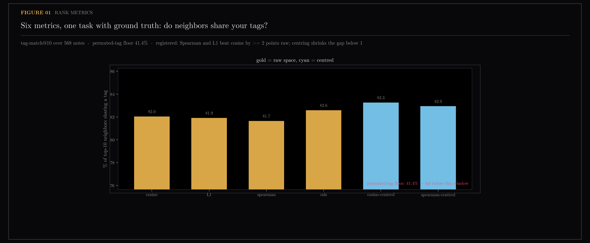
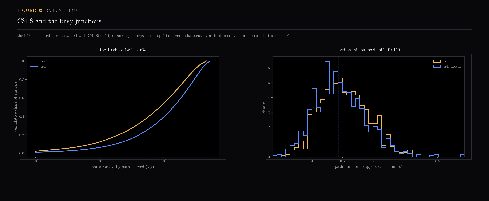
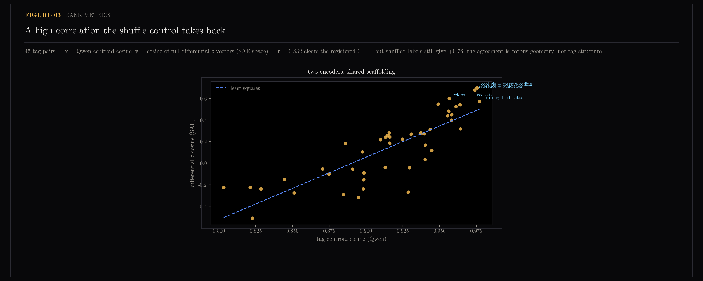

# Rank Metrics — The Night the Null Models Won

Semantic search almost always compares two embeddings by cosine similarity. A line of published work argues that when a vector space is anisotropic — when everything leans in one shared direction, which mine does — rank-based comparisons should beat cosine, because converting each vector to the *order* of its coordinates throws that shared lean away. This section tests six such alternatives on three tasks where the right answer is already known. Three of four registered predictions failed, and the most useful result of the whole night was a null model that dismantled a finding I had already believed.

The corpus is the note collection of `ytk`, my personal knowledge system, which ingests YouTube, Instagram and web content into an Obsidian vault and indexes it for semantic search. Metrics compared: cosine, cosine after subtracting the corpus mean ("centred"), L1 distance, Spearman (rank-transform each vector, then cosine), Spearman-centred, and CSLS — cross-domain similarity local scaling, which penalises notes that sit close to everything, a known cure for hub notes dominating retrieval.

Pre-registered in [section 18](../18-sae-fingerprints/README.md) (its section 19 and 18.4b registration blocks). Six metrics over the fresh Qwen snapshot, three tasks with ground truth, strictly offline. Production search was never touched. Results verbatim against registration; three of four predictions failed, each informatively.

Generated by `scripts/rank_metrics.py`.

```bash
uv run --with matplotlib python scripts/rank_metrics.py
```

## Figures

### 01-tag-match.png


### 02-hub-flattening.png


> **Later (#183 rung 1):** re-rendered with the support axis pinned to the data
> and both medians drawn — on the original 0.25–0.8 axis the measured −0.0119
> shift was invisible, so the 48% hub cut read as free. Same data, same numbers.

### 03-continuous-overlap.png


## Working notes

## Rank metrics, Phase A — the night the null models won

Pre-registered in `../18-sae-fingerprints/README.md` (section 19 +
18.4b). Six metrics over the fresh Qwen snapshot, three tasks with ground
truth, strictly offline. Production search was never touched. Results
verbatim against registration; three of four predictions failed, each
informatively.

### 19.1 — tag-match@10: FAILED, and the failure is the finding

Tag-match@10 is the task: take each note, pull its ten nearest neighbours
under a given metric, and count what fraction of them share a tag with it.
Registered: Spearman and L1 beat raw cosine by >= 2 points absolute
(prediction derived from arXiv 2606.29571's anisotropy regime split, given
this space's ‖mean‖ = 0.51). Measured (% of top-10 neighbors sharing a
tag; permuted floor 41.4 — the score when the tags are shuffled, i.e. what
chance looks like on this task):

| metric | raw | centred |
|---|---|---|
| cosine | 82.0 | **83.3** |
| L1 | 81.9 | — |
| Spearman | 81.7 | 82.9 |
| CSLS(10) | 82.6 | — |

Rank metrics do not beat cosine here — they lose slightly. The
anisotropy-decides regime split did not replicate on this corpus/task:
Qwen3's cone, though geometrically strong, is apparently not the
pathological concentration the paper's losing encoders have. The only
gain anywhere is centring (+1.2), consistent with the open
centring-helps-search thread — but under the registered Phase B gate
(**a >= 2-point win by a non-cosine metric**), nothing qualifies.

**Phase B verdict, decided by pre-registration: not earned. Production
search stays cosine.** The centring question remains open and belongs to
the eval gate — the frozen known-item query set that scores every change to
retrieval code, [section 8](../08-eval-gate-freeze/README.md) — on its own
merits, not through this door.

> **Later:** section 22 supplied a mechanism for this failure from the other
> side of the corpus. Reading the same notes through the gemma-scope SAE space
> showed that space is 0.949 source-pure where Qwen themes are 0.718, and
> section 22 draws the consequence in its own words: "a space organized by
> voice cannot find topical neighbors across media."

### 19.2 — CSLS hub flattening: SPLIT

Registered: top-10 answerer share cut >= 1/3, median min-support shift
< 0.01. Measured: share 12.2% -> 6.3% (a 48% cut — the flattening works,
fig 02 left) but the median min-support shift is -0.0119, just past the
registered tolerance. Half confirmed, half failed; reported as split. If
the path interface ever wants CSLS's diversity, it buys it at ~0.012
median support — a price now known, not assumed.

### 19.3 — duplicate detection: FAILED via a wrong assumption

Registered: the known duplicate pair ranks strictly higher under CSLS
than cosine. Measured: rank 2 under every metric, no movement possible in
either direction — and rank 1 for the heatmap note belongs to a
*different* note (the y7 fMRI reel, cos 0.673) that beats the duplicate
(0.630). The assumption was wrong: this corpus's "duplicates" are
re-ingestions with different enrichment texts, not near-identical
vectors. Consequence, already applied in the road scripts: dedup must use
content identity (shortcode markers), never embedding proximity.

### 18.4b — continuous cross-space agreement: bar cleared, control collapsed

Registered: differential-z cosine (SAE) vs centroid cosine (Qwen) at
r >= 0.4, with shuffled labels expected near 0. Measured: r = 0.832 —
and shuffled labels give r = 0.757. The control expectation was wrong
about the null: tag z-vectors share corpus-level structure whatever the
labels say, and both spaces inherit it, so almost all of the correlation
is scaffolding, not tag identity. The tag-specific excess (0.832 vs
0.757) is real but small. **Interpretation withdrawn**: no cross-space
tag-structure claim survives this null. The 18.4 quantized-Jaccard
failure was not merely quantization. (Fig 03 is titled accordingly.)
Echoes the standing rule: new metrics need their own nulls, measured,
never assumed.

### Figures

- `01-tag-match.png` — six metrics against the permuted floor
- `02-hub-flattening.png` — CSLS concentration curve + the support price
- `03-continuous-overlap.png` — the r=0.83 that the shuffle takes back

### Render

```bash
uv run --with matplotlib python scripts/rank_metrics.py
```

## Files

- `01-tag-match.png`
- `02-hub-flattening.png`
- `03-continuous-overlap.png`
- `results.json`
