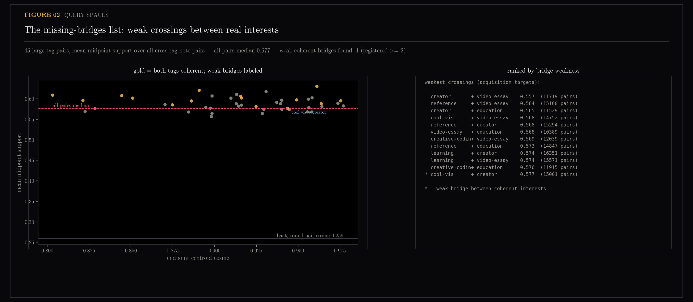
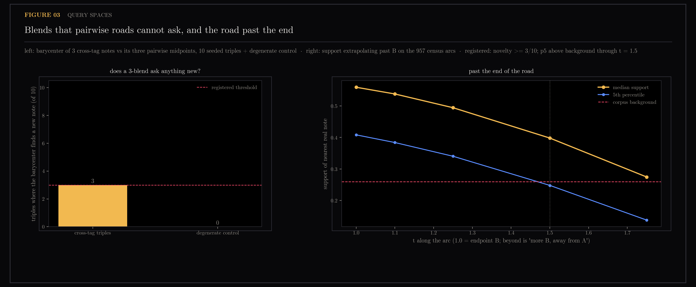

# Query Spaces — the Highway and the Missing Bridges

A search box takes one query. But two points in an embedding space define a path, three define a surface, and the far side of a point defines "more of this, less of that" — so a collection of documents can be questioned in shapes a search box cannot express. This section builds those shapes as roads: pick two topics, walk the arc between their centres, and see what the collection answers at each step along the way. The two most interesting results are both negatives — there are no unpaved gaps between my major interests, and the road past the end of a topic stays usable for a shorter distance than predicted.

The corpus is the note collection of `ytk`, my personal knowledge system, which ingests YouTube, Instagram and web content into an Obsidian vault and indexes it for semantic search. A tag centroid is the average embedding of every note carrying a tag; a road is the arc between two of them, sampled at nine stops, with the top three notes retrieved at each stop. "Support" is how strongly the collection answers at a stop — the similarity of the notes it returns there — and "background" is what an arbitrary point in the space would score.

Pre-registered exploration of tag-centroid roads in the corpus. Sections 20.1 and 20.4 ran this session; 20.2 (barycentric blends) and 20.3 (extrapolation) are registered and pending.

Generated by `scripts/query_spaces.py`.

```bash
uv run --with matplotlib python scripts/query_spaces.py
```

## Figures

### 01-highway.png
![Highway vocabulary handover between ai-agents and machine-learning]
(01-highway.png)
Vocabulary handover and feature lanes for the registered highway.

### 02-missing-bridges.png

45 bridges in a 0.07-wide band; the one starred crossing barely under the median.

> **Later (#183 rung 1):** re-rendered with the y-axis anchored on the corpus
> background pair cosine (0.259) — auto-scale had zoomed into the 0.556–0.631
> band, so a 0.075-wide spread filled the panel and read as large. Every
> "weak" crossing sits far above background; weakness here is relative to
> other pairs, not absolute. Same data, same numbers.

### 03-blends-extrapolation.png

Barycentric novelty vs control; support decay past the end of the road.

## Notes

Pre-registered in [section 18](../18-sae-fingerprints/README.md) (its section 20
blocks, committed before running). 20.1 and 20.4 ran this session;
20.2 (barycentric blends) and 20.3 (extrapolation) are registered and
pending. Inherits four instrument rules from the earlier sections: cosine
retrieval (the verdict of experiment 19.1 in
[section 19](../19-rank-metrics/README.md), where no rank metric beat it),
content-identity dedup, sum pooling, and treating auto-generated feature names
as hypotheses to be probed rather than facts. Feature names come from an SAE
(sparse autoencoder) run over the corpus in
[section 18](../18-sae-fingerprints/README.md), which re-describes each note as
a short list of named features.

### 20.1 — the highway: ai-agents -> machine-learning

The registered endpoint rule resolved to A = ai-agents (fresh z 19.0) and
B = machine-learning (z 11.7, centroid cos 0.862 — the first tag under
the 0.9161 threshold). Honest note on the rule: the threshold was
permissive enough that both endpoints are tech-side tags; a cross-domain
highway (ai -> creative-coding, cos 0.80) would be an unregistered
appendix, not a substitute.

Verdicts, sub-prediction by sub-prediction:

- **(a) CONFIRMED, overwhelmingly**: minimum stop support 0.750 vs
  background 0.259 — the highway runs through the densest country in the
  corpus.
- **(b) CONFIRMED**: vocabulary handover perfectly monotone, rho = -1.0
  (chance p95 0.63). Lanes: git commands, software capabilities and
  automated testing drain; tensor operations, neural networks, loss
  functions fill; the cone register persists — the cone being the always-on
  shared vocabulary every note in this collection carries, named in
  [section 18](../18-sae-fingerprints/README.md). (One B-lane auto-name,
  "election integrity" #13860, is another polysemantic mislabel per the
  standing caveat.)
- **(c) FAILED**: zero bridge stops — every stop's top note carries an
  endpoint tag. Between two large coherent regions the road is paved
  entirely with their own notes: the regions abut, with no third-party
  territory between them. The bridge prediction assumed sparse borders;
  the corpus has dense ones.

The itinerary is itself the artifact: Obsidian+Claude-Code agent tooling
-> Opus-vs-Fable testing -> code reel -> how GPT/Claude/Gemini are
actually trained. A hub path view rendering exactly this would need no
model call.

> **Later:** section 21 ran all 45 tag-centroid roads and found only 19 notes
> are ever retrieved across 1215 stop slots, with the top note — the
> Obsidian + Claude Code workflow video that opens this itinerary — serving 37
> of the 45 roads. Its conclusion for the hub: a tag-road overlay "would funnel
> every itinerary through the same few interchanges", so any multi-road view
> must dedup stops by interchange before rendering.

### 20.4 — missing bridges: FAILED, and the failure is the finding

Registered: at least 2 of the 45 large-tag pairs combine individually
coherent tags with mean midpoint support below the all-pairs median.
Measured: **1** (cool-vis + creator, 0.577, a hair under the 0.577
median). More telling than the count: all 45 tag-pair bridges live in a
narrow band (0.556-0.631), every one of them roughly 2x the corpus
background, and bridge strength is nearly uncorrelated with endpoint
distance (fig 02). The registered fallback line — "an empty acquisition
list is itself the answer" — is the verdict: **this corpus has no
meaningfully weak bridges at the tag level.** The census said no desert
between cities; this says every pair of major cities already has a paved
crossing. Acquisition targeting, if it ever matters, must look below tag
granularity (note-level gap stretches), not at it. ("The census" is the
957-path survey in [section 17](../17-corpus-growth/README.md), which found no
path anywhere dipping below the corpus background.)

### 20.2 — barycentric blends: CONFIRMED at exactly the bar

3 of 10 seeded cross-tag triples produce a barycenter whose top retrieved
note differs from all three pairwise midpoints' tops (registered >= 3);
the degenerate control (note + its two nearest neighbors) shows 0/10, as
expected. Three-note blends are a real query mode, but a marginal one —
seven times out of ten the pairwise roads already cover the territory.
Worth exposing in a path interface as a variant, not a headline.

### 20.3 — extrapolation: FAILED, with the usable leash measured

Registered: support stays above background through t = 1.5.
Operationalized at run time (the registration did not fix the statistic;
recorded as such): 5th percentile across the 957 census arcs. Measured:
p5 crosses background just before 1.5 (0.248 vs 0.259; 93.2% of walks
still above). Full profile: t <= 1.25 is fully safe (100% above
background), 1.5 loses the bottom 7%, 1.75 collapses (44% below). "More
of B, away from A" is a usable query with a shorter leash than predicted
— t <= 1.25 as the default cap, which is the number an interface slider
should enforce.

### Corpus action items produced by sections 17-20 (filed)

Issue numbers refer to this repository's tracker.

- #166 — duplicate-ingestion audit + ingest-time content-identity guard
  (from 19.3: duplicates are re-ingestions with different texts).
- #167 — boilerplate contamination: strip at ingest, find retroactively by
  ranking notes on the cookie-policy SAE feature (from 18.4's creator
  panel) — the fingerprint matrix doubles as a data-quality scanner.
- #168 — tag consolidation: near-synonym sprawl measured by centroid
  cosine + co-occurrence (from the coherence top-5 being near-clones and
  creator failing coherence).
- #164 — the two-store env fork (infrastructure, from 18.2's incident).

## Files

- `01-highway.png` — vocabulary handover and feature lanes
- `02-missing-bridges.png` — tag-pair bridge strength survey
- `03-blends-extrapolation.png` — blend novelty and extrapolation decay
- `results.json` — numerical results
