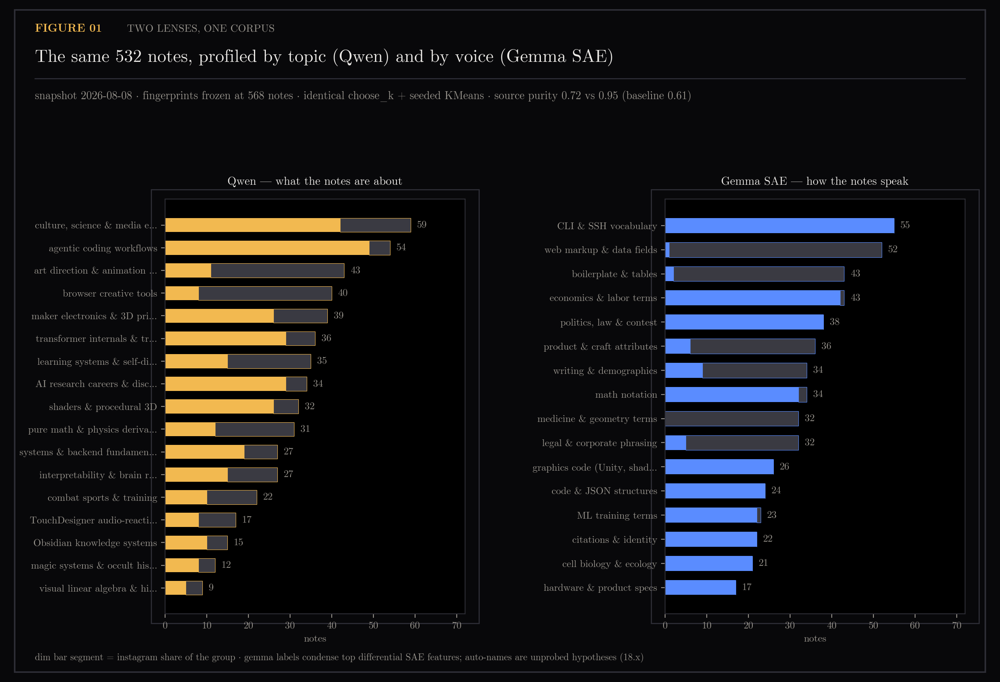
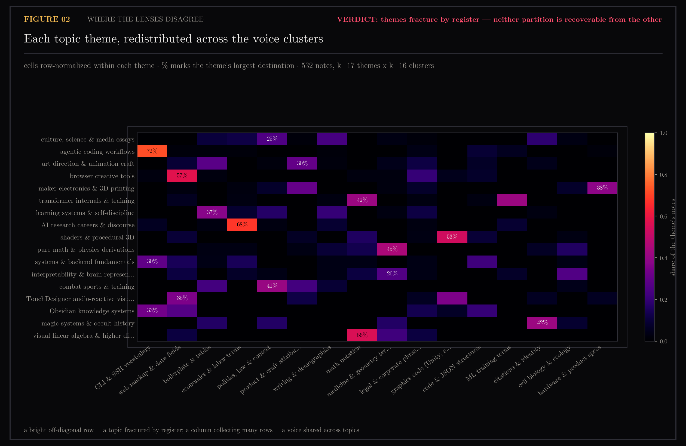
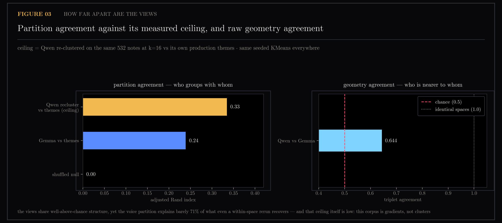
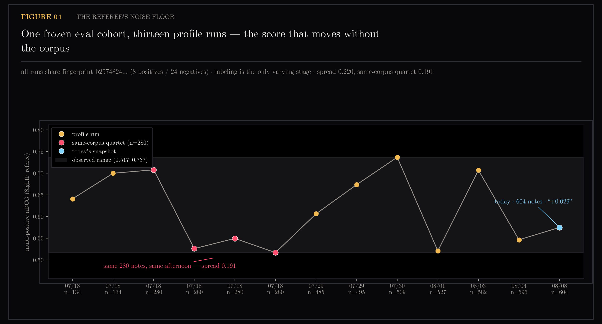

# Two Lenses, One Corpus — Qwen Themes vs Gemma SAE Clusters

My knowledge system builds a portrait of my interests by grouping my notes in one embedding space. That portrait is only as neutral as the space it is computed in, and nobody usually checks. This section groups exactly the same notes a second time, in a completely different space, and compares the two portraits. They disagree, and the way they disagree turns out to be the finding: one space sorts by what a note is *about*, the other by how it *sounds*.

The notes come from `ytk`, my personal knowledge system, which ingests YouTube videos, Instagram posts and web articles into an Obsidian vault and indexes them for semantic search. The production space is a Qwen3 text encoder at 1024 dimensions. The second space comes from a sparse autoencoder (SAE — a network that re-expresses each document as a short list of named features) run over Google's Gemma 2 2B in [section 18](../18-sae-fingerprints/README.md). Three measures do the work throughout: **ARI** (adjusted Rand index, how much two groupings of the same items agree; 0 is chance, 1 is identical), **triplet agreement** (for three items, do both spaces agree on which two are closest; chance is 0.5), and **source purity** (what fraction of each group comes from a single medium — a group that is all Instagram is sorting by medium, whatever its label says).

Profile the corpus twice — once with the production Qwen partition, once in the gemma-2-2b + gemma-scope SAE fingerprint space — and see how the two portraits differ.

Part of the two-lenses program — see [the program ledger](../README-two-lenses-program.md) for the reconciled cross-section picture.

Generated by `scripts/plot_two_lenses.py`.

```bash
uv run python scripts/plot_two_lenses.py
```

## Figures

### 01-two-profiles.png

Qwen themes versus Gemma SAE clusters: different lenses on the same 532 notes.

### 02-mapping-matrix.png

Cleanest theme→register concentrations and most fractured groupings.

### 03-agreement.png

The ARI ladder against its measured ceiling, and triplet agreement against chance.

### 04-noise-floor.png

nDCG spread of 0.517–0.737 on the same frozen eval cohort; the noise floor is ~0.19. nDCG is normalized discounted cumulative gain, a ranking score that rewards putting the right items high in a list.

## Notes

Question (2026-08-08): profile the corpus twice — once with the production
Qwen partition, once in the gemma-2-2b + gemma-scope SAE fingerprint space
from sections 18–21 — and see how the two portraits differ.

### Method

- Universe: 532 notes = fingerprint rows (568, frozen at batch time) matched
  to today's themed snapshot (604 notes) via the exact `note_texts()` keying
  (`title[:80]` for videos, `source_path` stem for memories), verified by the
  manifest's `sha256(text[:2000])[:12]` — 562/563 sha-exact, 1 content drift,
  5 rows whose notes were since deleted, 31 matched notes outside the
  profile's content sources.
- Gemma space: `sum` pooling (recorded convention), `log1p`, corpus-mean
  centered (removes the cone found in experiment 18.3 — the always-on shared
  voice every note in the collection carries), L2. Preprocessing is
  a free parameter: three variants agree only ARI 0.29–0.40 with each other,
  so the partition is *not* preprocessing-stable; log-center-l2 is reported
  as the primary because it mirrors the 18.4 differential move.
- Same `choose_k` (k=16 at n=532) and seeded KMeans as production; the only
  variable is the space.
- Cluster labels condense top differential features (z of log-activation,
  in vs out). Cached 18.x token-probed names first; 91 gaps auto-named via
  one Neuronpedia `POST /api/features` batch. Auto-names are unprobed
  hypotheses (the 18.x drug-usage lesson) and are marked `*` in the data.

### Results

| measure | value |
|---|---|
| triplet agreement, Qwen vs Gemma geometry (chance 0.5) | 0.644 |
| ARI cross-space vs production themes | 0.239 |
| ARI within-space ceiling (Qwen re-clustered, same subset, k=16) | 0.335 |
| ARI shuffled null | 0.000 |
| source purity — Gemma clusters | 0.95 |
| source purity — Qwen themes | 0.72 |
| source purity — majority baseline | 0.61 |

> **Later:** section 25 retracts the "% of ceiling" reading below. E3's
> random-direction control puts ARI-vs-themes anywhere in 0.31-0.48 when 25
> arbitrary directions are removed from the 1024-d space, so 0.335 is one draw
> from a wide band, not a fixed bar. The direction of the gap stands; the ratio
> does not.

Reading: the Gemma view recovers ~71% of the agreement that even a
within-space rerun achieves — but the flat-partition instrument is blunt
here (the ceiling itself is only 0.335; the corpus is more gradient than
cluster). The decisive contrast is *what organizes* each partition: Gemma
clusters are near source-pure (0.95) — medium/register — while Qwen themes
mix media freely. Qwen reads what a note is about; the SAE lens reads how
it speaks. This gives the retrieval failure of experiment 19.1
([section 19](../19-rank-metrics/README.md), where no rank metric beat plain
cosine) a mechanism: a space organized by voice cannot find topical neighbors
across media.

> **Later:** section 23 narrowed what "how it speaks" is measuring.
> StyleDistance matches this purity (0.959 vs 0.949) at 20x fewer parameters
> with essentially no topic bleed, but once the medium is held fixed the two
> voice lenses barely agree — within YouTube, ARI 0.047 and triplet 0.562 — so
> "most of their global agreement was the medium." Section 25 then found the
> two spaces' shared subspace is overwhelmingly topical (mean excess eta²
> 0.254 for theme against 0.054 for medium over 25 dimensions), with medium
> isolated to a single dimension that reads as document furniture.

Cleanest theme→register concentrations (fig 02): agentic coding → CLI & SSH
vocabulary (72%), AI research careers → economics & labor terms (68%),
browser creative tools → web markup & data fields (57%), visual linear
algebra → math notation (56%), shaders → graphics code (53%). Most
fractured: culture, science & media essays (max cell 25%). Fig 03 carries
the agreement evidence alone: the ARI ladder against its measured ceiling,
and triplet agreement against chance.

### The noise floor (fig 04)

Side finding with teeth: all 13 scored profile runs share one frozen eval
cohort (fingerprint `b2574824…`, 8 positives / 24 negatives), and the
nDCG still spans 0.517–0.737. Four runs on the identical 280-note corpus
in one afternoon spread 0.191. Clustering is seeded; the Claude labeling
call is the only varying stage, so the eval's noise floor is ~0.19 —
single-run deltas (today's "+0.029" included) are not signal. Any future
encoder comparison must compare distributions or structure, not one score.

### Caveats

- Fingerprints frozen at 568 notes (2026-08-02 batch); coverage 532/604
  themed notes (88%). Growth silently ages the instrument — a conclusion
  already recorded in [section 18](../18-sae-fingerprints/README.md).
- k=16 vs production k=17 (subset size), so the ceiling is not 1.0 by
  construction; that is why it is measured rather than assumed.
- Cluster hand-labels in the figures compress 8 features into 2–4 words;
  the full ranked feature lists live in `two-lenses.json`.
- `google/embeddinggemma-300m` (a Gemma-3 *encoder*, unrelated job to the
  gemma-2-2b instrument) was downloaded this session and remains unused —
  available if a real v3 encoder audition is ever wanted.

## Files

- `01-two-profiles.png` — dual partition visualization
- `02-mapping-matrix.png` — theme-to-register concentrations
- `03-agreement.png` — ARI and triplet agreement
- `04-noise-floor.png` — retrieval eval noise floor
- `feature-names.json` — Neuronpedia auto-names cache
- `two-lenses.json` — full ranked feature lists and all numbers
