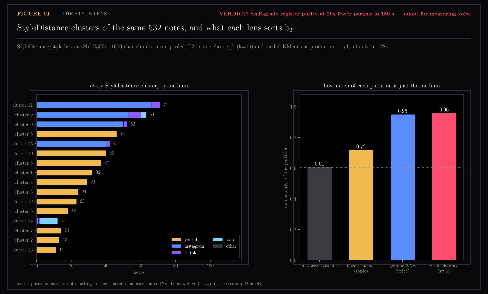
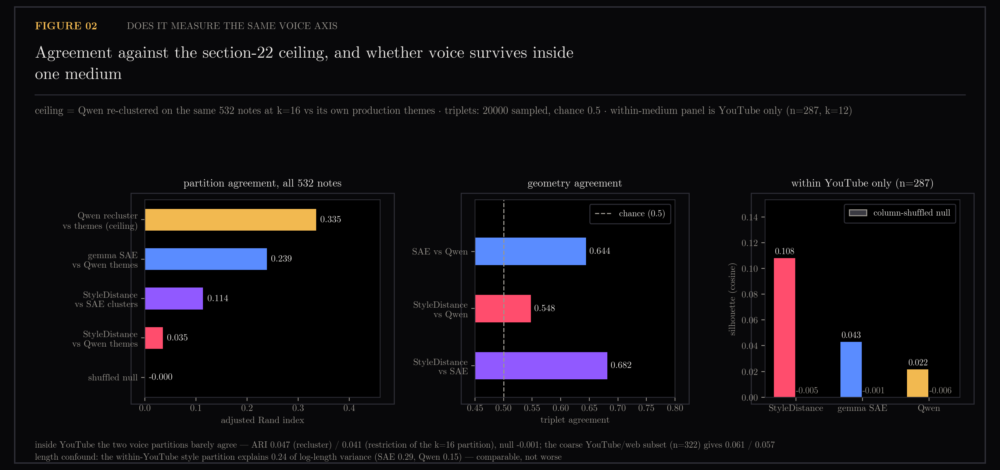

# E1 — A Purpose-Built Style Embedder as the Voice Axis

The previous section found that reading a note collection through a sparse autoencoder groups it by *voice* — how a note sounds — rather than by subject. That raised a cheaper possibility and an uncomfortable one. The cheaper: there are models built specifically to embed writing style while ignoring content, and one of them is twenty times smaller. The uncomfortable: maybe "voice" here is just "Instagram versus YouTube" wearing a better word. This section tests both, and the second question produces the more interesting answer — voice structure does survive inside a single medium, but the two instruments supposedly measuring it stop agreeing once the medium is removed.

The notes come from `ytk`, my personal knowledge system, which ingests YouTube videos, Instagram posts and web articles into an Obsidian vault and indexes them for semantic search. An SAE (sparse autoencoder) re-describes each note as a short list of named features; the one referred to throughout is the gemma-scope rig built in [section 18](../18-sae-fingerprints/README.md). Four measures recur: **ARI** (adjusted Rand index — how much two groupings of the same items agree, 0 being chance), **triplet agreement** (given three items, do two spaces agree on which pair is closest; chance is 0.5), **silhouette** (how well-separated a grouping is within one space, 0 being no structure), and **eta²** (the share of a variable's spread explained by group membership). "E1" is the first of four experiments in the two-lenses program.

Does a content-independent style embedder measure the same voice axis as the gemma-scope SAE for a fraction of the compute, and does voice structure survive inside a single medium?

Part of the two-lenses program — see [the program ledger](../README-two-lenses-program.md) for the reconciled cross-section picture.

Generated by `scripts/e1_style_lens.py`.

```bash
uv run --with matplotlib --with scikit-learn python scripts/e1_style_lens.py
```

## Figures

### 01-style-lens.png

Register detection across media using StyleDistance embeddings.

### 02-voice-axis.png

Voice-axis silhouette and geometric agreement inside a single medium.

## Notes

Question (2026-08-08): [section 22](../22-two-lenses/README.md) showed the gemma-2-2b + gemma-scope SAE
fingerprint space partitions this corpus by register/medium (source purity
0.95) where the production Qwen space partitions by topic (0.72, baseline
0.61). Two follow-ups: (a) does a content-independent *style* embedder measure
the same voice axis for a fraction of the compute, and (b) does voice structure
survive inside a single medium, or is "voice" here just "YouTube vs Instagram"?

### Method

- Model: `StyleDistance/styledistance`, revision
  `b7df5f0b0480773c097ba3121d83ca32b71015ca` (roberta-base, 125M params,
  `max_seq_length` 512, mean-token pooling, arXiv 2410.12757). 20x smaller than
  the gemma-2-2b instrument it is being auditioned against.
- Universe: the identical 532 notes, ids, sources, Qwen theme labels, Qwen
  vectors and SAE partition, taken by importing `build()`/`align()` from
  `scripts/plot_two_lenses.py`. The ceiling and the SAE-vs-Qwen numbers are
  recomputed by that call, not copied; they land on 22's values exactly
  (deterministic pipeline, unchanged snapshot).
- Texts come from the same two Chroma collections `align()` reads, keyed by
  chroma id. Chroma stores documents truncated at 8000 chars, so long
  transcripts are already head-truncated before this experiment sees them.
- Chunking: 1000 chars (~230 roberta tokens), non-overlapping, a trailing
  sliver under 200 chars dropped. 1711 chunks over 532 notes. Chunk vectors are
  **mean-pooled per note, then L2-normalized** — a stated confound (below).
- Partition: the same `ytk.synthesis.choose_k` (k=16 at n=532) and seeded
  `cluster_embeddings`. The only variable is the space.
- Embedding cost: 150.4s wall for the whole corpus on MPS. The SAE batch it is
  compared against is a scheduled overnight job; its wall clock was not measured
  here, so the cost claim rests on parameter count and this measured number, not
  on a head-to-head timing.

Finer medium labels than 22's two-way `youtube/web` vs `instagram` were derived
from the collection and `source_path`: youtube 287, instagram 210, tiktok 17,
web 13, pinterest 5. Both label sets are reported — the coarse one for
comparability with 22, the fine one because 22's "youtube/web" bucket silently
contains three other media.

### The battery

| measure | StyleDistance | gemma SAE | Qwen themes | reference |
|---|---|---|---|---|
| source purity (2-way, section-22 labels) | **0.959** | 0.949 | 0.718 | baseline 0.605 |
| source purity (5-way medium) | **0.951** | 0.927 | 0.673 | baseline 0.539 |
| ARI vs Qwen themes | 0.035 | 0.239 | — | ceiling 0.335, null -0.000 |
| ARI vs the SAE partition | 0.114 | — | 0.239 | ceiling 0.335, null 0.000 |
| triplet agreement vs Qwen geometry | 0.548 | 0.644 | — | chance 0.500 |
| triplet agreement vs SAE geometry | **0.682** | — | 0.644 | chance 0.500 |
| silhouette, all 532, own k=16 | **0.129** | 0.044 | 0.031 | nulls -0.005 / -0.001 / -0.005 |

Ceiling = Qwen re-clustered on the same 532 notes at k=16 against its own
production themes (0.335). ARI nulls are the mean over 200 label shuffles.
Triplets: 20000 sampled, chance 0.5.

### Reading

1. **It is a register detector, and a slightly stronger one than the SAE.**
   Purity 0.959 vs 0.949, both far above topic (0.72) and the majority
   baseline (0.61). On the plain question "does StyleDistance find the medium
   axis", yes.
2. **It is content-independent as advertised — more so than the SAE.** ARI vs
   Qwen themes 0.035 and triplet 0.548 (chance 0.5): almost no topical signal
   at all. The SAE space still leaks topic (0.239 / 0.644). So StyleDistance is
   a *purer* style axis, not the same axis.
3. **It does not reproduce the SAE's partition.** ARI 0.114 against a measured
   ceiling of 0.335 is 34% of ceiling, where the SAE reached 71% of ceiling
   against Qwen. But the geometries agree more than the partitions do —
   triplet 0.682, the highest pairwise number in the whole battery, above even
   SAE-vs-Qwen. This is section 22's "gradients, not clusters" showing up again: flat
   ARI understates agreement in this corpus, and the two voice spaces really
   are closer to each other than either is to the topic space.

   > **Later:** section 25 retracts the "% of ceiling" arithmetic in this
   > paragraph. Removing 25 random directions from the 1024-d space lands
   > ARI-vs-themes anywhere in 0.31-0.48, so 0.335 is one draw from a wide
   > band and should be read as an order of magnitude. The ordering — the SAE
   > partition sits closer to Qwen than StyleDistance does — stands; 34% and
   > 71% do not.

### The decisive sub-test: inside one medium

Restricted to YouTube only (n=287, `choose_k` → k=12); the coarse
`youtube/web` restriction (n=322, k=13) is reported alongside because 22's
label lumps tiktok/web/pinterest in with YouTube.

| within YouTube only (n=287, k=12) | StyleDistance | gemma SAE | Qwen |
|---|---|---|---|
| silhouette (cosine) | **0.108** | 0.043 | 0.022 |
| column-shuffled null | -0.005 | -0.001 | -0.006 |
| ARI vs SAE partition (re-clustered on subset) | 0.047 | — | — |
| ARI vs SAE partition (restriction of the k=16 one) | 0.041 | — | — |
| ARI vs Qwen themes (restricted) | 0.023 | — | — |
| triplet vs SAE geometry | 0.562 | — | — |
| eta² of log note length explained | 0.242 | 0.294 | 0.148 |

Coarse `youtube/web` subset (n=322, k=13): silhouette 0.137 / 0.048 / 0.039,
ARI vs SAE 0.061 (recluster) / 0.057 (restriction), triplet vs SAE 0.580,
eta² of log-length 0.611 / 0.285 / 0.134.

**Verdict on (b): yes, non-trivial structure survives inside one medium — but
the two lenses do not agree on what it is.** Silhouette 0.108 against a
column-shuffled null of -0.005 is real structure, and it is 2.5x the SAE's and
5x Qwen's on the identical points at the identical k. Yet ARI between the
StyleDistance and SAE within-YouTube partitions is 0.047 (null -0.001) and
their triplet agreement falls to 0.562, barely above chance. So "voice beyond
medium exists" is answered by StyleDistance's own geometry and is *not*
corroborated by the SAE rig. Strip the medium out and the two instruments stop
tracking each other. Most of their global agreement (triplet 0.682) was the
medium.

### Caveats

- **Pooling is unstable, worse than 22's preprocessing spread.** Three pooling
  choices over the identical chunk embeddings give partitions agreeing at ARI
  0.487 (mean vs mean-of-unit-chunks), 0.250 (mean vs first chunk only) and
  0.179 (unit vs head). Section 22 reported 0.29–0.40 across its three variants
  and called the partition preprocessing-unstable; this is the same problem or
  worse. The specific k=16 partition is therefore not a stable object. The
  geometry-level numbers (silhouette, triplet) do not depend on the flat
  partition and are the load-bearing results here.
- **Length.** Within YouTube the style partition explains 24% of log-length
  variance — a real confound, but the SAE partition explains 29% on the same
  points, so it is not a StyleDistance-specific artifact and does not by itself
  explain the 2.5x silhouette gap. It does mean roughly a quarter of what the
  "voice" partition is doing is "how long the note is". Length is partly a
  medium proxy that survives the medium restriction (a 3-minute clip vs a
  40-minute talk), so it is arguably signal, not only noise — untested.
  In the coarse youtube/web subset the number is 0.611, which is why the
  n=322 silhouette of 0.137 should not be quoted as within-medium evidence.
- **Cross-space silhouette magnitudes are suggestive, not decisive.** The three
  spaces have different dimensionality (768 / 16384 / 1024) and different
  concentration; each has its own null but all three nulls sit at ~0, so the
  nulls establish "nonzero structure" without calibrating the scale difference
  between spaces.
- StyleDistance is trained on short passages; a note is 1–8 chunks, mean-pooled.
  Notes with one chunk get an un-averaged vector while long notes get a
  smoothed one, which is exactly the mechanism behind both the pooling
  instability and the length eta². A length-matched replication was not run.
- Chroma's 8000-char document cap truncates long transcripts before chunking,
  so the "voice" of a long video is measured from its opening ~8000 chars.
- The SAE fingerprints remain frozen at the 2026-08-02 batch (568 notes), so
  this inherits section 22's coverage caveat unchanged.
- Everything here is one seeded run of each estimator. Given section 22's
  noise-floor finding, single-number differences under ~0.02 should not be read as signal;
  the differences leaned on above (0.108 vs 0.043, 0.682 vs 0.548) are much
  larger than that, the ones not leaned on above (0.959 vs 0.949) are not.

### Can StyleDistance replace the SAE rig as the voice axis?

For measuring voice, yes — and it is the better instrument on this corpus. It
matches the SAE's register purity (0.96 vs 0.95) with 20x fewer parameters and
a 150-second full-corpus pass, carries essentially zero topic contamination
where the SAE still leaks it (ARI vs themes 0.035 vs 0.239), and resolves
within-medium structure 2.5x more crisply than the SAE does on the same points.
What it cannot do is stand in for the SAE's *specific* partition — ARI 0.114
globally and 0.047 inside YouTube — so any downstream artifact keyed to
particular SAE clusters would have to be rebuilt, not ported. It also gives up
the one thing the SAE rig uniquely provides: named, inspectable dimensions. If
the job is "hold voice constant while retrieving on topic", or "diversify a
feed along register", StyleDistance is the cheaper and cleaner axis and should
replace the rig. If the job is "explain *why* these notes sound alike", the SAE
still wins, because a 768-d roberta vector has nothing to say. The honest
qualifier: the two disagree so sharply once the medium is removed that at least
one of them is measuring something other than voice inside a medium, and
nothing in this experiment says which.

## Files

- `01-style-lens.png` — register detection via StyleDistance
- `02-voice-axis.png` — within-medium voice structure
- `style-lens.json` — all numbers and analysis
