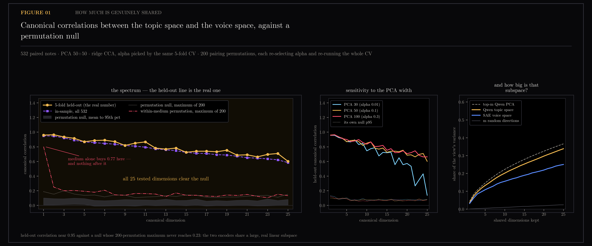
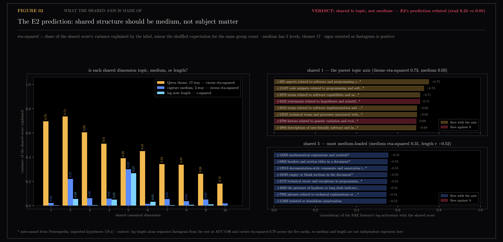
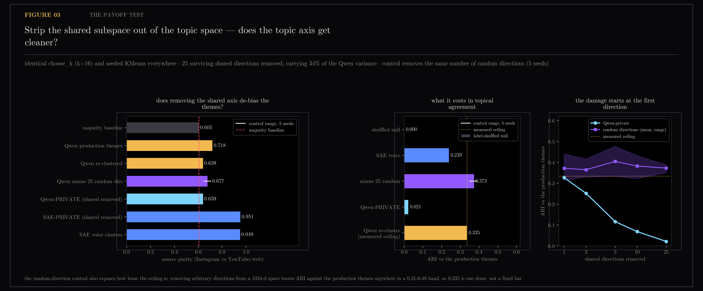

# E3 — Shared / Private Decomposition of the Two Lenses

Decompose the paired Qwen and SAE-fingerprint views into shared structure, Qwen-private (topic net of voice) and SAE-private (voice net of topic) using regularized linear CCA. Reference: SPLICE (arXiv 2408.12091), linear first.

Part of the two-lenses program — see [the program ledger](../README-two-lenses-program.md) for the reconciled cross-section picture.

Generated by `scripts/e3_shared_private.py`.

```bash
uv run --with matplotlib --with scikit-learn python scripts/e3_shared_private.py
uv run --with matplotlib --with scikit-learn python scripts/e3_shared_private.py --figs-only
```

## Figures

### 01-shared-spectrum.png

The spectrum of held-out canonical correlations against the permutation null; shared subspace variance explained.

### 02-medium-or-topic.png

Label variance of shared dimensions; named SAE features for the leading shared axes.

### 03-payoff.png

Qwen-private and SAE-private source purity and ARI after removing shared directions; comparison with random-direction control.

## Notes

Question (2026-08-08): sections 22–24 established that the Qwen production
space groups this corpus by topic and the gemma-2-2b + gemma-scope SAE
fingerprint space groups it by voice/register. E3 asks the formal version of
"derive something from BOTH": decompose the paired views into SHARED
structure, QWEN-PRIVATE (topic net of voice) and SAE-PRIVATE (voice net of
topic). Reference: SPLICE (arXiv 2408.12091) — linear CCA first, by design.

### Method

- **Universe.** The identical 532 paired notes, ids, sources, Qwen vectors,
  SAE fingerprints and Qwen theme labels, taken by importing
  `align()` / `gemma_space()` / `build()` from `scripts/plot_two_lenses.py`.
  The 22-battery reference numbers (ceiling 0.335, cross-ARI 0.239, purities
  0.72 / 0.95 / 0.61) are recomputed by that call, not copied, and land on
  22's values.
- **Preprocessing.** Qwen L2-normalized (1024-d). SAE side through
  `gemma_space()` — log1p, corpus-mean centered (the 18.3 cone removed), L2
  (16384-d). Both views reduced by PCA to 30 / 50 / 100 components; 50 is the
  primary and the other two are the sensitivity sweep. PCA at 50 keeps 52.1%
  of the Qwen variance and 43.4% of the SAE variance.
- **Regularized CCA.** Classical CCA solved by whitening, with shrinkage
  `C + alpha * (trace(C)/p) * I` on both covariances. `alpha` is chosen from
  {1e-4, 1e-3, 1e-2, 3e-2, 0.1, 0.3, 1.0} by the *same* 5-fold CV that reports
  the held-out numbers. This is a selection effect, but a small one: the whole
  grid spans 0.9145–0.9291 on the selection criterion at d=50, so which alpha
  wins moves the answer in the third decimal.
- **Held-out correlation.** 5-fold `KFold(shuffle, seed 0)`. Fit on the train
  folds, project the test fold, correlate per canonical dimension, average over
  folds. Signed, never absolute — taking absolute values would inflate the null.
- **Permutation null.** 200 shuffles of the pairing between views. Each
  permutation re-runs the entire procedure including the alpha selection, so
  the null is calibrated against the same estimator, not a simpler one.
- **Leakage guard.** PCA is fit once on all 532 and shared by the observed run
  and every permutation (PCA is blind to the pairing, so the null is calibrated
  on identical footing). A per-fold-PCA control reproduces the spectrum:
  0.957 / 0.961 / 0.925 / 0.910 / 0.854 against the shared-PCA 0.961 / 0.965 /
  0.934 / 0.916 / 0.869. The shortcut is not what produces the result.

### The spectrum (fig 01)

| d | alpha | held-out dims 1–3 | dim 10 | dim 25 | null p95 (worst dim) | null max of 200 | survive |
|---|---|---|---|---|---|---|---|
| 30 | 0.01 | 0.957 / 0.957 / 0.927 | 0.745 | 0.139 | 0.132 | 0.220 | 25/25 |
| **50** | **0.1** | **0.961 / 0.965 / 0.934** | **0.850** | **0.603** | **0.102** | **0.200** | **25/25** |
| 100 | 0.3 | 0.958 / 0.964 / 0.938 | 0.836 | 0.663 | 0.124 | 0.186 | 25/25 |

Every one of the 25 dimensions tested clears its own null's 95th percentile at
every PCA width, and the gap is not marginal: the *maximum* held-out
correlation any of 200 permutations reached, over all dimensions, is 0.220,
while the observed dim-25 value is 0.603 at d=50. The test stopped at 25
because 25 was the pre-set report depth, not because the signal ran out —
d=30's dim-25 falls to 0.139 presumably because taking 25 canonical pairs out
of 30 components leaves the last ones nothing to work with.

In-sample flatters at d=30 (0.967 vs held-out 0.957 on dim 1) and *under*states
at d=50 and d=100 (0.950 vs 0.961, 0.930 vs 0.958) — expected, since the
shrinkage that buys generalization costs in-sample fit, and alpha rises with d.

**How big is that subspace** (fig 01, right): 25 shared directions carry 33.8%
of the Qwen variance and 25.0% of the SAE variance, against 36.6% for the
top-25 Qwen PCA components — the theoretical maximum for any 25-dim subspace —
and 2.4% for 25 random directions. The shared subspace is not a nuisance axis
sitting off to the side of the space. It is very nearly the space's own
principal subspace.

### The E2 prediction (fig 02) — refuted, with one true part

E2's standing prediction was that the shared component should be substantially
MEDIUM, not subject matter, because the deliberate-save label turned out to be
a disguised medium label and E1 found the two voice lenses agree mostly through
medium. Two independent measurements say otherwise.

**1. Label variance of each shared score.** Signs oriented so Instagram is
positive; eta² reported minus its shuffled expectation for the same group count
(medium 5 levels, themes 17 — the shuffled baselines are 0.008 and 0.030, so
the group-count bias is negligible at this scale).

| shared dim | held-out r | excess eta² theme | excess eta² medium | r with log length | AUC Instagram |
|---|---|---|---|---|---|
| 1 | 0.961 | **0.696** | 0.022 | −0.060 | 0.559 |
| 2 | 0.965 | **0.735** | 0.220 | +0.237 | 0.716 |
| 3 | 0.934 | **0.605** | 0.062 | +0.069 | 0.534 |
| 4 | 0.916 | **0.511** | 0.058 | +0.224 | 0.639 |
| 5 | 0.869 | 0.391 | **0.301** | **+0.518** | **0.809** |
| 6 | 0.886 | **0.451** | 0.015 | +0.182 | 0.568 |
| 7–10 | 0.82–0.89 | 0.18–0.34 | 0.02–0.05 | ≤0.10 | ≤0.62 |

Over all 25 shared dimensions: mean excess eta² of theme 0.254, of medium
0.054; only 2 of 25 dimensions are medium-dominant. The leading shared axes are
topical by a factor of roughly five.

**2. A within-medium permutation null.** Shuffle the pairing only *inside* each
medium, so medium is preserved and note identity is destroyed. If the shared
structure were medium, this null would stay high. It does, for exactly one
dimension: dim-1 stratified null mean 0.773 (p95 0.791, max 0.802) against the
observed 0.961. From dim 2 on it collapses — mean 0.076, p95 0.19, max 0.25,
i.e. back to the ordinary null.

The honest reading of the two together: **a strong medium axis genuinely exists
in the shared subspace** — medium alone buys a shared direction pair worth 0.77
held-out correlation, which is a real vindication of the E2 intuition — **but
it is one axis out of 25+**, and it is not even the axis CCA finds first. Every
other shared dimension carries note-specific content that no medium shuffle can
reproduce. The prediction "the shared component should be substantially medium,
not subject matter" is wrong as stated; "medium is one large, isolable
component of a much larger shared subspace" is what the data supports.

Corroborating detail from the payoff run: removing all 25 shared directions
from the SAE side leaves its source purity at 0.951 (from 0.949) and its
log-length eta² at 0.739 (from 0.725). If the shared subspace were the medium
signal, stripping it would have de-registered the SAE view. It does not touch it.

### Named SAE loadings for the shared subspace (fig 02, right)

Top features by correlation between their log-activation and the shared score.
238 of the 250 names rendered are Neuronpedia auto-names — **unprobed
hypotheses**, the 18.x drug-usage lesson applies unchanged, and they are marked
`*` wherever rendered.

Shared 1, the purest topic axis (theme eta² 0.73, medium 0.03):

| r | feature |
|---|---|
| +0.75 | #325 aspects related to software and programming structures or commands* |
| +0.73 | #15107 code snippets related to programming and software development errors* |
| +0.71 | #3878 terms related to software capabilities and user experience* |
| −0.71 | #3452 statements related to hypotheses and scientific validation* |
| +0.69 | #2845 terms related to software implementation and project details* |
| −0.69 | #2788 factors related to genetic variation and evolutionary processes* |

This is a software-engineering-versus-natural-science axis. It is subject
matter, read off the *voice* lens, and it is the single most shared direction
between the two spaces.

Shared 5, the medium-loaded one (medium eta² 0.31, length r +0.52):

| r | feature |
|---|---|
| +0.55 | #13250 mathematical expressions and symbols* |
| +0.55 | #9263 headers and section titles in a document* |
| +0.55 | #12913 documentation-style comments and annotation indicators in code* |
| +0.55 | #10165 empty or blank sections in the document* |
| +0.54 | #4020 the presence of hyphens or long dash indicators |
| +0.54 | #11362 isolated or standalone punctuation |

Document furniture — headers, blank sections, punctuation, annotation markers.
Exactly what "medium" ought to look like when it is written down as features,
and a good sanity check that the eta² split is measuring what it claims.

### The payoff test (fig 03)

Qwen projected orthogonal to the surviving shared subspace, renormalized, and
re-clustered with the same `choose_k` (k=16) and seeded `cluster_embeddings`.
Control: remove the same number of *random* directions, 5 seeds.

| removed | var of Qwen removed | Qwen-private purity | random control | Qwen-private ARI vs themes | random control | SAE-private purity | SAE-private ARI vs SAE |
|---|---|---|---|---|---|---|---|
| 1 | 3.5% | 0.690 | 0.668 (0.637–0.690) | 0.327 | 0.372 (0.314–0.441) | 0.951 | 0.354 |
| 2 | 7.3% | 0.679 | 0.672 (0.641–0.690) | 0.252 | 0.365 (0.330–0.417) | 0.957 | 0.353 |
| 5 | 13.3% | 0.611 | 0.682 (0.660–0.699) | 0.117 | 0.405 (0.333–0.478) | 0.955 | 0.305 |
| 10 | 20.2% | 0.630 | 0.676 (0.639–0.694) | 0.069 | 0.383 (0.323–0.433) | 0.957 | 0.238 |
| 25 | 33.8% | 0.639 | 0.677 (0.650–0.703) | 0.021 | 0.373 (0.351–0.389) | 0.951 | 0.191 |

Reference row: production themes purity 0.718, a plain Qwen re-cluster at k=16
purity 0.639, majority baseline 0.605, measured ARI ceiling 0.335, ARI
label-shuffled null 0.000.

**It does not de-bias, and it does destroy the topic axis.** The right
comparator for a re-clustered residual is not the production partition's 0.718
but the plain re-cluster's 0.639 — and Qwen-private lands on 0.639 exactly,
with the random control sitting slightly *higher* at 0.677. Source purity is
flat across the whole sweep, inside the control's own spread. Meanwhile ARI
against the production themes falls monotonically from 0.327 at one direction
removed to 0.021 at twenty-five, while the control stays at 0.37–0.40. The
damage begins with the very first shared direction.

SAE-private is the mirror image and equally uninformative as a product: its
register purity is untouched (0.951 vs 0.949) and only its agreement with its
own partition degrades (0.354 → 0.191).

**The random control also indicts the ceiling.** Removing ten arbitrary
directions from a 1024-dimensional space moves ARI against the production
themes over 0.31–0.48 across the sweep. Section 22's 0.335 "measured ceiling"
is one draw from a distribution at least that wide; it should be read as an
order of magnitude, never as a bar to clear by 0.01.

### Caveats

- **Coverage.** Fingerprints remain frozen at the 2026-08-02 batch (568 notes);
  the paired universe is 532 of today's 604 themed notes (88%). A corpus-wide
  rebatch was attempted twice overnight and failed twice — a wedged MPS process
  after machine sleep, with no intermediate checkpointing — so the instrument is
  aging exactly as 18.x warned. Nothing here was re-run on the missing 72 notes.
- **n=532 with PCA 50 + 50 is a thin regime for CCA.** The permutation null is
  what makes the result safe, and the margin (0.60–0.96 observed vs 0.22 null
  maximum) is large enough that thinness is not the binding constraint on the
  *existence* claim. It very much is a constraint on the *count*: "25+ shared
  dimensions" is a floor set by the report depth and by how many PCA components
  were kept, not an estimate of the true shared rank.
- **alpha is selected on the same folds it is reported on.** Mitigated by the
  flat grid (0.9145–0.9291) and by the null re-running the selection, but it is
  a selection effect and the held-out numbers are mildly optimistic.
- **Preprocessing instability is inherited.** 22 measured three gemma-space
  variants agreeing only ARI 0.29–0.40, and E1 found pooling worse still. Only
  the log-center-L2 variant was run here. The canonical correlations are
  geometry-level and should be more robust than a flat partition, but that is an
  assumption, not a measurement.
- **KMeans on this corpus is unstable**, as the random-direction control shows.
  Every ARI and purity number in the payoff table is one seeded run of an
  estimator whose spread across trivial perturbations is ~0.1 ARI. The
  monotone collapse 0.327 → 0.021 is far outside that spread; the purity
  differences of ~0.04 are not.
- **Feature names are unprobed.** 238 of 250 are Neuronpedia auto-explanations.
  They are read here as a hypothesis about what the axis is, corroborated by an
  independent measurement (eta² against theme labels), not as evidence on their
  own.
- The medium and length regressors are not independent: log length alone
  separates Instagram from the rest at AUC 0.96 and carries eta² 0.79 across
  the five media. "Dim 5 is medium" and "dim 5 is length" are the same finding
  seen twice.

### Verdict

**Yes, the two views share a large real linear subspace — and precisely because
it is large, the shared/private decomposition does not give a usable derivation
of both outputs.** Held-out canonical correlations of 0.96, 0.96, 0.93, 0.92
falling to 0.60 by dimension 25, against a 200-permutation null whose maximum
over every dimension is 0.22, is about as unambiguous as this corpus gets; the
per-fold-PCA control and the flat alpha grid say it is not an artifact of the
free parameters. But the shared subspace turns out to be nearly the principal
subspace of both views (33.8% of Qwen variance at 25 dimensions, against 36.6%
for the best possible 25-dimensional subspace), and it is overwhelmingly
*topical* — mean excess eta² 0.254 for theme against 0.054 for medium, with the
strongest axis being a software-versus-natural-science direction read off the
voice lens. E2's prediction survives only in miniature: a genuine medium axis
exists in there, worth 0.77 held-out correlation under a within-medium
permutation, but it is one dimension out of twenty-five and CCA does not reach
for it first. The consequence for the project is negative and clean: subtracting
the shared subspace from Qwen leaves a residual that clusters no more
source-neutrally than a plain re-cluster (0.639 vs 0.639, control 0.677) while
losing almost all agreement with the production themes (ARI 0.021 vs a ceiling
of 0.335), and subtracting it from the SAE side leaves register purity
untouched at 0.951. There is no clean topic axis hiding under the voice, because
topic *is* what the two lenses agree on; what section 22 measured as their
disagreement lives in the low-variance private tails, where a flat partition
cannot reach it. n=532 is not the limiting factor for the existence result —
the null margin is enormous — but it is the limiting factor for anything
finer-grained, and a nonlinear SPLICE-style decomposition is not worth building
on this corpus: it would be asked to find private structure that the linear
version says is mostly not there, at a sample size where its own extra
parameters could not be nulled as cleanly as these were.

## Files

- `01-shared-spectrum.png` — canonical correlations and shared variance
- `02-medium-or-topic.png` — E2 prediction test and named loadings
- `03-payoff.png` — private re-clustering battery
- `feature-names.json` — Neuronpedia auto-names cache
- `shared-private.json` — all numbers and analysis
