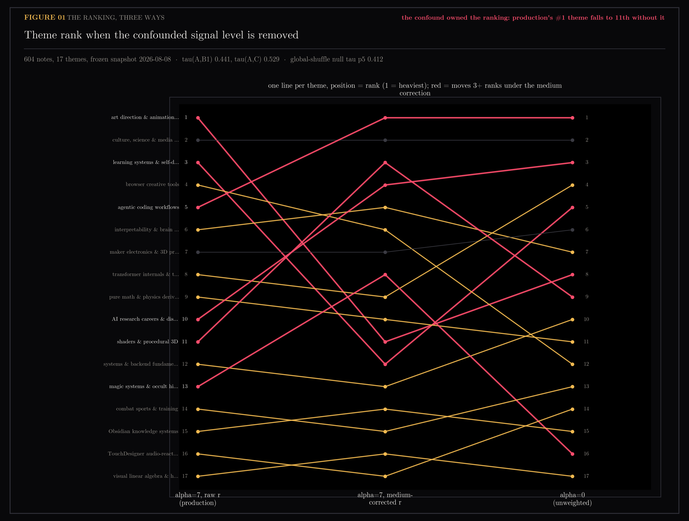
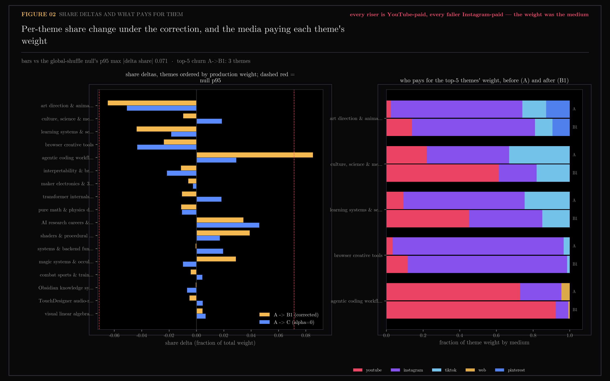

# E4 — Does the Portrait Change When the Confound Is Removed?

Recompute the interest profile's theme weights with the medium confound taken out of the deliberate-save signal, and measure how far the ranking the user actually sees moves. Closes the two-lenses program.

Part of the two-lenses program — see [the program ledger](../README-two-lenses-program.md) for the reconciled cross-section picture.

Generated by `scripts/e4_medium_signal.py`.

```bash
uv run --with matplotlib python scripts/e4_medium_signal.py
uv run --with matplotlib python scripts/e4_medium_signal.py --figs-only
```

## Figures

### 01-ranking-three-ways.png

Theme rank under alpha=7 raw r, alpha=7 medium-corrected r, and alpha=0. VERDICT: the confound owned the ranking — production's #1 theme falls to 11th without it.

### 02-share-deltas-and-media.png

Per-theme share change against the shuffle null, and which media pay for the top-5 themes' weight before and after.

## Notes

Question (2026-08-09): E2 measured the deliberate-save signal r as a disguised
medium label — every r>=1 note arrives through the pending queue
(Instagram/TikTok/web), every r=0 note but seven is bulk-ingested YouTube, and
a linear probe reads the label off raw embeddings at AUC 0.978.
`ytk/config.py` sets alpha=7, so `w = 1 + alpha*r` weighs an authored note
~15x a passive one. The original E4 (a theme x voice facet grid) was killed by
E1 and E3; the redesigned question is the one the profile page actually
exposes: **does the theme ranking and attention distribution change when the
intake-path component is removed from r?**

The KMeans partition is deliberately unweighted (`ytk/synthesis.py`,
`cluster_embeddings` — alpha=7 used to collapse it and sample_weight was
removed 2026-07-17), so theme *membership* cannot move by construction. Alpha
reaches the snapshot only through theme weight (signal-weighted share), rank
order, the confidence-weighted centroids, and the `share="N%"` rendered into
`me/profile.md`. Those are what E4 measures. A subtlety the brief missed:
production weights are `signals.decayed_weights` — `(1 + alpha*r) *
recency-decay * day-batch-dampening` — so decay and batch factors are held
fixed across all variants and only the signal term varies.

### Method

- **Universe.** The frozen 2026-08-08 snapshot (`~/.ytk/interest/latest.json`,
  read-only): 604 notes, 17 themes, alpha=7, half-life 90 d. Theme membership
  taken from the snapshot's own `note_ids`; embeddings, sources and capture
  times joined back from the live Chroma collections; r re-read from the vault
  by `signals.signal_levels`. All 604 notes matched, zero missing.
- **The correction.** `classify()` writes r=1 for saved-source membership
  alone — that is the mechanical part E2 caught. `intake_adjusted_levels`
  subtracts exactly it: r' = max(0, r-1) for instagram/tiktok/web/pinterest/
  screenshots, r' = r for YouTube. A deliberate act then competes within its
  medium instead of against the intake route.
- **Why not the brief's literal "rank r within each source":** 338 of 345
  YouTube notes tie at r=0, so any percentile scheme hands the whole tie block
  a mid-rank ~0.5 — a phantom signal for every passive note. Baseline
  subtraction is the tie-safe instantiation of the same idea.
- **Variants**, all sharing the identical decay*batch base:
  A = alpha=7 raw r (production); B1 = alpha=7 intake-adjusted r (primary);
  B2 = alpha=7 with only the r=1 level zeroed (sensitivity — keeps authored
  thoughts at full level on every medium); C = alpha=0 (unweighted control).
- **Gate before reading anything.** Variant A must reproduce the snapshot:
  recomputed shares match every stored theme weight to the stored rounding
  (max abs diff 0.00000) and recomputed signal counts equal the stored
  `{r0: 338, r1: 239, r2: 27}`. They do — no vault drift since the snapshot,
  and the harness is exactly the production computation.
- **Nulls**, 1000 shuffles each, seed 0, same fixed base: shuffle r globally
  (destroys the medium tie) and within each source (preserves it). Both
  recompute alpha=7 shares and compare to A with the same statistics.

### The ranking moves, and it moves by medium

Kendall tau between theme orderings (1 = identical ranking):

| pair | tau | Spearman |
|---|---|---|
| A vs B1 (corrected) | **0.441** | 0.591 |
| A vs B2 | 0.500 | 0.667 |
| A vs C (alpha=0) | 0.529 | 0.723 |
| B1 vs B2 | 0.853 | 0.946 |

Against the nulls, observed A->B1: tau 0.441, max |share delta| 0.0851,
top-5 churn 3 of 5.

| null | tau mean (p5) | p(tau <= obs) | max dshare p95 | p(dshare >= obs) | churn p95 | p(churn >= obs) |
|---|---|---|---|---|---|---|
| within-source (medium tie kept) | 0.817 (0.765) | **0/1000** | 0.037 | **0/1000** | 1 | **0/1000** |
| global (medium tie destroyed) | 0.519 (0.412) | 0.14 | 0.071 | 0.003 | 3 | 0.37 |

The two rows are the finding. Keep the medium tie and shuffle everything else:
not one of 1000 shuffles moves the ranking as far as the correction does, on
any statistic — the movement is not relabeling noise. Destroy the medium tie
at random: the ranking moves about as far as the correction moves it
(tau 0.52 vs 0.44). Removing the medium alignment *is* what the correction
does; beyond it, r barely matters to the ordering. The one statistic beating
even the global null is the size of the single largest share move (p 0.003) —
the agentic-coding surge below.

Where it moves (rank A -> B1, share A -> B1, and who pays the theme's weight
under A):

| theme | rank | share | weight paid by |
|---|---|---|---|
| art direction & animation craft | 1 -> 11 | 0.112 -> 0.048 | instagram 72%, tiktok 13% |
| learning systems & self-discipline | 3 -> 12 | 0.090 -> 0.046 | instagram 66%, tiktok 25% |
| agentic coding workflows | 5 -> 1 | 0.088 -> **0.173** | **youtube 73%** |
| shaders & procedural 3D | 11 -> 3 | 0.042 -> 0.081 | **youtube 74%** |
| AI research careers & discourse | 10 -> 4 | 0.043 -> 0.077 | **youtube 68%** |
| magic systems & occult history | 13 -> 8 | 0.032 -> 0.061 | **youtube 68%** |
| browser creative tools | 4 -> 6 | 0.090 -> 0.066 | instagram 93% |
| culture, science & media essays | 2 -> 2 | 0.093 -> 0.083 | mixed (45/33/22) |

Every theme that rises 3+ ranks is majority-YouTube-paid; every theme that
falls 3+ ranks is majority-Instagram-paid; the only top theme that barely
moves is the one whose weight was already medium-mixed. The top-5 the user has
been shown (art direction, culture essays, learning systems, browser tools,
agentic coding) becomes culture essays, agentic coding, interpretability, AI
research careers, shaders. B2 lands on nearly the same ordering as B1
(tau 0.853, Spearman 0.946), so the verdict does not hinge on how the
correction treats authored thoughts on saved sources.

The per-theme query vectors are the part alpha does *not* poison: the
confidence-weighted centroids move almost nowhere under the correction
(cosine A vs B1 >= 0.925 on all 17 themes, median 0.980). Within a theme the
weighting scales members near-uniformly, so directions survive; it is the
*between*-theme accounting — rank and share, exactly what the profile page
renders — that was the medium's.

One more place the confound lives: alpha=7 itself was fitted (2026-07-05) by
5-fold held-out-**save** retrieval — the fitting target is the same confounded
label. The knob's value, not just its application, inherits the intake path.

> **Later:** section 27 (E5) swept alpha over {0,1,3,7,15,31} in both arms.
> The corrected ranking is still alpha-sensitive beyond the medium-preserving
> null (p 0.003 at alpha=0), so the inherited slope does real work the fit
> never justified; the honest refit stays blocked on cross-source save data.

### Shipped

The outcome branch in the brief: ranking moves materially -> ship the
corrected signal with the evidence attached. Done in this change, minimally:

- `signals.intake_adjusted_levels()` — the correction as a pure function.
- `interest.medium_controlled` (default on, config kill switch) routes it
  into `run_profile`'s **weight computation only**. The synthesis prompt,
  `signal_counts`, `evidence_signals` and the explicit channel keep raw r —
  the capture ladder stays honest in the record; only the importance
  accounting stops paying the intake route.
- `me/profile.md` is *not* regenerated here: theme weights live inside a
  snapshot, so the corrected portrait appears at the next `ytk profile` run
  after this merges. Re-rendering tonight would also re-roll the Claude
  labelling call, whose eval sits under the measured ~0.19 noise floor —
  deliberately not spent.

> **Later:** `medium_controlled` served for one day and is retired by section
> 28, its job done. The confound it corrected arithmetically turned out to be
> a bookkeeping omission — the owner's curated playlist meant 322 "passive"
> YouTube notes were deliberate captures with no place to be recorded. With
> that intent recorded, the subtraction would re-create the confound mirrored
> (remove Instagram's r=1, keep YouTube's), so raw levels are honest again
> and the medium repair this section bought survives by construction:
> YouTube pays 0.73 of the top-5 weight under both the corrected and honest
> ladders, against 0.26 raw.

### Caveats

- Membership is fixed by design: E4 measures the accounting the profile page
  shows, not geometry. A full re-synthesis would also re-label themes and
  rewrite the portrait prose through the Claude call, which single-run eval
  cannot referee (the ~0.19 noise floor; 13 runs, spread 0.517-0.737).
- The corrected signal still assumes an authored thought means the same act
  on every medium (B1 shifts saved-source thoughts down one level, B2 does
  not; they agree at tau 0.853, so nothing downstream turns on it).
- 27 r=2 notes carry the whole "authored" tier; within-medium taste signal at
  that n was already shown unlearnable (E2: AUC 0.59, nothing sign-stable).
- The nulls hold decay and batch factors fixed; they calibrate the signal
  term only. Recency effects were not varied and were identical across
  variants by construction.
- One frozen snapshot (2026-08-08), one corpus, seeded shuffles (1000, seed
  0). The empirical p-values are resolution-limited at 1/1000.
- YouTube notes with `## My take` keep r=2 under both corrections — the seven
  exceptions E2 found are treated as genuine engagement, untested here.

### Verdict

**Every portrait to date has been part medium-portrait, and the part was
large.** Holding the medium tie fixed, chance cannot reproduce the movement
(0/1000 on all three statistics); destroying the medium tie reproduces it
almost exactly — which is the mechanism stated twice. The production #1 theme
was #1 because Instagram wrote r=1 on everything it delivered and alpha=7
multiplied that by ~8x per note; strip the intake component and the profile's
top-5 replaces three of five entries, with agentic coding doubling its share
to become the heaviest theme. The corrected signal ships as
`interest.medium_controlled` (default on) feeding only the weight path, with
raw r preserved everywhere the record is descriptive rather than
weight-bearing. The program's closing state: the two-lenses question is
settled (topic is what the lenses share, voice lives in unreachable tails),
the annotation layer is the surviving product idea, and the one production
change the program justified is this one.

## Files

- `01-ranking-three-ways.png` — theme rank under the three weighting variants
- `02-share-deltas-and-media.png` — share deltas vs nulls; media composition
- `e4-medium-signal.json` — all numbers: shares, ranks, taus, nulls, p-values
