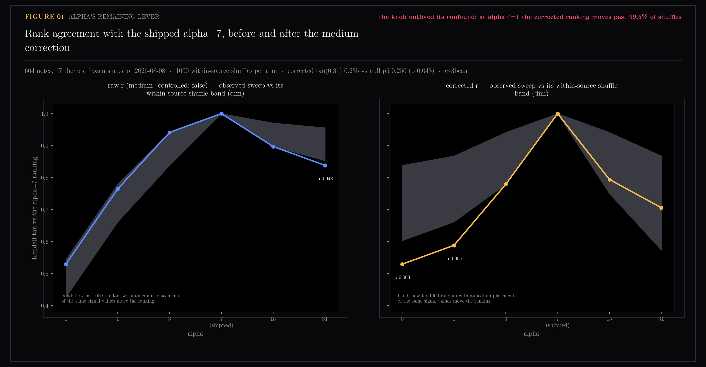
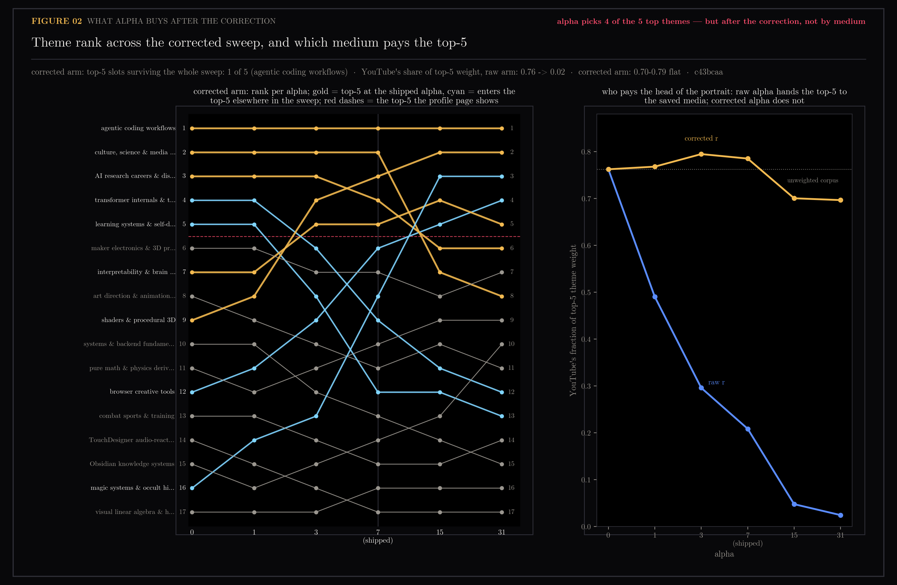

# E5 — Does Alpha Still Matter Once the Signal Is Medium-Corrected?

Sweep the confidence slope alpha over {0, 1, 3, 7, 15, 31} in both signal arms
(raw r and the E4-corrected r') on the frozen snapshot, and measure whether the
shipped alpha=7 — fitted 2026-07-05 against the confounded held-out-save target
— still decides the portrait after the medium confound is removed. It does.

Part of the two-lenses program's aftermath — the open door recorded in
[the program ledger](../README-two-lenses-program.md) and in
[section 26](../26-medium-signal/README.md)'s closing note.

Generated by `scripts/e5_alpha_sensitivity.py`.

```bash
uv run --with matplotlib python scripts/e5_alpha_sensitivity.py
uv run --with matplotlib python scripts/e5_alpha_sensitivity.py --figs-only
```

## Figures

### 01-tau-vs-alpha-two-arms.png

Kendall tau between each alpha's theme ranking and the shipped alpha=7 ranking,
per arm, against each arm's within-source shuffle band. VERDICT: the knob
outlived its confound — at alpha<=1 the corrected ranking moves past 99.5% of
shuffles.

### 02-head-composition-across-alpha.png

Rank trajectories across the corrected sweep, and YouTube's fraction of top-5
weight per alpha in both arms. VERDICT: alpha picks 4 of the 5 top themes —
but after the correction, not by medium.

## Notes

Question (2026-08-09): `ytk/config.py` sets alpha=7 in `w = 1 + alpha*r`
(an authored note weighs ~15x a passive one), fitted 2026-07-05 by 5-fold
held-out-save retrieval. E2 (asset 24) later measured the save label as a
disguised medium label, and E4 (asset 26) shipped the corrected signal — but
alpha itself was never refit. The slope is inherited from a fit against the
confounded target, now applied to a corrected signal.

### The straightforward refit is blocked, and was known to be

`scripts/eval_profile.py` — the original fit — flagged its own confound in its
docstring the day it shipped: *"saves are almost all Instagram, passives all
YouTube ... Re-run once cross-source saves (hub-ingested YouTube with thoughts)
exist."* That re-run condition is still unmet. Measured 2026-08-09 over the
whole vault (`signals.classify` on every source note):

| source | r >= 1 | r = 0 |
|---|---|---|
| youtube | **7** | 350 |
| instagram | 224 | 0 |
| tiktok | 17 | 0 |
| web | 21 | 0 |
| pinterest | 5 | 0 |
| screenshots | 6 | 0 |

Source implies r in both directions — no saved-source passives, seven YouTube
saves — so no target derived from r can be de-confounded on this corpus. The
collinearity is structural: `classify()` awards r=1 for saved-source membership
alone, so "which app" and "did you save it" are one column. The fit script is
also broken outright: `eval_profile.py:60` passes `sample_weight` to
`cluster_embeddings`, removed deliberately on 2026-07-17 when weighted KMeans
was measured collapsing the partition (`ytk/synthesis.py:59-68`). E5 therefore
asks the narrower question that is answerable today: **how much does the choice
of alpha still move the portrait, per arm, and is the residual movement
medium-driven or note-specific?**

### Method

- **Universe and harness.** E4's exactly: the frozen 2026-08-08 snapshot
  (604 notes, 17 themes, read-only), theme membership from the snapshot's own
  `note_ids`, embeddings/sources/capture times joined from live Chroma, r
  re-read from the vault. Theme membership cannot move by construction
  (`cluster_embeddings` is unweighted); alpha reaches the portrait only through
  the between-theme accounting. Recency decay and day-batch dampening held
  fixed across every cell; only the signal term `1 + alpha*r` varies.
- **Grid.** alpha in {0, 1, 3, 7, 15, 31} x arms {raw r
  (`medium_controlled: false`), corrected r' (`intake_adjusted_levels`,
  production default)}. Reference within each arm: the shipped alpha=7.
  Corrected signal counts: {r0: 577, r1: 20, r2: 7} — 27 nonzero notes carry
  the whole corrected signal.
- **Gate.** Raw alpha=7 reproduces the snapshot's stored theme weights (max
  abs diff 0.00000) and stored counts {r0: 338, r1: 239, r2: 27}; 0 missing
  notes. The harness is the production computation.
- **Null.** E4's medium-preserving within-source shuffle, run per arm: 1000
  shuffles, seed 0, one shuffled label vector per draw reused across the whole
  sweep, per-source marginals preserved. It answers: how far does the sweep
  move the ranking when *which* notes carry signal is random but the medium's
  share of signal is not?
- **Referee.** Rank statistics only (tau, share deltas, top-5 churn, head
  movement, medium composition). The profile eval score is not consulted — its
  ~0.19 single-run noise floor (asset 22) cannot referee deltas of this size.

### The raw arm's alpha was the medium; the corrected arm's alpha is real

Observed tau vs the alpha=7 ranking, against each arm's null (p = fraction of
shuffles moving at least as far):

| alpha | raw tau | raw p | corrected tau | corrected p |
|---|---|---|---|---|
| 0 | 0.529 | 0.915 | 0.529 | **0.003** |
| 1 | 0.765 | 0.937 | 0.588 | **0.005** |
| 3 | 0.941 | 0.986 | 0.779 | 0.061 |
| 15 | 0.897 | 0.066 | 0.794 | 0.172 |
| 31 | 0.838 | 0.048 | 0.706 | 0.333 |
| 0 vs 31 | 0.368 | 0.350 | 0.235 | 0.048 |

Two arms, two different sentences. In the **raw** arm the observed sweep sits
inside (mostly *above*) its shuffle band: random within-medium placements of
the same signal values move the ranking as far or farther at every alpha below
the reference. Alpha's raw-arm lever is the medium label itself, confirming E4
from the sweep side. In the **corrected** arm the movement survives the null
where it is largest: dropping alpha from 7 to 0 or 1 re-ranks the portrait
farther than 995+ of 1000 chance placements. The 27 surviving nonzero notes
sit in specific themes and alpha=7 is genuinely promoting them — the slope
does real, note-identity-specific work even after the medium is removed.

And it is not flat anywhere: corrected tau(0, 31) = 0.235, *lower* than the
raw arm's 0.368 — the corrected portrait is more alpha-sensitive than the
confounded one, because 27 notes now carry all of what alpha amplifies. Only
**one of the five top-5 slots survives the whole corrected sweep** (agentic
coding workflows, rank 1 at every alpha). The head the profile page shows is
alpha's to give:

| theme | rank at alpha 0 / 7 / 31 | share 0 -> 31 |
|---|---|---|
| agentic coding workflows | 1 / 1 / 1 | 0.117 -> 0.229 |
| culture, science & media essays | 2 / 2 / 8 | 0.112 -> 0.055 |
| transformer internals & training | 4 / 9 / 12 | 0.081 -> 0.024 |
| learning systems & self-discipline | 5 / 12 / 13 | 0.072 -> 0.021 |
| shaders & procedural 3D | 9 / 3 / 2 | 0.059 -> 0.103 |
| browser creative tools | 12 / 6 / 4 | 0.047 -> 0.086 |
| magic systems & occult history | 16 / 8 / 3 | 0.022 -> 0.100 |

But the movement is no longer the medium's: YouTube's fraction of top-5 weight
collapses from 0.76 to 0.02 across the raw sweep — at raw alpha=31 the saved
media have bought the entire head — while the corrected arm holds at 0.70-0.79
across the same sweep. Cross-arm tau falls monotonically (1.0 at alpha=0 to
0.338 at 31): alpha amplifies whatever its label carries, which is exactly why
an unjustified slope on a corrected label still matters.

### What this settles, and the recommendation

The handoff's decision branch: if the corrected ranking were flat across
alpha, 7-by-inheritance would be harmless and the thread would close. It is
not flat. **The refit is a blocking prerequisite for trusting the portrait's
ranking**, and it stays blocked until the corpus has deliberate-save signal
that is not collinear with source — concretely, a way for YouTube items to
carry r >= 1. Options, all product decisions for the owner:

- A save/annotate action on YouTube items in the hub, recording intent instead
  of inferring it from intake path. Fixes the collinearity at its root
  (`_SAVED_SOURCES` in `ytk/signals.py`).
- Treating an existing YouTube-side behaviour (rewatches, playlist membership,
  timestamped notes) as intent — cheaper, but re-imports the "label is really
  something else" failure unless validated first.
- Waiting for cross-source saves to accumulate naturally: at 7 in five weeks,
  years, not weeks.

Until one of these exists, which alpha to run is also an open product
decision, not a measured one; this section's contribution is the menu with
prices. alpha=0 maximizes distance from the unjustified fit but discards the
27 authored notes' genuine, null-beating signal; alpha=7 keeps that signal at
a slope nothing currently justifies; alpha>7 buys chance-like drift (p 0.17 to
0.33) concentrated on 27 notes. The shipped default stays alpha=7 with
`medium_controlled: true` — unchanged by this section — with the knob's status
now recorded on the knob itself (`ytk/config.py`).

### Caveats

- One frozen snapshot, one corpus, seeded shuffles; empirical p-values are
  resolution-limited at 1/1000. The corrected-arm extremes result (p 0.048)
  is a single-corpus borderline read, not a strong claim.
- The head of the corrected sweep's significance is asymmetric by construction:
  27 nonzero notes are many relative to a downweighting (alpha < 7 changes
  their relative mass against 577 passives) but few relative to an
  upweighting's noise (alpha > 7 concentrates weight on themes with r'-carrying
  notes, which chance placement mimics). Read "p 0.003 at alpha=0" as "the
  current authored notes are really pulling the ranking," not as evidence any
  particular alpha is right.
- Theme membership, labels, and centroids are fixed throughout; E4 measured
  centroid movement under the correction at cosine >= 0.925 on all 17 themes.
  A full re-synthesis would re-roll the Claude labelling call, which the
  ~0.19 eval noise floor cannot referee.
- The seven YouTube r >= 2 notes keep full signal in both arms (E4's
  convention); nothing here tests whether they should.

### Verdict

**Alpha survived its confound and is now the portrait's largest unjustified
degree of freedom.** The raw arm's alpha-sensitivity was the medium label
wearing a slope; the corrected arm's is real — note-specific beyond 1000
medium-preserving shuffles at the low end, four of five top slots in play
across the sweep, agentic coding's share doubling from 0.117 to 0.229 between
alpha 0 and 31 — and the value 7 rests on a fit whose target was the label E2
falsified and whose script no longer runs. The refit is blocked by data, not
by statistics: seven cross-source saves cannot de-confound anything. Until the
hub can record a deliberate save on a YouTube item, every rendered ranking
should be read knowing its head order below rank 1 is substantially a knob
nobody has justified.

## Files

- `01-tau-vs-alpha-two-arms.png` — tau vs the shipped ranking across the sweep, both arms, against shuffle bands
- `02-head-composition-across-alpha.png` — corrected-arm rank trajectories; YouTube's share of top-5 weight
- `e5-alpha-sensitivity.json` — all numbers: shares, ranks, taus, nulls, p-values, media fractions
