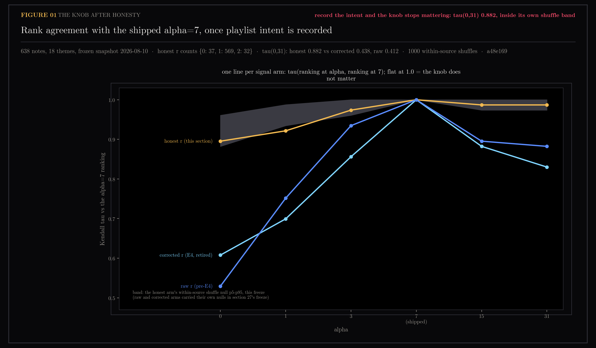
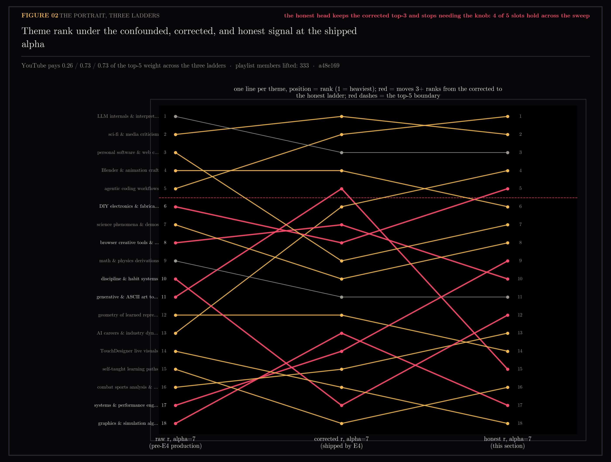

# E6 — The Honest Ladder: Record the Intent, and Re-ask E5's Question

Section 27 measured the inherited alpha=7 doing real, unjustified work on the
medium-corrected signal, and declared the honest refit blocked for want of
cross-source save data. The owner then supplied the fact the pipeline never
recorded: *"I literally only add to that playlist when I want to surface that
to my notes."* The ytk playlist is curated — playlist membership IS the
deliberate-save signal YouTube was assumed not to have. E6 records it, adds
the honest arm to E5's sweep, and closes the alpha thread that three sections
chased as a statistics problem: it was a bookkeeping problem.

Generated by `scripts/e6_honest_ladder.py`.

```bash
uv run --with matplotlib python scripts/e6_honest_ladder.py
uv run --with matplotlib python scripts/e6_honest_ladder.py --figs-only
```

## Figures

### 01-knob-after-honesty.png

Kendall tau between each alpha's ranking and the shipped alpha=7 ranking, all
three arms, with the honest arm's within-source shuffle band. VERDICT: record
the intent and the knob stops mattering — tau(0,31) 0.882, inside its own
shuffle band.

### 02-portrait-three-ladders.png

Theme rank under the confounded, corrected, and honest ladders at the shipped
alpha. VERDICT: the honest head keeps the corrected top-3 and stops needing
the knob — 4 of 5 slots hold across the sweep.

## Notes

Question (2026-08-10): the signal ladder defined r=0 as "synced from the
playlist, never touched", so 322 of 358 YouTube notes carried zero recorded
intent while every Instagram delivery scored r=1 mechanically. E2 (asset 24)
found the resulting label collinear with medium; E4 (asset 26) corrected the
weights; E5 (asset 27) showed the corrected ranking still hanging on the
unjustified alpha=7. All three were downstream of the same omission: one
medium's intent was recorded, the other's was not. Measured against the live
playlist (334 videos, joined by video id): 322/358 vault YouTube notes are
playlist members; the auto-arrived margin is 36 notes.

### The change (shipped in this section's branch)

- `ytk sync` persists playlist membership to `~/.ytk/playlist_ids.json`
  (atomic write, refreshed every run) and logs `surface="sync"` per ingest —
  the provenance whose absence hid this signal for five weeks.
- `signals.signal_map` lifts a cached YouTube video to r >= 1 exactly as
  saved-source membership does elsewhere; takes keep their higher tier; a
  missing cache degrades to the text-only ladder.
- `interest.medium_controlled` is removed. With both media's intent recorded,
  E4's subtraction would mirror the confound it fixed — remove Instagram's
  r=1 but keep YouTube's. Raw levels are honest now; the correction is
  retired with its job done. `intake_adjusted_levels` survives for this
  record's scripts.
- `signals.assert_signal_coverage` guards `run_profile`: a saved-source note
  at r=0 is impossible by construction, so one proves the vault scan lost
  notes. E6's own first run demonstrated the failure mode — a pending macOS
  permission prompt made the iCloud vault scan silently return nothing, every
  note read r=0, and only the snapshot gate caught it. Production would have
  shipped that unweighted portrait without a word.

### Method

E5's harness, one freeze, three arms: **raw** (classify() only, pre-E4
production), **adjusted** (E4's correction — what production computed until
this branch merges), **honest** (raw + playlist lift — what production
computes after). Alpha over {0, 1, 3, 7, 15, 31}, decay*batch base held
fixed, reference = shipped alpha=7 within each arm; within-source shuffle
null (1000 draws, seed 0) for the honest arm.

- **The freeze is newer than section 27's.** The profile regenerated on
  schedule at 2026-08-10T10:18Z, mid-section: 638 notes, 18 themes
  (re-clustered and re-labelled), stored counts {r0: 361, r1: 245, r2: 32}.
  Section 27 ran on the 2026-08-08 snapshot (604 notes, 17 themes). Every
  cross-arm claim here is computed inside the new freeze; comparisons to 27's
  exact values are same-design-different-freeze and labelled as such.
- **Gate.** The *adjusted* arm at alpha=7 must reproduce the stored weights,
  because this snapshot was generated by post-E4 production — max abs diff
  0.00000, counts exact, 0 missing. (27 gated on raw for the same reason
  against its pre-regeneration snapshot; the gate follows the producer.)
- Honest counts on the snapshot universe: {r0: 37, r1: 569, r2: 32};
  333 playlist members lifted.

### The knob stops mattering

Observed tau vs the alpha=7 ranking (raw and adjusted carried their own nulls
in 27's freeze; the honest null is this freeze's):

| alpha | raw | adjusted | honest | honest null p05 | p(chance moves as far) |
|---|---|---|---|---|---|
| 0 | 0.529 | 0.608 | 0.895 | 0.882 | 0.185 |
| 1 | 0.752 | 0.699 | 0.922 | 0.935 | 0.047 |
| 3 | 0.935 | 0.856 | 0.974 | 0.961 | 0.242 |
| 15 | 0.895 | 0.882 | 0.987 | 0.974 | 0.370 |
| 31 | 0.882 | 0.830 | 0.987 | 0.974 | 0.487 |
| 0 vs 31 | 0.412 | 0.438 | **0.882** | p05 0.851 | 0.170 |

The honest arm is what E5 hoped the corrected arm would be and measured it
was not: flat. Max |share delta| across the entire sweep is **0.006** — no
theme's rendered share moves by even one point whatever the knob says — and
the observed curve sits inside its own within-source shuffle band everywhere
(worst p 0.047 at alpha=1, one point at the 1/1000-resolution edge; every
other p 0.17-0.49). The mechanism is arithmetic, not subtlety: with 569 of
638 notes at r=1, `w = 1 + alpha*r` multiplies nearly everyone equally and
cancels out of the shares; alpha's surviving lever is the 32 takes against
the 37 auto-arrivals, and that lever is weaker than chance placement of the
same values. The refit question E5 declared blocking is not unblocked — it is
**dissolved**: there is no ranking-relevant slope left to fit.

### What the honest portrait shows

At the shipped alpha, corrected and honest agree on the top-3 outright —
sci-fi & media criticism, agentic coding workflows, LLM internals &
interpretability — and the honest arm holds 4 of its 5 top slots across the
entire sweep (E5's corrected arm held 1 of 5). YouTube pays 0.73 of the top-5
weight under both corrected and honest ladders, against 0.26 under raw: the
correction's medium repair is preserved, now by honest bookkeeping instead of
a subtraction. Below the head, volume-vs-boost rebalances: AI careers (6→4),
DIY electronics (8→5), science demos (10→8) and systems engineering (14→9)
rise on curated volume; generative & ASCII art tools falls 5→15 and graphics
& simulation 13→17 as the r=2 concentration boost stops carrying them. The
rendered portrait picks this up at the next scheduled `ytk profile` run after
the merge.

### Caveats

- One freeze, seeded shuffles, p-resolution 1/1000; the alpha=1 p 0.047 is a
  borderline single point, not a finding.
- The 36 non-playlist YouTube notes are treated as passive; some are
  deliberate one-off `ytk add`s the capture log (born 2026-07-29) predates.
  Misclassifying them understates honest intent slightly — in the
  conservative direction.
- 12 playlist videos are not in the vault at all (filtered or failed at
  ingest, unaudited); the cache lifts only notes that exist.
- The playlist lift trusts the owner's stated rule. If playlist behaviour
  drifts (bulk adds, auto-adds), r=1 inherits the drift — the provenance now
  in the capture log is what would catch it.
- Theme labels changed with the overnight re-clustering; cross-references to
  section 27's theme names do not map one-to-one.

### Verdict

**Three sections of statistics were compensating for a missing checkbox.**
The save signal was never confounded because saving means less than intent —
it was confounded because YouTube's intent had no place to be written down.
Record it, and every downstream pathology resolves at once: the medium
correction becomes unnecessary (and is retired), the alpha slope cancels out
of the shares (tau 0.882-1.000 across a 31x sweep, inside its shuffle band,
max share move 0.006), and the portrait's head stops depending on a number
nobody could justify. The knob stays at 7 because it no longer matters where
it points; what remains alpha-touchable — 32 takes against 37 auto-arrivals —
is below the noise floor of random placement. The July fit never needs
rerunning. The durable lesson for the record: when a weighting knob is doing
mysterious work, audit what the label *means* before fitting how much it
should weigh.

## Files

- `01-knob-after-honesty.png` — tau vs the shipped ranking, three arms, honest-arm shuffle band
- `02-portrait-three-ladders.png` — theme rank under raw, corrected, honest at alpha=7
- `e6-honest-ladder.json` — all numbers: shares, ranks, taus, nulls, p-values, media fractions
