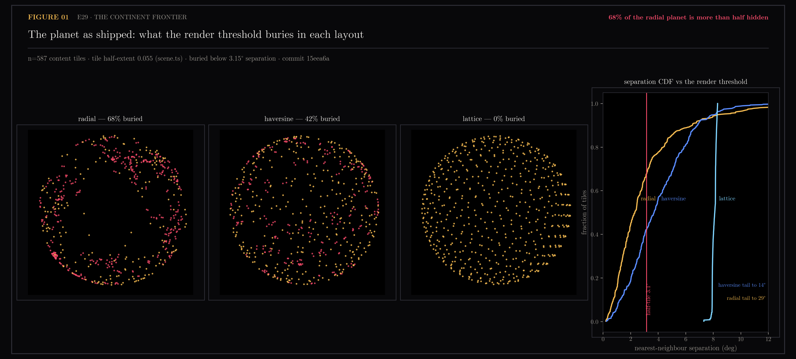
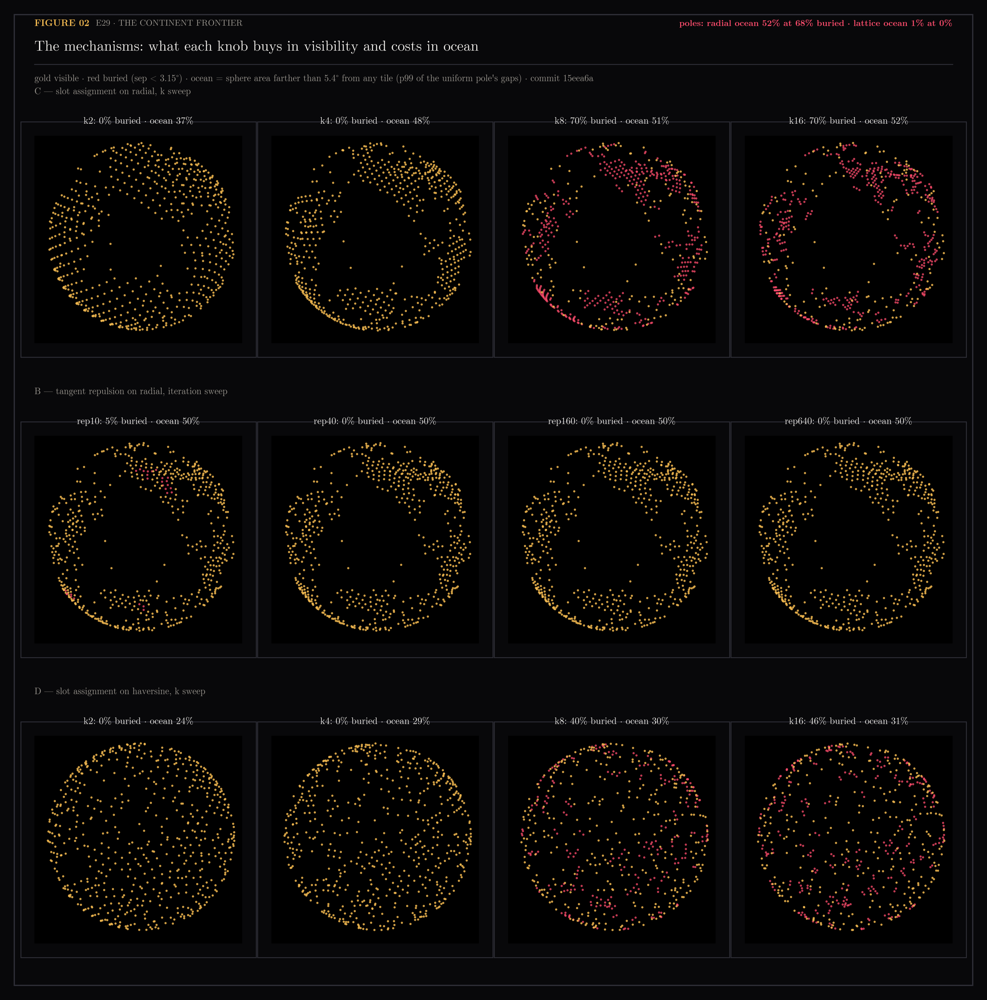
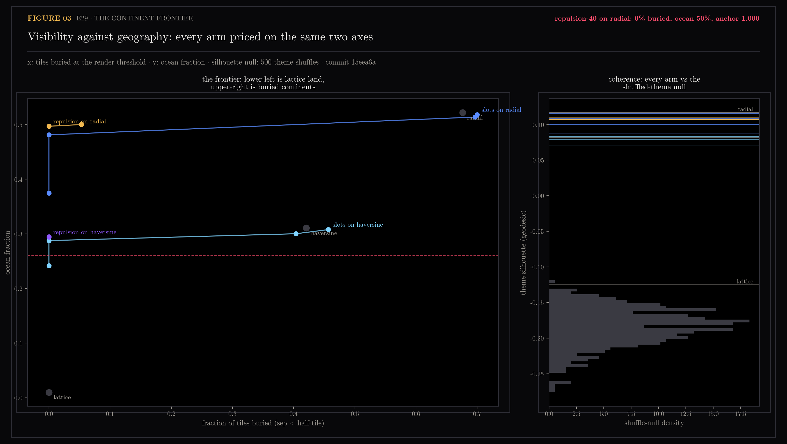

# E29 — The Continent Frontier: De-overlap the Planet Without Draining the Oceans

Issue #175 began as "spread radial's bearings so it passes the overlap gate."
Checking the built artifact reframed it: `chosen` is only `/orb`'s on-load
default, all three layouts ship, and the gate's winner (lattice) wins by
destroying the thing radial is valued for — continents. Dense themed
landmasses need empty ocean, and neither trustworthiness nor overlap_frac can
see density structure. The honest visibility bound also isn't the score's
equal-area theta (4.19°) but the renderer's tile size: `TILE_HALF = 0.055`
(`web/src/lib/orb/scene.ts:20`), 3.15° of arc, under which a neighbour hides
more than half a tile. Radial's mean nearest-neighbour separation is 3.05° —
the median tile on the shipped radial planet is more than half buried.

E29 asks: is there a transform of radial's bearings that brings every tile
above the visibility line while keeping the geography, and what does each
unit of visibility cost?

Generated by `scripts/e29_continent_frontier.py`.

```bash
uv run --with matplotlib,scikit-learn,scipy python scripts/e29_continent_frontier.py data
...                                                                          transforms
...                                                                          frontier
...                                                                          assets
```

## Figures

### 01-the-buried-planet.png

The poles as shipped, buried tiles red. Radial: 68% buried, the red riding
exactly the dense continent ring. Haversine: 42%. Lattice: 0% and no
geography. VERDICT: 68% of the radial planet is more than half hidden.

### 02-the-mechanisms.png

Arm C (assignment to a k-times-oversampled fibonacci lattice, minimum-total-
displacement) and arm B (fixed-iteration tangent repulsion) across their
knobs, plus arm C on haversine. C-k4 and B-rep40+ reach 0% buried with the
continent ring intact; k8/k16 collapse to 70% buried exactly where the slot
pitch drops below a tile (pitch ≥ 3.15° only holds for k ≤ 7 at n=587).

### 03-the-frontier.png

Every arm priced on visibility (x) and ocean (y); each mechanism's path is a
curve, poles in DIM. The gold repulsion path reaches x=0 nearly without
descending; every haversine arm sits in a dominated band below. Right panel:
all radial-derived arms hold theme silhouette far above the 500-shuffle null.
VERDICT: repulsion-40 on radial — 0% buried, ocean 50%, anchor 1.000.

## Notes

### Measured state at the start (all numbers at commit 15eea6a, n=587)

| layout | trust | occluded @3.15° | ocean | silhouette |
|---|---|---|---|---|
| radial | 0.8646 | 67.6% | 52.2% | 0.117 |
| haversine | 0.8472 | 42.1% | 31.1% | 0.082 |
| lattice | 0.6290 | 0.0% | 1.0% | -0.125 |

Ocean is calibrated so the uniform pole defines zero: sphere area farther
than 5.4° (p99 of lattice's probe gaps) from any tile, on an 8192-point
fibonacci probe grid. Raw uncovered area would call the lattice itself 56%
"ocean" — at n=587 even uniform spacing (8.07° mean NN) leaves gaps wider
than a tile.

### Method

Both mechanisms transform the stored radial bearings, deterministically.
Arm B: tangent repulsion, pairs closer than 1.15x the render threshold push
apart along the great-circle tangent, fixed iteration count; the only
randomness is seeded jitter breaking exactly-coincident bearings. Arm B
converges — rep40, rep160 and rep640 are identical to three decimals because
the force goes quiescent once no pair overlaps. Arm C: scipy
`linear_sum_assignment` of points onto a k-oversampled fibonacci lattice,
minimizing total geodesic displacement; separation is guaranteed by slot
pitch while k ≤ 7, and empty slots are the ocean. Continent coherence is
per-theme geodesic silhouette against a shuffled-label null; anchoring is
Spearman rho of pairwise theme-centroid geodesics against raw radial.
Trustworthiness is measured on 582/587 url-matched store vectors (the store
had drifted 74 points ahead of map.json; index alignment is for shipping,
url-matching is fine for a measurement).

### The frontier

| arm | occluded | ocean | silhouette | anchor | trust |
|---|---|---|---|---|---|
| radial (pole) | 67.6% | 52.2% | 0.117 | 1.000 | 0.8646 |
| **B-rep40** | **0.0%** | **49.7%** | **0.108** | **1.000** | **0.8626** |
| C-k4 | 0.0% | 48.1% | 0.100 | 1.000 | 0.8598 |
| B-rep160-wide | 0.0% | 45.1% | 0.102 | 0.999 | 0.8585 |
| C-k2 | 0.0% | 37.5% | 0.088 | 0.996 | 0.8514 |
| DB-rep40 (haversine) | 0.0% | 29.4% | 0.082 | 0.946 | 0.8466 |
| lattice (pole) | 0.0% | 1.0% | -0.125 | 0.528 | 0.6290 |

The pre-registered bar (0% occluded, ocean ≥ half of radial's, silhouette
clear of the null) is passed by ten arms; B-rep40 dominates. De-overlapping
radial costs 2.5 points of ocean, 0.009 of silhouette, 0.002 of
trustworthiness, and moves no continent (anchor 1.000). Issue #175's original
"within a whisker" target is met literally. The haversine family is dominated
end to end — the compass bearings are the better substrate, and the fitted
layout's advantage evaporates once both are made visible.

### The two thresholds disagree, and that decides the wiring

B-rep40 passes the render threshold but still fails the legacy `score()`
gate (81.9% overlap at its equal-area theta of 4.19°): repulsion stops just
above 3.15°, and the old gate calls that overlapping. The gate is measuring
a threshold the renderer does not draw. Widening the repulsion target to
1.15x the old theta (B-rep160-wide above) passes both gates for a measured
price: 4.6 points of ocean and 0.004 of trust. So the options for wiring,
each with its cost on the table:

1. Ship B-rep40 and re-derive `score()`'s threshold from `TILE_HALF` — the
   experiment's position: the render is the honest bound.
2. Ship B-rep160-wide and leave `score()` untouched — pays the measured
   price for not touching the gate.
3. Either way, a spread layout with trust ~0.86 entering `sphere_block`
   takes `chosen` from lattice (0.629) and flips `/orb`'s on-load default.
   Whether it replaces `radial` or ships as a fourth layout key
   (`LayoutName`, `web/src/api/orb.ts:25`) is the owner's call — deferred
   out of E29 deliberately.

### Ceilings and confounds

- Theme labels come from the 2D map clustering, not the sphere; a noisy
  partition depresses every arm's silhouette equally. Comparisons are
  paired; absolute silhouette values are not meaningful alone.
- Arm C optimizes displacement, not geography; the anchoring axis exists to
  catch objective-vs-goal divergence and read 1.000/0.996 — no divergence
  at these k.
- The sphere block is computed from stored `c3` and drifts from the vault
  between full builds (74 points at measurement time). Unchanged from #175,
  still out of scope.
