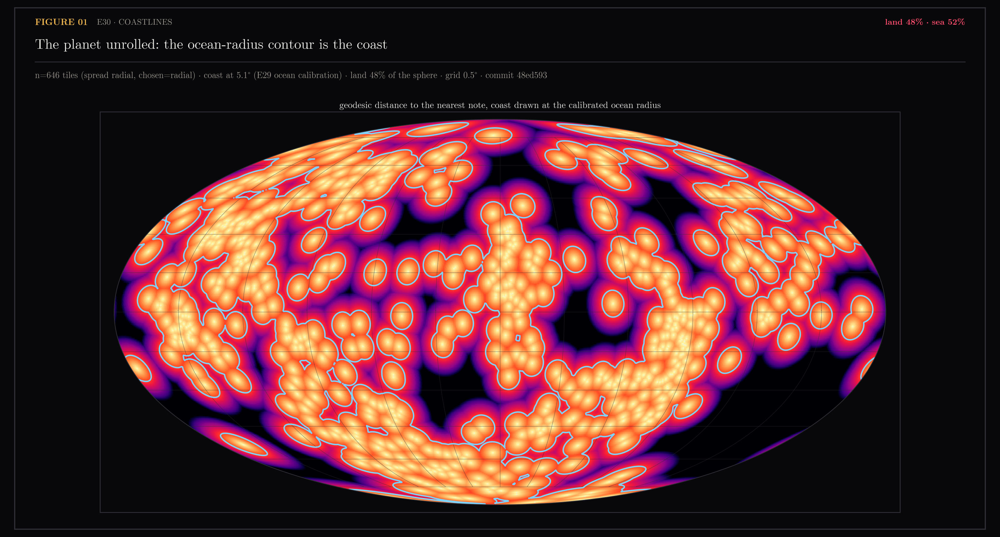
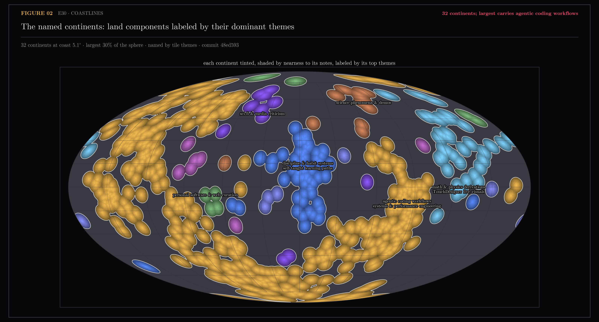

# E30 — Coastlines: The Land/Sea Boundary of the /orb Planet

E29 quietly proved the planet has a shoreline; E30 draws it. The sphere is the
embedding manifold, and E29's ocean calibration already answered "where does
emptiness begin": farther than the p99 gap of the uniform lattice pole from
any note. That number is not just a scalar for scoring — it is a contour
level. Geodesic distance to the nearest note, contoured at the calibrated
radius, *is* the coastline. No bandwidth, no density estimator, no knob to
defend: the coast is derived from the record. The honest price is shape —
fixed-radius coasts are unions of circular caps, beads of water on glass
rather than eroded rock. A KDE would look more geological at the cost of a
bandwidth argument; that remains an explicitly cosmetic later option.

Substrate: the spread radial layout that shipped from E29 (chosen at trust
0.8640, 0% buried, 646 content points after the full rebuild), so the field
is drawn from positions where every note is actually visible.

Generated by `scripts/e30_coastlines.py`.

```bash
uv run --with matplotlib,scipy python scripts/e30_coastlines.py field
...                                                             continents
...                                                             assets
```

## Figures

### 01-the-planet-unrolled.png

The distance field on a 0.5° grid, Mollweide-projected; brightness is
nearness to content, the cyan contour is the coast at the calibrated radius.
VERDICT: land 48% · sea 52%.

### 02-the-named-continents.png

Wrap-aware connected land components, tinted, shaded by nearness, labeled at
their interior poles by the dominant themes of the tiles they carry.
VERDICT: 32 continents; the largest carries agentic coding workflows.

### 03-the-planet-turns.mp4
One full 18-second orbit of the planet in 3D (ManimCE, 720p30) — tiles in
their continent tints, coasts drawn on the surface. What the orbit adds to
the stills is parallax: a still sphere cannot prove the far side exists.
Rendered by `scripts/manim/planet.py` from `scripts/manim/planet.json`
(the harness's `export` stage); motion verified by pixel-diffing frames
inside the window, never by exit code.

## Notes

### Method

- Grid: 721x361 lon/lat (0.5°); per cell, geodesic distance to the nearest
  tile and that tile's theme.
- Coast radius: p99 of the uniform lattice pole's probe gaps (E29's ocean
  calibration), 5.09° at n=646.
- Continents: `scipy.ndimage.label` on the land mask, components touching
  across the longitude seam merged (the seam is where the map was cut open,
  not a coast). Areas are cos(lat)-weighted.
- Names: dominant one or two themes among each continent's tiles, from the
  17 labeled groups in map.json.
- Labels sit at each continent's interior pole (deepest-inland cell,
  cos(lat)-deflated so stretched polar rows don't win), never its centroid —
  a sprawling landmass centres over someone else's ocean.
- Sidecar: `continents.json` (coast radius, per-continent areas and names) —
  exactly what a future /orb coastline layer would consume.

### The atlas at commit 48ed593 (n=646, coast 5.09°)

| continent | area | themes |
|---|---|---|
| 1 | 29.9% | agentic coding workflows, systems & performance engineering |
| 2 | 4.8% | discipline & habit systems, self-taught learning paths |
| 3 | 4.5% | math & physics derivations, TouchDesigner live visuals |
| 4 | 1.0% | sci-fi & media criticism |
| 5 | 0.9% | science phenomena & demos |
| + 27 smaller | ~7% | islands down to single-note atolls |

Land covers 48.4% of the sphere. One supercontinent carries the daily-work
themes; the personal-growth cluster (discipline, self-taught learning) is its
own continent dead centre, separated from the work landmass by open sea.

### Ceilings and confounds

- The 0.5° grid bounds coastal detail; structure finer than half a degree is
  invisible.
- Continent names inherit the theme clustering's noise (fitted in the 2D map
  view, not on the sphere); a mislabeled theme mislabels a continent.
- This is a visual and semantic layer only: search, scoring and the retrieval
  gate are untouched, and E30 makes no fidelity claim beyond E29's.
- Drawing the coasts live on the /orb globe is separate frontend work; this
  section ships the data and the proof.
