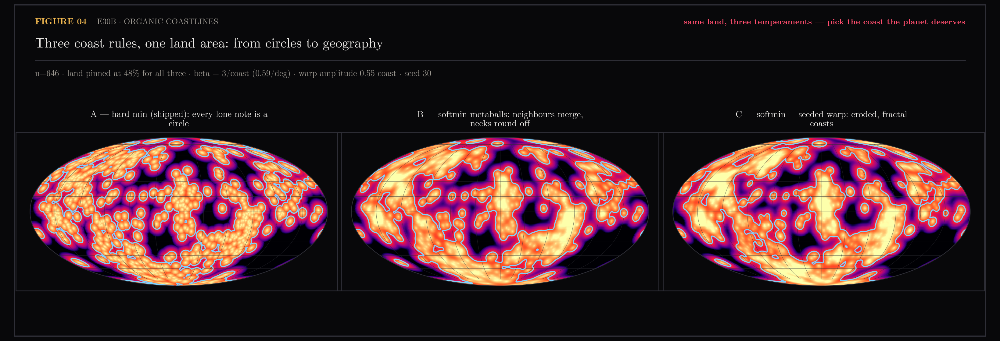
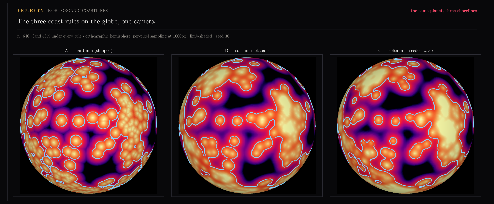
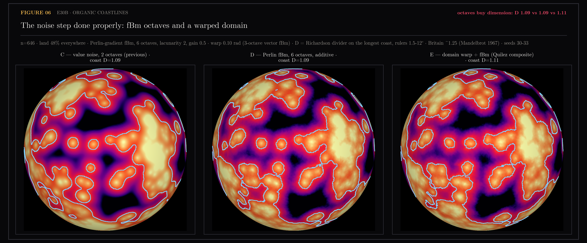
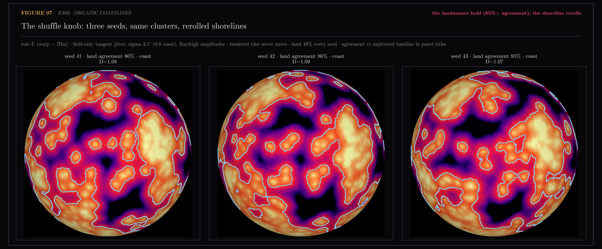

# E30 — Coastlines: The Land/Sea Boundary of the /orb Planet

E29 quietly proved the planet has a shoreline; E30 draws it. The sphere is the
embedding manifold, and E29's ocean calibration already answered "where does
emptiness begin": farther than the p99 gap of the uniform lattice pole from
any note. That number is not just a scalar for scoring — it is a contour
level. Geodesic distance to the nearest note, contoured at the calibrated
radius, *is* the coastline. No bandwidth, no density estimator, no knob to
defend: the coast is derived from the record. The honest price is shape —
fixed-radius coasts are unions of circular caps, beads of water on glass
rather than eroded rock. A KDE would look more geological at the cost of a
bandwidth argument; that remains an explicitly cosmetic later option.

> **Later:** the cosmetic option was exercised the same day the section
> landed. The owner's verdict on the caps — cartoonish — drove figures
> 04-07, and the default coast rule is now the organic composite (softmin
> metaballs over a warped domain, Perlin fBm roughening), with land area
> still pinned by the E29 calibration. The parameter-free contour survives
> as `--coast hard`, and figures 01-03 as committed now show the organic
> rule. The original claim above stands as written: the hard rule needed no
> knobs, and every knob added since is priced in figures 04-07.

Substrate: the spread radial layout that shipped from E29 (chosen at trust
0.8640, 0% buried, 646 content points after the full rebuild), so the field
is drawn from positions where every note is actually visible.

Generated by `scripts/e30_coastlines.py`.

```bash
uv run --with matplotlib,scipy python scripts/e30_coastlines.py field
...                                                             continents
...                                                             assets
```

## Figures

### 01-the-planet-unrolled.png

The distance field on a 0.5° grid, Mollweide-projected; brightness is
nearness to content, the cyan contour is the coast at the calibrated radius.
VERDICT: land 48% · sea 52%.

### 02-the-named-continents.png

Wrap-aware connected land components, tinted, shaded by nearness, labeled at
their interior poles by the dominant themes of the tiles they carry.
VERDICT: 32 continents; the largest carries agentic coding workflows.

### 03-the-planet-turns.mp4
One full 18-second orbit of the planet. What the orbit adds to the stills
is parallax: a still sphere cannot prove the far side exists. Motion is
verified by pixel-diffing frames inside the window, never by exit code.

> **Later:** re-rendered in the stills' own language after the owner's
> style verdict on the first cut. The manim/cairo version
> (`scripts/manim/planet.py`, kept as the record of the attempt) could only
> offer a lit grey mesh with drawn outlines; the current clip
> (`scripts/render_planet_orbit.py`) renders every frame with the same
> per-pixel orthographic projection as figures 05-07 — magma-glow land
> anchored at the shoreline, cyan coast, limb shading, the organic rule.
> Lesson: importing the palette constants is not importing the style; the
> composition is the style.

### 04-three-coast-rules.png

The owner's circle critique made concrete (`scripts/e30b_organic_coast.py`):
the shipped hard-min coast can only draw circles around lone notes, because
it is a union of fixed-radius caps. A softmin (metaball) field pools nearby
notes into organic landmasses; a seeded value-noise warp erodes the edges.
All three re-level to the same 48% land, so the E29 calibration and the
atlas numbers survive a rule change. Not wired into the pipeline — the
temperament choice is the owner's, and a lone note stays round-ish under
any rule (an isolated note is an atoll).

> **Later:** the choice was made — rule E (figures 05-06) is the default
> `--coast organic`.

### 05-globes-three-rules.png

The rules judged where they will live: per-pixel orthographic hemispheres
(`scripts/e30b_globes.py`), limb-shaded, one camera. On the sphere the
circle problem compounds; the metaball and warped coasts read as geography.

### 06-fbm-and-domain-warp.png

The noise step done per the literature (`scripts/e30b_fbm.py`): Perlin-
gradient fBm, six octaves (Perlin 1985/2002; Musgrave 1989), and the Quilez
composite that warps the domain before roughening. Instrument correction
recorded: box-counting on an archipelago returns impossible dimensions
below 1 (disconnected islands collapse to lone boxes at coarse scale); the
committed D values use Mandelbrot's Richardson divider on the longest
single coast — 1.09/1.09/1.11 at rulers 1.5-12°, vs Britain's ~1.25, with
the caveat that the finest ruler cannot see the top octaves' roughness.

### 07-the-shuffle-knob.png

The reroll parameter (`scripts/e30b_shuffle.py`): seeded tangent jitter of
the notes inside the field computation only (Rayleigh amplitudes, sigma 0.6
coast). Rendered tiles never move, so E29's visibility guarantees are
untouched; land-mask agreement with the unjittered baseline is 85-86% while
the shoreline visibly rerolls. Wired as `--shuffle-seed`.

## Notes

### Method

- Grid: 721x361 lon/lat (0.5°); per cell, geodesic distance to the nearest
  tile and that tile's theme.
- Coast radius: p99 of the uniform lattice pole's probe gaps (E29's ocean
  calibration), 5.09° at n=646.
- Continents: `scipy.ndimage.label` on the land mask, components touching
  across the longitude seam merged (the seam is where the map was cut open,
  not a coast). Areas are cos(lat)-weighted.
- Names: dominant one or two themes among each continent's tiles, from the
  17 labeled groups in map.json.
- Labels sit at each continent's interior pole (deepest-inland cell,
  cos(lat)-deflated so stretched polar rows don't win), never its centroid —
  a sprawling landmass centres over someone else's ocean.
- Sidecar: `continents.json` (coast radius, per-continent areas and names) —
  exactly what a future /orb coastline layer would consume.

### The atlas at commit 48ed593 (n=646, coast 5.09°)

| continent | area | themes |
|---|---|---|
| 1 | 29.9% | agentic coding workflows, systems & performance engineering |
| 2 | 4.8% | discipline & habit systems, self-taught learning paths |
| 3 | 4.5% | math & physics derivations, TouchDesigner live visuals |
| 4 | 1.0% | sci-fi & media criticism |
| 5 | 0.9% | science phenomena & demos |
| + 27 smaller | ~7% | islands down to single-note atolls |

Land covers 48.4% of the sphere. One supercontinent carries the daily-work
themes; the personal-growth cluster (discipline, self-taught learning) is its
own continent dead centre, separated from the work landmass by open sea.

> **Later:** under the organic rule the atlas re-draws at the same land
> area: 27 continents, the largest (still agentic coding + systems
> engineering) now 39% of the sphere — the metaball pooling joins caps the
> hard rule kept apart. The story above is unchanged; the current numbers
> live in `continents.json`, which records its `coast_rule`.

### Ceilings and confounds

- The 0.5° grid bounds coastal detail; structure finer than half a degree is
  invisible.
- Continent names inherit the theme clustering's noise (fitted in the 2D map
  view, not on the sphere); a mislabeled theme mislabels a continent.
- This is a visual and semantic layer only: search, scoring and the retrieval
  gate are untouched, and E30 makes no fidelity claim beyond E29's.
- Drawing the coasts live on the /orb globe is separate frontend work; this
  section ships the data and the proof.
