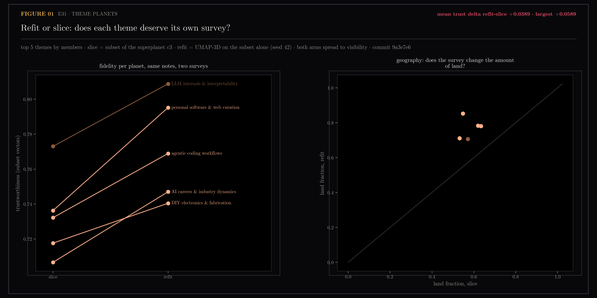
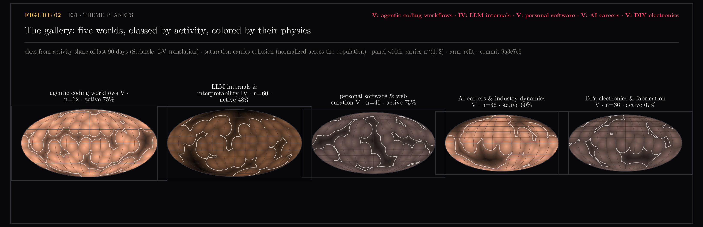

# E31 — Theme Planets: Refit vs Slice, and a Physically-Motivated Taxonomy

Toward #78, designed in #176. E30 proved the planet pipeline never knew it
was drawing "the" planet; E31 recurses it onto the top five themes and
measures the two decisions the recursion needs: whether each theme deserves
its own survey (refit UMAP-3D on the subset) or can keep its corner of the
superplanet's projection (slice of stored c3), and how sibling planets stay
visually distinct without arbitrary palette cycling.

Generated by `scripts/e31_theme_planets.py`.

```bash
uv run --with matplotlib,scipy,scikit-learn,umap-learn python \
    scripts/e31_theme_planets.py planets   # build + score both arms
...                              figures
...                              assets
```

## Figures

### 01-refit-vs-slice.png

Same notes, two surveys. Every line rises: refit beats slice on all five
planets. VERDICT: mean trust delta +0.0389, largest +0.0589.

### 02-the-gallery.png

The taxonomy rendered: class hue from activity, saturation from cohesion
(normalized across the population), panel width from n^(1/3), terrain from
each planet's own E30 geography.

## Notes

### Refit vs slice (n=641 url-matched of 646; commit 9a3e7e6)

| planet | n | trust slice | trust refit | delta | land slice→refit |
|---|---|---|---|---|---|
| agentic coding workflows | 62 | 0.7322 | 0.7689 | +0.037 | 63% → 78% |
| LLM internals & interpretability | 60 | 0.7730 | 0.8088 | +0.036 | 57% → 71% |
| personal software & web curation | 46 | 0.7363 | 0.7952 | +0.059 | 62% → 78% |
| AI careers & industry dynamics | 36 | 0.7067 | 0.7470 | +0.040 | 53% → 71% |
| DIY electronics & fabrication | 36 | 0.7177 | 0.7405 | +0.023 | 55% → 85% |

Refit wins everywhere, mean +0.0389 — clear, not decimals, so the recursion
justifies per-planet refits (with the encoder-epoch stamp and the grove
rule: cache topologies, attach incrementally, never reshuffle). Both arms
reach 0% occlusion after `spread()`. A second, unplanned finding: refit
worlds are Pangeas — land fraction rises to 71-85% and continents collapse
to one, because the harbor-scale survey spends the whole sphere on the
theme's internal structure. The slice keeps more ocean by inheriting the
corner geometry. If sub-planet geography is ever the point (continents
*within* a theme), the slice arm is the more geological one — worth knowing
before the galaxy commits.

### The taxonomy (Sudarsky I-V translated; astro-ph/9910504, 1807.08453)

| astronomy | theme planet | channel |
|---|---|---|
| effective temperature | activity share, last 90 days | class hue I-V |
| metallicity | cohesion (mean cosine to centroid) | saturation |
| cloud cover | cohesion spread | (reserved) |
| radius | n^(1/3) | panel width |
| surface | E30 geography at own calibration | terrain + coast |

Measured classes: four of five top themes are class V (silicate glow,
active ≥ 50%), one class IV (LLM internals, 48%). That degeneracy is
Batalha's caution realized — top-by-membership selects for currently-active
themes, so color alone cannot separate this population and the other
channels (size, saturation, terrain) must carry it; in the gallery they do.
Class spread will appear when mid-tail and dormant themes become planets.
Date coverage is 95% overall; activity is computed over dated notes only.

### Sidecar

`planets.json`: per planet — label, n, activity, cohesion, class, hue, and
both arms' spread positions with their geography. This plus E30's
`continents.json` is the input a galaxy view (#78) consumes: planets at
member centroids under the map's fitted projection, radius n^(1/3), surface
from the refit arm.

### Ceilings and confounds

- Small-n UMAP refits (36-62 points) are the least stable piece; the win is
  consistent across all five but stability across encoder epochs is
  untested.
- Theme labels inherit the 2D clustering's noise; paired comparisons are
  unaffected.
- The activity thresholds for classes are stated (0.05/0.15/0.30/0.50), not
  fitted; with five hot planets they barely discriminate — deliberate, so
  the class means the same thing when colder planets join.
