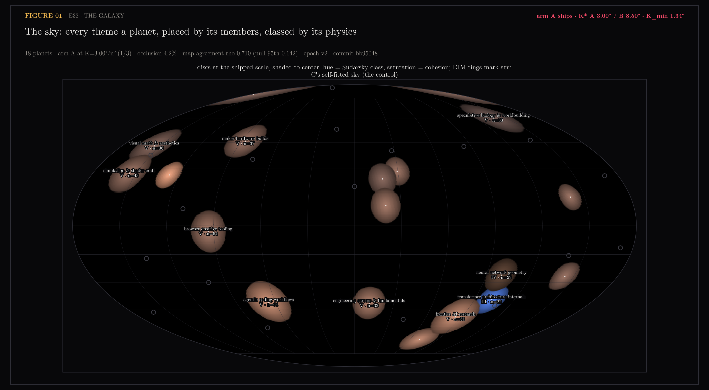
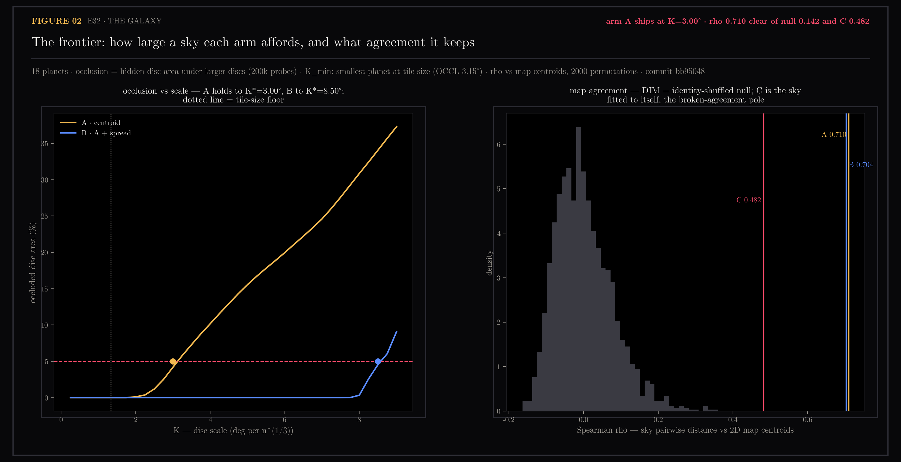
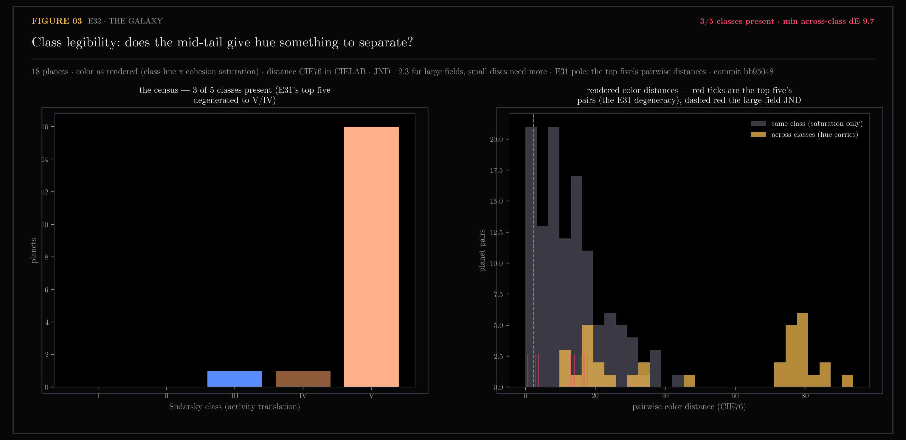

# E32 — The Galaxy Layout: A Legible Sky Over the Planets

Toward #78, designed in #177. E31 left the level above the planets
unmeasured: does placing every theme planet at its members' centroid under
the map's already-fitted projection produce a legible sky — planets visible,
neighbors meaningful, classes readable at distance — or does the galaxy need
its own de-overlap pass the way the planet surface did (E29)? Three arms:
**A**, centroids of member `c3` turned into directions from the content
cloud's own center (agrees with `/map` by construction, and a planet hangs
over its members' tiles on `/orb`); **B**, A plus E29's tangent repulsion
recursed upward with a per-pair target — discs of radius r_i, r_j clear each
other at r_i + r_j; **C**, the control, a haversine UMAP fitted to the 18
centroid vectors alone — the sky fitted to itself, deliberately breaking
agreement.

The scale question the design left implicit is anchored in render truth: the
disc radius is the galaxy's render threshold, and its floor K_min is the
scale at which the smallest planet still draws as large as one tile does on
`/orb` today (`OCCL_DEG` = 3.15°). The frontier then measures the largest
scale each arm affords under the pre-registered bar (<5% hidden disc area).

Generated by `scripts/e32_galaxy.py`, on the same-day full map rebuild
(655 content points, radial chosen, 0% overlap) — the url-match fallback is
fine for measurement but positions ship here, so the map was rebuilt first.

```bash
uv run --with matplotlib,scipy,scikit-learn,umap-learn python \
    scripts/e32_galaxy.py galaxy   # arms, sweep, axes -> ~/.ytk cache
...                       figures
...                       assets
```

## Figures

### 01-the-sky.png

Every theme placed, sized by n^(1/3), hue from Sudarsky class, saturation
from cohesion, shaded to center; DIM rings are arm C's self-fitted sky.
VERDICT: arm A ships — K* A 3.00° / B 8.50°, K_min 1.34°.

### 02-the-frontier.png

The two clauses of the verdict rule on one page: how large a sky each arm
affords under the 5% bar, and what map agreement it keeps against the
identity-shuffled null and arm C's floor.

### 03-the-classes.png

The mid-tail delivers classes III and IV but no I or II; hue separates only
across the warm/blue divide. VERDICT: 3/5 classes present, min across-class
dE 9.7.

## Notes

### The verdict (n=655 content points, 18 themes; epoch v2, commit bb95048)

**Arm A ships: the galaxy is free.** At the tile-size floor and up to
K* = 3.00° per n^(1/3), the centroid sky keeps hidden disc area under the
pre-registered 5% (4.2% at the shipped K), with map agreement rho 0.710 —
clear of the identity-shuffled null (95th percentile 0.139) and of arm C's
floor (0.482). No de-overlap pass is needed at the scale that ships.

| axis | A · centroid | B · A + spread | C · self-fitted |
|---|---|---|---|
| K* (largest scale under 5% occlusion) | 3.00° | 8.50° | — |
| occlusion at K=3.00° | 4.2% | 0.0% | — |
| map agreement rho | 0.710 | 0.704 | 0.482 |
| trustworthiness (centroid vectors) | 0.726 | 0.734 | **0.777** |
| anchor vs A at K=3.00° (disp/radius, rho) | — | 0.18, 0.998 | — |

C behaves exactly as priced: it wins fidelity (trust 0.777, the best sky
for the centroids alone) and pays for it in shared geometry — its agreement
floor is what "breaking `/map`" costs, and A clears it by 0.23 of rho.

**B is the reserve, and the frontier prices it.** Spreading holds occlusion
at 0% out to K* = 8.50° — nearly triple A's sky — but not for free: by
K≈7° the mean displacement reaches a full disc radius and the A↔B pairwise
agreement sags to ~0.71. At the shipped scale B is cheap (disp 0.18 radii,
anchor rho 0.998), so if the build ever wants discs past 3°, E29's machinery
recursing upward is the finding to reach for, priced by `anchor_disp` in the
cache.

### The census — E31's prediction, measured

E31 predicted class spread "when mid-tail and dormant themes become
planets." Measured: partially. The full population adds one class III
(transformer architecture internals, activity 0.24) and one class IV
(neural network geometry, 0.33) — but 16 of 18 planets are still class V.
This owner is simply active everywhere: even physics & vector calculus and
TouchDesigner live visuals run activity ≥ 0.85. Classes I-II (activity <
0.15) do not exist in this vault today. Consequence for the build: hue
separates the blue III world from everything and barely orders the warm
rest (min across-class dE 9.7 sits inside the within-class saturation
spread, max 44.4) — size and saturation still carry the population apart,
Batalha's caution twice confirmed.

### Sidecar

`galaxy.json` — the frontend's input for the #78 galaxy view: per planet —
label, n, activity, date coverage, cohesion, class, hue, `map_xy` (the 2D
map centroid), `radius_deg`, and the shipped arm-A position on the unit
sphere. Header carries the epoch (v2), commit, arm, K, K_min, and the
agreement rho. **The renderer must consume `radius_deg` verbatim** — the
disc radius is the render threshold, the same sync contract as `TILE_HALF`.

### Ceilings and confounds

- Theme identity is rebuild-scoped: the same-day rebuild dissolved the n=2
  theme and re-cut several memberships (E31's table names themes today's
  map no longer has). `galaxy.json` is consistent with the map.json of its
  stamped commit; a future rebuild must regenerate both together.
- K_min anchors to today's `TILE_HALF`; if the galaxy view renders tiles at
  a different scale the floor moves with it (the sweep in the cache covers
  0.25°-9°).
- Occlusion uses a deterministic z-order (larger n paints on top). A camera
  view would make "nearer" view-dependent; this is the view-independent
  bound the layout can control.
- Activity is computed over dated notes only; date coverage spans 0.77-1.0
  per planet (timestamp-coverage caveat — the two coldest planets are also
  the two worst-dated, 0.77 and 0.83, so their classes lean on the thinnest
  timestamp base).
- The agreement reference is the 2D map's theme centroids (`content.groups`
  x/y), not a ground truth — it prices consistency between views, not
  correctness of either.
