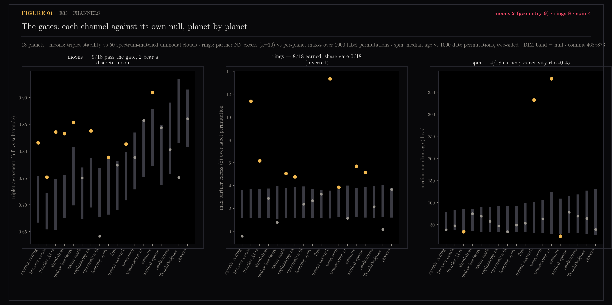
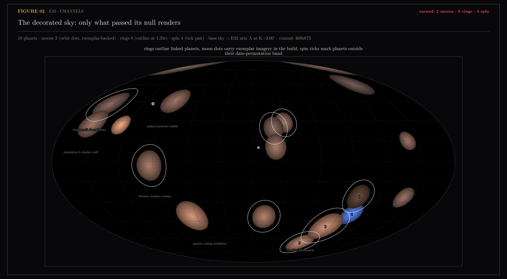

# E33 — Channels Earn Their Place: Moons, Rings, Spin

Toward #78, designed in #178, decorating E32's sky. Before the galaxy view
renders anything beyond the discs, each orbital channel passes its own null
or it does not render: moons gate on triplet agreement between the full
dendrogram and subsample dendrograms against spectrum-matched unimodal
clouds (the cone and the anisotropy survive the null, sub-structure does
not); rings gate partner-pair nearest-neighbor excess against the planet's
own max-z over theme-label permutations; spin gates median member age
two-sided against date permutations, then pays a pre-registered redundancy
price against the class channel's activity.

The owner's contract, registered in #178 up front: moons render as imagery
in the build — each moon ships its sub-cluster's medoid note (url, title,
thumb), so drawing the moon as a thumbnail is a data lookup.

Generated by `scripts/e33_channels.py`.

```bash
uv run --with matplotlib,scipy,scikit-learn,umap-learn python \
    scripts/e33_channels.py channels   # gates -> ~/.ytk cache
...                         figures
...                         assets
```

## Figures

### 01-the-gates.png

Every channel against its own null, planet by planet; GOLD = earned.
VERDICT: moons 2 (geometry 9) · rings 8 · spin 4.

### 02-the-decorated-sky.png

Only what passed renders: ring outlines at 1.35r, moon dots at 1.6r
(exemplar-backed), spin guillemets (fast », dormant «).

## Notes

### The verdict (n=650 url-matched of 655; epoch v2, commit 468b873)

| channel | earned | the finding |
|---|---|---|
| moons | 2 of 18 (9 pass the geometry gate) | reproducible internal hierarchy is common; discrete satellites are rare — gradients, not clusters, one level down |
| rings | 8 of 18 | real cross-theme structure, all pairs legible (table below) |
| spin | 4 of 18 (2 fast, 2 dormant) | independent of the hue channel (rho −0.45 < 0.8 bar) — spin earns its slot |

**Moons.** Nine planets reproduce their internal dendrogram geometry beyond
the unimodal null, but when the stable flat cut is taken, seven of them are
one core plus fringe — the "moon" was the planet itself. The rule shipped:
the largest cluster is the core, a moon is a minority sub-cluster with ≥ 3
members. Two planets bear one: maker hardware builds (an 8-note low-poly /
character-modeling cluster; exemplar "Create a 3D Low Poly Character…") and
learning systems & discipline (a 3-note somatic-movement cluster). This is
the epicmap lesson recursed: coarse geometry reproduces, flat partitions
mostly do not. The gate-only planets keep their stability numbers in
`channels.json` — a future sub-planet view (E31's slice arm) is the right
consumer, not a moon.

**Rings.** The registered share-gate (#178) failed by construction and is
reported, not used: under full label permutation the null cross-share sits
near 1 (permutation destroys all coherence), so the observed 0.18–0.76 can
only sit below it — its 0/18 confirms theme coherence and cannot detect a
ring. The ring lives in the pair excess, gated against the planet's own
max-z permutation null (99th), which handles partner multiplicity
empirically. Eight planets earn one; every partner is legible:

| planet | partner (z) |
|---|---|
| neural network geometry | transformer architecture internals (13.4), frontier AI research (5.0) |
| browser creative tooling | agentic coding workflows (11.4) |
| frontier AI research | transformer architecture internals (6.2) |
| compute & systems internals | frontier AI research (5.7) |
| visual math & aesthetics | TouchDesigner live visuals (5.1) |
| combat sports craft | learning systems & discipline (5.1) |
| engineering careers & fundamentals | agentic coding workflows (4.8) |
| neurotech & DIY science | learning systems & discipline (3.9) |

Directionality is honest — it is whose members look outward. Physics &
vector calculus misses at z 3.7 vs its own bar 3.8.

**Spin.** Four planets sit outside their date-permutation band: frontier AI
research (34d, fast), compute & systems internals (24d, fast), neural
network geometry (332d, dormant), transformer architecture internals (380d,
dormant). The two dormant planets are exactly the two non-V worlds — the
same dormancy that made them class III/IV — yet spin is not redundant with
hue across the population (rho −0.45, pre-registered bar 0.8): activity is
a 90-day share, median age is a different shape of time. Both fast planets
sit barely past the band; the dormant pair is unambiguous.

### Sidecar

`channels.json` — per planet: `moons` (gate stability + null, core size,
minority moons with exemplar url/title/thumb), `rings` (max_z, per-planet
bar, partners with z, plus the registered share-gate result kept for the
record), `spin` (median age, band, side). Header stamps epoch, commit, and
`galaxy_commit` — channels decorate E32's sky and are only consistent with
that `galaxy.json`.

### Ceilings and confounds

- The moon flat cut is descriptive (k ∈ 2..4 by co-assignment stability);
  the gate happened at hierarchy-geometry level. A different cut rule could
  surface different satellites — the two shipped moons are the ones this
  rule finds reproducibly.
- Small planets inflate the moon null (a 12-member dendrogram is trivially
  stable): the null band rises toward small n and the gate self-corrects —
  visible in figure 01's first panel.
- Rings count directed NN edges among themed content points only (505 of
  650); unthemed neighbors are invisible to the channel.
- Spin inherits the timestamp-coverage caveat: computed on dated members
  only (coverage 0.77–1.0 per planet); the null preserves each planet's
  dated count, so coverage bias is in the band, not the verdict.
- The store drifted 3 points past the map between E32 and E33 (continuous
  ingest); channels are measurements and note-level payload, so the
  url-fallback (650/655) is within contract — positions were not touched.
