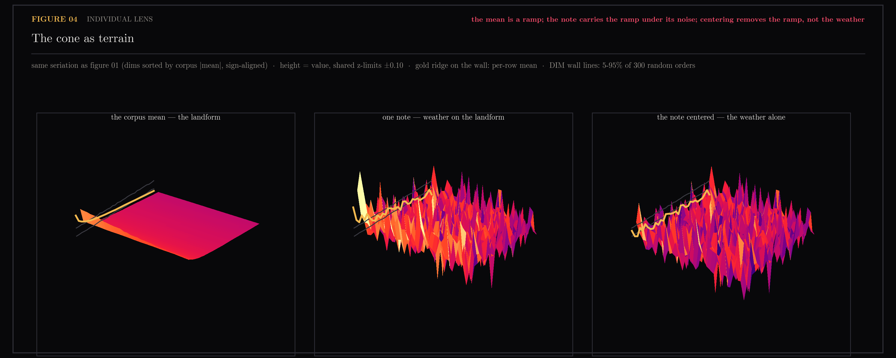

# 34 — The individual lens

This record proves things about populations: distributions, nulls, Gram
matrices, medians. Welch Labs' *The Dark Matter of AI* (ingested 2026-08-12;
studied in
[`docs/research/2026-08-12-welch-labs-visual-grammar.md`](../../research/2026-08-12-welch-labs-visual-grammar.md))
argues the opposite way — render the vector itself as an image, follow one
concrete example through the entire system, keep a readout on screen, never
switch examples. Two grammars, and the record had only one of them. So let's
ask the question directly: **can a single real note carry a finding this
record has so far only stated statistically?**

Three findings get re-shot through the individual lens, each paired with the
house null in the same panel, so the individual makes the claim legible and
the population keeps it true.

## The seriation readout

Every vector image in this section uses one pixel order: dimensions sorted by
the corpus mean's coordinate magnitude, sign-aligned to the mean, so the
shared direction — the cone of sections [12](../12-embedding-geometry/README.md),
[16](../16-corpus-primer/README.md) and [17](../17-corpus-growth/README.md) —
concentrates in the top rows of the image. The null is the same
transformation under 300 random pixel orders.

We didn't start here. The plan was the naive Welch claim — surely a direction
that's 26% of every vector's length shows up in the picture? It doesn't. In
native dimension order, raw and centered vectors are indistinguishable; the
mean's largest single coordinate is 0.06 on a unit vector. We'd reached the
first hurdle before drawing the first figure: the strongest geometric fact
about this corpus is invisible in the raw object. The video's own third
technique is the answer — when the object hides its structure, build a
readout — and that checkpoint failure chose the section's shape.

## Figures

**01 — The cone, held up to the light** (remix of 16/17). Let's look at the
corpus mean as an image: a smooth gradient under seriation, its 32 loudest
dims making up row 0. Now one note, in native order — structureless. The same
note, seriated — a visible top band. Centered — the band is gone. The
row-profile panels put the individual against the population and the null:
this note's raw profile exits the random-order band for the first ~6 rows
(rows 0-2 mean 0.037 against a null band of ±0.02), collapses to 0.0015 after
centering, and the 568-note median does exactly the same. **One note is
enough to see the cone — once the pixels are sorted by it.**

**02 — One note through the whole system** (remix of 12/18). The running
individual is the video's own note, and we follow it the whole way: the
stored document (1639 chars → 424 tokens), its Qwen3 vector with real values
on screen, the 32×32 image, the retrieval readout, the Gemma-Scope
fingerprint — 16,384 features as a 128×128 image, computed fresh on the 18.2
rig by `scripts/fingerprint_one_note.py` with the same MAX_CHARS=2000 cut as
the batch — and finally its place among the 568. It turns out to be a typical
citizen: L0 5370 against a population median of 5282, cone mass 0.125 against
0.113. Its loudest feature is 9622, *"references to convolutional neural
networks and their capabilities"* — the note about reading networks with SAEs
is itself read by an SAE, correctly. And its nearest neighbors are its own
reference list: `toy-models-of-superposition` at 0.605,
`on-the-biology-of-a-large-language-model` at 0.604 — the papers the video
cites, ingested weeks before the video that cites them.

**03 — The road, watched instead of scored** (remix of 20). Section 20 scored
the ai-agents → machine-learning road in aggregate; let's walk it instead,
with the readout on screen. The film strip draws each stop as its
**difference from the start** — change is what is drawn, so the walk is
finally visible: flat at t=0.17, full texture by t=1.0. Under each frame, the
top-3 retrieved notes; under everything, the crossing cos-to-endpoint curves.
The top result changes hands 4 times, and the nearest-note cosine declines
monotonically 0.793 → 0.737 with no mid-road spike — exactly what section
20's missing-bridges verdict predicts. **The walk is a handover, not a
fade.**

**04 — The cone as terrain** (the same field, one more lens). A vector image
is a scalar field on a 32×32 grid, and a scalar field doesn't have to spend
brightness on the value — it can spend height. So let's stand the seriated
views of figure 01 up as surfaces. The corpus mean becomes a landform: a
smooth ramp falling away from its 32 loudest dims. One note is weather on
that landform — noise spikes riding a tilted floor — and the gold ridge on
the side wall (figure 01's row profile, now a literal silhouette) starts
above the DIM null rails and decays into them. Center the note and the ramp
is gone: the silhouette never leaves the rails, but the weather is untouched.
Same claim as figure 01, now visible as geography rather than read off a
chart.



## Honest edges

- The seriation order is fitted on the same 568 notes it displays. That is
  fine for an exhibition of a known finding (the cone was established with
  proper nulls in 12/16/17); it would not be evidence of a *new* structure.
- The one-note fingerprint reuses the 18.2 rig configuration (MPS) without
  re-running the rig-validation gate; the rig was validated against the
  Neuronpedia API in 18.1 and is unchanged since.
- Figure 03's strip mixes scales: panel 0 is the centered start (absolute),
  panels 1-6 are deltas on their own symmetric limit. Both are stated on the
  panels.
- Retrieval in 02/03 is raw cosine over the frozen 568, not the production
  searcher — same convention as section 20, so numbers are comparable within
  the record but are not gate scores.

## Reproduce

```
uv run --with matplotlib python scripts/plot_individual_lens.py        # all three
uv run --with sae-lens --with torch python scripts/fingerprint_one_note.py  # regenerate the npz
```

Inputs: `17-corpus-growth/{vectors-fresh.npz,tags-fresh.json}`,
`18-sae-fingerprints/{manifest.json,fingerprints.npz,cone-features.json}`,
and this directory's `darkmatter-fingerprint.npz` + `feature-names.json`
(Neuronpedia explanations for the note's top features, fetched 2026-08-12).

## What the lens is worth

The pairing is the lesson: the individual panel makes the finding *legible* —
you can point at the row, the pixel, the handover stop — and the population
panel makes it *true*. Neither replaces the other. Section
[35](../35-the-knob/README.md) takes the next step the video takes: from
rendering the objects to turning the dials.
