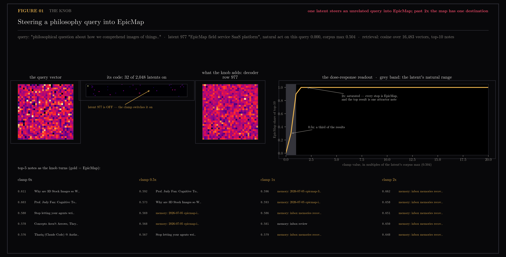
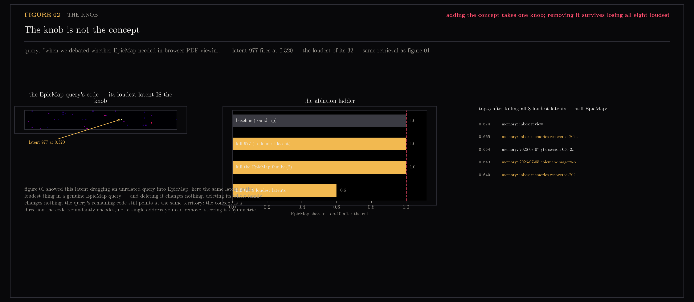
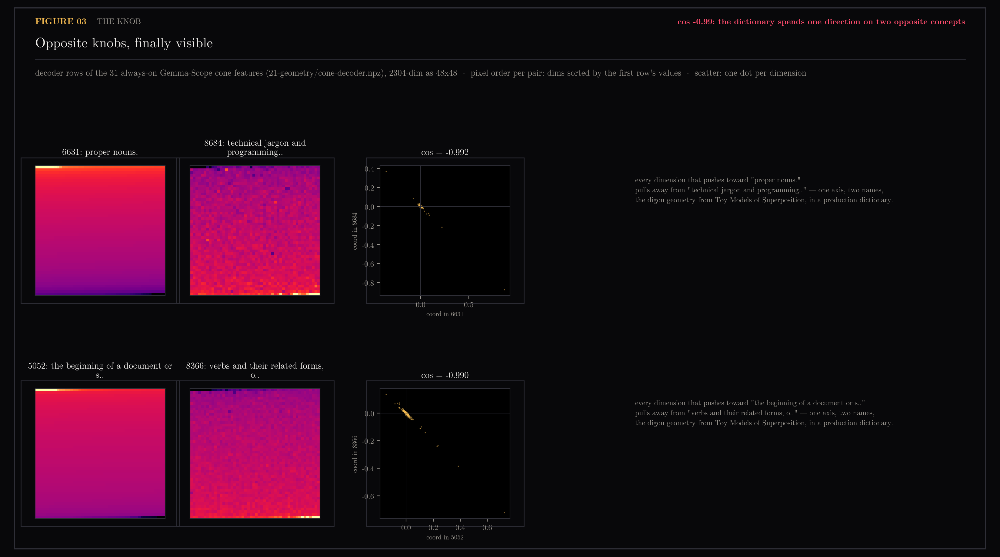

# 35 — The Knob

Section [34](../34-individual-lens/README.md) rendered the objects; this
section turns the dials. Sections [18](../18-sae-fingerprints/README.md) and
[24](../24-native-sae/README.md) gave features names by reading their
exemplars — but a name earned by correlation is a hypothesis, not a handle.
So let's do what the Welch Labs video does at its climax: take one named
feature, clamp it, put the modified vector back, and watch what changes.
Everything here runs on the production space — the native top-k SAE from
section 24 (its checkpoints survived in `experiments/sae_qwen/`, d=2048,
k=32, held-out reconstruction cosine 0.825), real gate queries, retrieval by
cosine over the same 16,483 vectors the SAE was trained on.

The knob is latent 977, which section 24's naming pass called *"EpicMap field
service SaaS platform."* It fires on 1,590 of 16,483 vectors, and its largest
observed activation anywhere in the corpus is 0.504 — every clamp below is
stated in multiples of that, because an intervention without a calibration is
just a stunt.

## Figure 01 — the knob works

Let's take a query that has nothing to do with EpicMap: *"philosophical
question about how we comprehend images of things that don't exist."* Its
code activates 32 of 2,048 latents, and latent 977 is not among them — its
natural activation on this query is exactly zero. Now we switch it on
ourselves: set 977 to half its corpus max, decode, retrieve. A third of the
top-10 is suddenly EpicMap. At 1x, nine of ten. At 2x the takeover is total —
and something familiar happens: the top result stops depending on the clamp.
One attractor note sits at rank 1 from 2x all the way to 20x, the retrieval
version of Gemma babbling "question question question" when the video's
feature 8249 was cranked to 500. The dose-response curve carries the whole
story: a steep usable slope inside the latent's natural range, saturation
just past it, nothing gained beyond.



## Figure 02 — the knob is not the concept

So we have a knob that adds EpicMap. Surely deleting it subtracts EpicMap?
Let's take a genuine EpicMap query — *"when we debated whether EpicMap needed
in-browser PDF viewing or geometric overlays"* — where 977 fires at 0.320,
the loudest latent in the entire code. Kill it: the top-10 is still 100%
EpicMap. Kill the whole EpicMap-family of latents in the code: still 100%.
Kill the eight loudest latents at once: 60%, and the top-5 is still EpicMap
territory. This is the video's neuron-1393 lesson pointed the other way —
causal influence in one direction is not identity. The concept is a
direction the remaining 24 latents still encode redundantly, not an address
you can evict. Steering is asymmetric: adding takes one knob, removing
survives losing all eight loudest.



## Figure 03 — opposite knobs

Section [21](../21-geometry/README.md) reported antipodal pairs among the 31
always-on Gemma-Scope cone features — decoder rows at cosine −0.99 — as
numbers in a table. Numbers that extreme deserve to be seen. In native
dimension order the two rows look like unrelated salt-and-pepper (we checked;
that checkpoint is why this figure exists). Sort the pixels by the first
row's values and the pair becomes two mirrored gradients; plot coordinate
against coordinate and every dimension lands on one anti-diagonal line. The
dictionary spends a single direction on two opposite concepts — "proper
nouns" is, geometrically, the negative of "technical jargon" — the digon from
Toy Models of Superposition, sitting in a production dictionary.



## Honest edges

- **The clamp adds a 33rd active latent** on the steering query (top-k picked
  32, we switch on one more). Stated rather than hidden; the baseline
  comparison is the unclamped roundtrip through the same decoder.
- **"EpicMap" ground truth is a title/key regex** (2,530 of 16,483 rows).
  A latent-based label would be circular; a regex is crude but independent.
- **Gate gold ids are not tracked** — the eval set's gold keys use a
  different id scheme than the SAE data dump's note keys, so the readout here
  is composition of the top-10, not gate hit@k. Nothing in this section
  touches production search behavior; the eval gate is not involved.
- **One knob, two queries.** This is a demonstration on the record's
  best-named latent, not a sweep. Whether the asymmetry holds across the
  other 109 named latents is an open, cheap follow-up.

## Reproduce

```
uv run --with matplotlib --with torch python scripts/plot_the_knob.py
```

Inputs: `experiments/sae_qwen/` (checkpoint `final_d2048_k32_s0.pt`,
`data/{vectors,queries}.npz`, `data/rows.jsonl`, `features.json`) and
`21-geometry/cone-decoder.npz` with names from
`18-sae-fingerprints/cone-features.json`.
