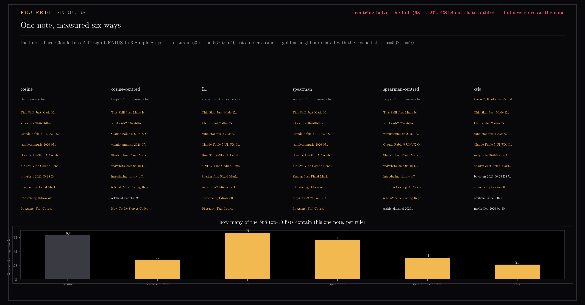
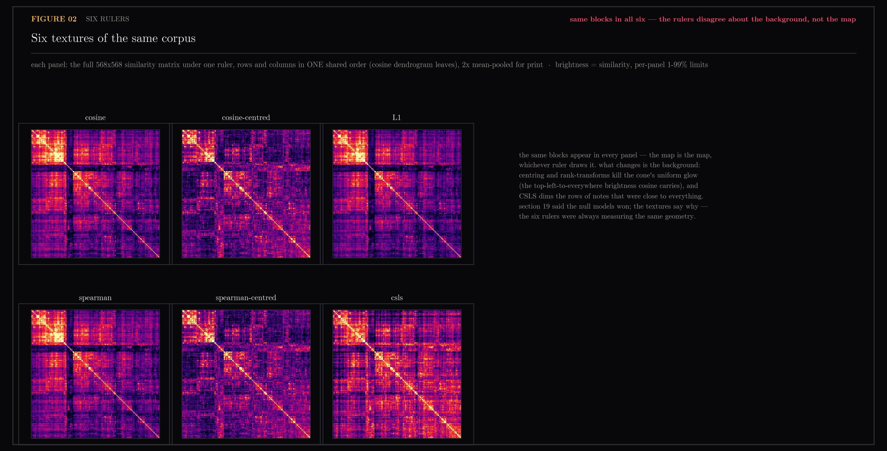

# 36 — Six rulers, one note

Section [19](../19-rank-metrics/README.md) put six similarity metrics through
three registered tasks and the null models won — the alternatives didn't beat
cosine where it mattered, and the one clean win was CSLS cutting hub mass.
Aggregates settled the scores; they never showed what a ruler actually *does*
to a note. So let's pick the most interesting note in the corpus — the
biggest hub — and measure it six ways.

The hub, under cosine, is *"Turn Claude Into A Design GENIUS In 3 Simple
Steps."* It sits in 63 of the 568 top-10 lists. One note in every ninth
search result. Continues [34](../34-individual-lens/README.md)'s individual
lens; metrics are computed by `sim_matrices()` imported from
`scripts/rank_metrics.py` — same code path as 19, strictly offline.

## Figure 01 — one note, measured six ways

First question: do the rulers even disagree about *this note's own
neighbours*? Barely. L1 and Spearman keep cosine's list 10/10, the centred
variants 9/10, CSLS 7/10. Now the second question — how many *other* notes'
lists contain the hub — and here the rulers split hard: 63 under cosine, 67
under L1, 56 under Spearman... but 27 under cosine-centred, 31 under
spearman-centred, 21 under CSLS. Centring alone halves the hub. That's the
part 19's aggregate hub-cut number couldn't say out loud: hubness is not a
property CSLS uniquely fixes — it substantially *rides on the cone*, and any
ruler that removes the shared direction deflates it. The hub's own
neighbourhood stays put; its gravitational pull is what the transforms take
away.



## Figure 02 — six textures of the same corpus

Then let's stop sampling and look at everything at once: the full 568×568
similarity matrix under each ruler, rows and columns in one shared order
(cosine's dendrogram leaves), so the eye can compare textures directly. The
same block structure appears in every panel — the map is the map, whichever
ruler draws it. What changes is the background: centring and rank transforms
kill the uniform glow the cone paints over cosine's panel, and CSLS dims the
rows of notes that were close to everything. Section 19 said the null models
won; the textures say why. The six rulers were always measuring the same
geometry — they only disagree about the background light.



## Honest edges

- One hub, k=10. The in-degree collapse is this note's story; 19's figure 02
  carries the population-level hub statistics this figure individuates.
- The shared seriation is fitted on cosine, which flatters cosine's blocks;
  the point survives because the same blocks show in all six panels anyway.
- The matrices are 2× mean-pooled before rendering (568 data pixels would
  alias below panel resolution at print size); stated in the meta line.

## Reproduce

```
uv run --with matplotlib --with scipy python scripts/plot_six_rulers.py
```

Inputs: `17-corpus-growth/vectors-fresh.npz`, names from
`18-sae-fingerprints/manifest.json`, metrics from `scripts/rank_metrics.py`.
