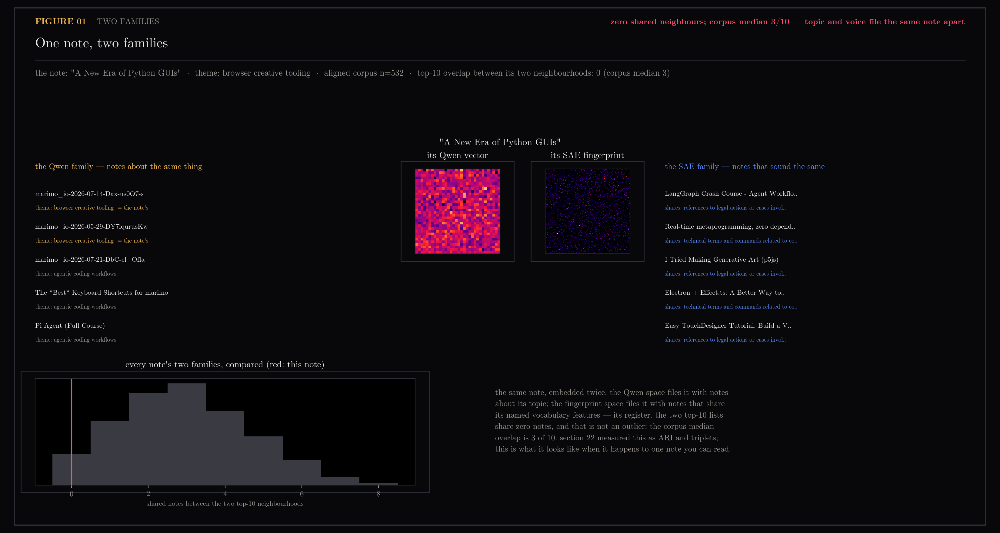

# 37 — One note, two families

Section [22](../22-two-lenses/README.md) grouped the same 532 notes in two
different spaces and found the partitions disagree — ARI 0.239 against a
0.335 ceiling, triplet agreement 0.644 — and that the disagreement has a
direction: the Qwen space sorts by what a note is *about*, the Gemma
SAE-fingerprint space by how it *sounds*. Those are aggregates. Let's find
the note the two spaces disagree about hardest and actually meet both of its
families.

The rule is deterministic: among titled notes whose two top-10
neighbourhoods share **zero** notes, take the one most solidly embedded in
its own Qwen neighbourhood (highest mean cosine to its top-5) — a note that
is nobody's outlier, filed in two different drawers. It comes out as *"A New
Era of Python GUIs."*

## Figure 01 — the two families

On the left, the Qwen family: marimo notebook posts and agentic-coding notes
— the note's topic, and two of five even share its exact snapshot theme. On
the right, the SAE family: a LangGraph crash course, real-time
metaprogramming, p5js generative art, Electron + Effect.ts, a TouchDesigner
tutorial. Five different topics with one register — the technical tutorial
voice — and each neighbour is annotated with the named fingerprint feature it
shares most strongly with the note. Zero notes appear in both lists. And the
histogram says this is the ordinary condition, not a stunt: across all 532
notes the median overlap between a note's two top-10 neighbourhoods is 3 of
10. Section 22 measured the two lenses drifting apart; this is what the drift
looks like when it happens to one note you can read.



## Honest edges

- The shared-feature annotations inherit section 18's standing caveat:
  auto-names are hypotheses, not probes, and the weaker ones ("references to
  legal actions...") read as exactly what they are — a fuzzy name for a
  register feature that fires on procedural/technical prose.
- The Qwen themes come from the live interest snapshot at run time
  (`~/.ytk/interest/latest.json`), matched through the same `align()` used by
  22 — the alignment reproduced 22's count exactly (532 notes, 1 drifted).
- Neighbourhoods are cosine in each space (fingerprints log-compressed,
  cone-removed, normalized — 22's `gemma_space()`); k=10 throughout.

## Reproduce

```
uv run --with matplotlib --with scikit-learn python scripts/plot_two_families.py
```

Inputs: live store + interest snapshot via `scripts/plot_two_lenses.py`'s
`align()`, `18-sae-fingerprints/fingerprints.npz`,
`22-two-lenses/feature-names.json`.
