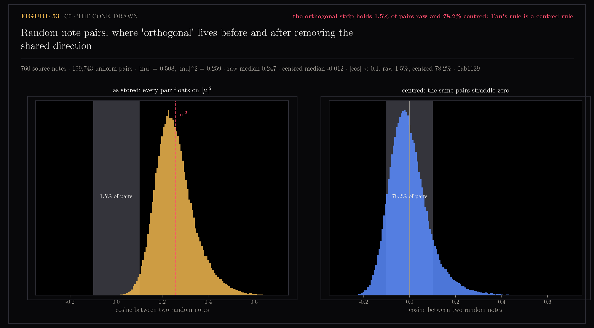
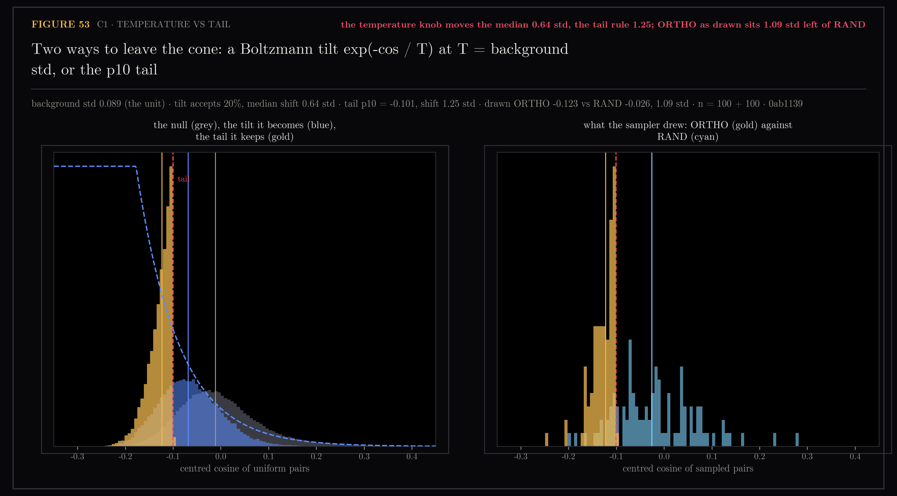
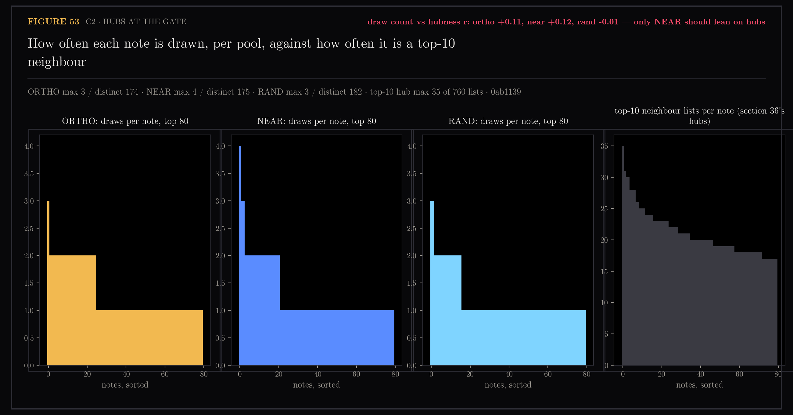
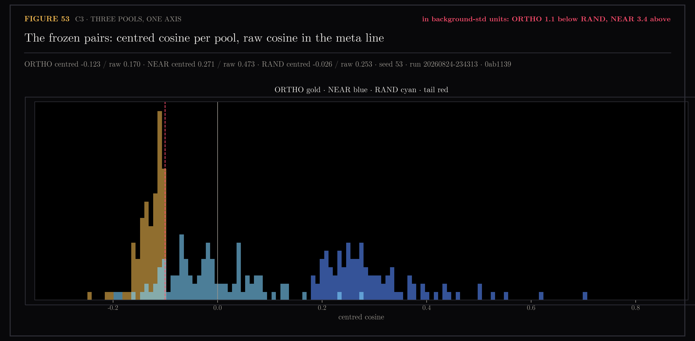

# 53 — LSD mode (orthogonal idea generation, rung 0)

**Question.** Garry Tan describes a feature he calls LSD mode, Lateral
Syntactic Drift (`sources/instagram/ycomclips-2026-08-24-DcbbpsdjI12.md`):
forbid combining concepts inside the similarity cone, raise the randomness of
the retrieval step, generate hundreds of orthogonal pairings, rank them by
coherence, and the top 5 of 100 are reliably strong. Does that hold on this
vault, and what does "orthogonal" even mean in a space where every note leans
the same way?

The record already answers half of it. Section 12: every note sits at cosine
0.51 from one shared direction. Sections 20 and 36: roads between interests
run through hubs, so "the note between A and B" retrieves the same few notes
every time. Section 18: the corpus voice is literal, so a coherence ranker with
no null will prefer the cone. Section 50: the background-pair std is the unit
separations are measured in.

## Pre-registration (written before generation ran)

**Pools.** 760 source notes (431 YouTube docs from `ytk_videos_v2` plus 329
`note_sources_*` rows of `ytk_memories_v2`: instagram, web, tiktok,
pinterest; journal digests excluded), unit-normalised, centred on the pooled
mean, re-normalised. Three pools of 100 pairs each, seed 53:

- **ORTHO** — uniform pairs kept only when centred cosine is under the 10th
  percentile of the background-pair null (the mirror of NEAR's top-10 rule).
- **NEAR** — i uniform, j uniform among i's top-10 centred neighbours. The
  inside-the-cone control Tan says produces predictable ideas.
- **RAND** — uniform pairs, no constraint. Whether orthogonality does anything
  beyond randomness.

The base draw is uniform in every pool so hubs cannot enter through the
sampler. The run file freezes pairs, both cosines, and every candidate.

**Generation.** One structured Haiku call per pair, identical prompt for all
pools, returning a `build` idea (title, pitch, first experiment) and a `post`
angle (hook, angle). **Judge.** Haiku, shuffled batches of ten, 1-5 coherence
rubric, sees only the candidate. **Novelty.** Each candidate embedded as a
document; centred cosine to its nearest non-parent note, to its parents'
midpoint, and raw cosine to the corpus mean.

**Deck.** Per kind: the judge's top-5 from each pool (15) plus 5 uniform draws
from each pool's remaining 95 (15), shuffled, 30 cards per kind, 60 total.
Pool labels never leave the run file; parent notes are hidden until a card
is rated. The owner rates 1-5; 4 and above counts as "would build" or "would
publish".

**Registered gates.**

- **G1, the yield claim.** Among ORTHO's judge-top-5, owner score >= 4 on at
  least 3 of 5 for at least one kind, *and* strictly more than NEAR's
  judge-top-5 for that kind. Fail either bar and LSD mode is not a feature.
- **G2, the judge is real.** Spearman(judge, owner) >= 0.30 over the 60
  rated cards, against a permutation null. Fail and the ranker is decoration;
  rung 1 replaces it before anything else is built.

**Disclosed, not gated.** ORTHO vs RAND on the owner's scores; novelty by
pool; hub concentration among NEAR parents; candidates' raw cosine to the
corpus mean (whether generated ideas fall back into the cone). Judge-only
metrics run under 20 seeds with paired intervals; the owner's ratings are one
seed by construction and are stated as the ceiling.

**What the section will not claim.** That any candidate is good in the
abstract. The only ground truth here is the owner's blind score, and the
section reports the gates as pass/fail against the bars above, which do not
move after the data.

## C0 — the cone, drawn

Two unit vectors that share a mean decompose as `x = mu + r_x`, so their
cosine is `|mu|^2 + mu.(r_x + r_y) + r_x.r_y`. The constant term is the whole
story of the left panel: `|mu| = 0.508`, `|mu|^2 = 0.259`, raw-pair median
0.247. The orthogonal strip `|cos| < 0.1` holds 1.5% of random pairs as
stored and 78.2% once the shared direction is removed. Tan's rule is a
centred rule; applied literally to stored vectors it returns nothing.

## C1 — temperature vs tail

Tan's mechanism is "bump the temperature on the vectors". Drawn as a
Boltzmann tilt `exp(-cos / T)` with `T` = the background std (0.089, the
measured unit, never tuned), the tilt accepts 20% of uniform pairs and moves
the median 0.64 std. The p10 tail moves it 1.25. On a centred corpus the bulk
of random pairs is already unrelated, so a soft temperature barely changes the
draw; the hard tail is what makes ORTHO a distinct pool. ORTHO as drawn sits
1.09 std left of RAND. The tilt stays in the module as `tilt_acceptance` for
this figure and is not used by the sampler.

## C2 — hubs at the gate

No note is drawn more than 3 times in any pool (174-177 distinct notes per
pool of 100 pairs), against a top-10 neighbour-list hub of 35 among the same
760 notes. Draw count vs hubness correlates at +0.01 for ORTHO, -0.01 for
RAND, +0.19 for NEAR: the only route a hub has into a pair is the neighbour
step, which is the pool that is supposed to be hub-shaped.

## C3 — three pools, one axis

The frozen run: ORTHO centred median -0.123 (raw 0.170), RAND -0.026 (raw
0.253), NEAR 0.271 (raw 0.473). In background-std units ORTHO is 1.1 below
RAND and NEAR 3.4 above. Three regimes, no overlap between NEAR and the other
two; ORTHO and RAND touch at the tail line by construction.

## C4 — where the ideas land

*(pending: drawn from the run file once generation and novelty finish)*

## C5, C6 — the owner's ratings

*(pending: require the rating deck, which requires the approved hub page)*
