# Memory Field Audits — the Free Audits (Rung 0 of #150)

Baseline figures on ytk_memories data quality: duplicate density, timestamp integrity, and capture-pattern analysis.

Generated by `scripts/memory_field_audits.py`.

```bash
uv run --with matplotlib python scripts/memory_field_audits.py           # all
uv run --with matplotlib python scripts/memory_field_audits.py --only a1
```

## Figures

### Audits (A-series)

#### a1-dup-density.png
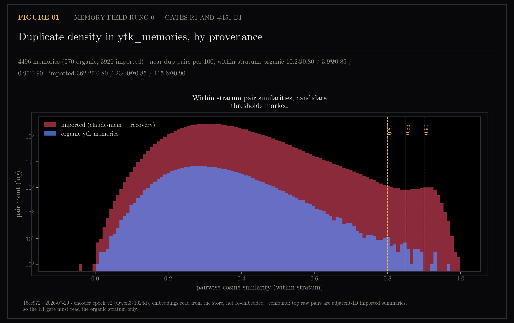
Duplicate density — pairwise cosine over ytk_memories; gates R1 and #151 D1.

#### a2-mtime-divergence.png
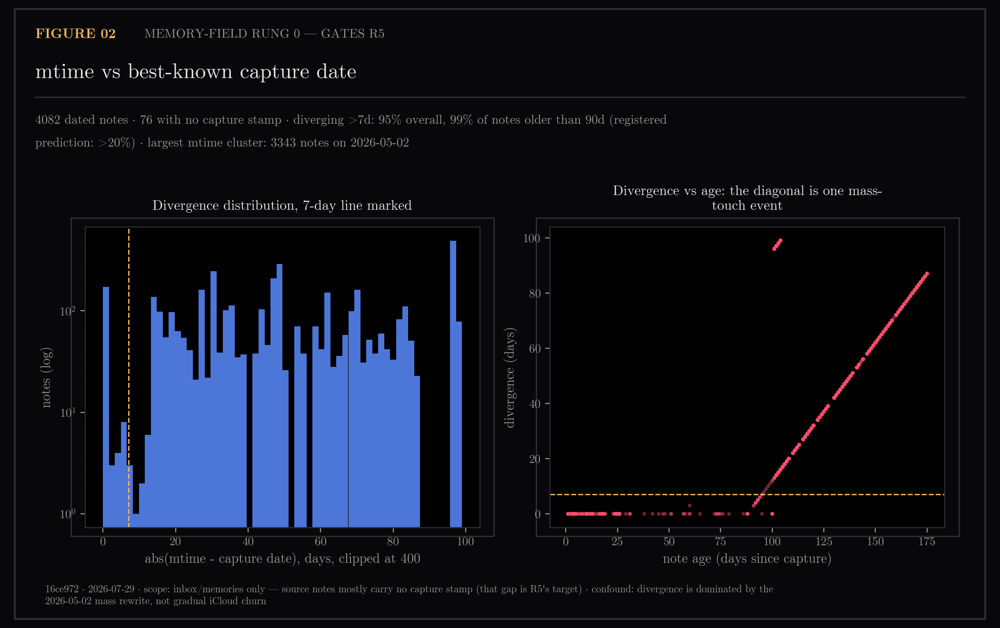
Timestamp integrity — mtime versus best-known capture date; gates R5.

#### a3-memo-bursts.png
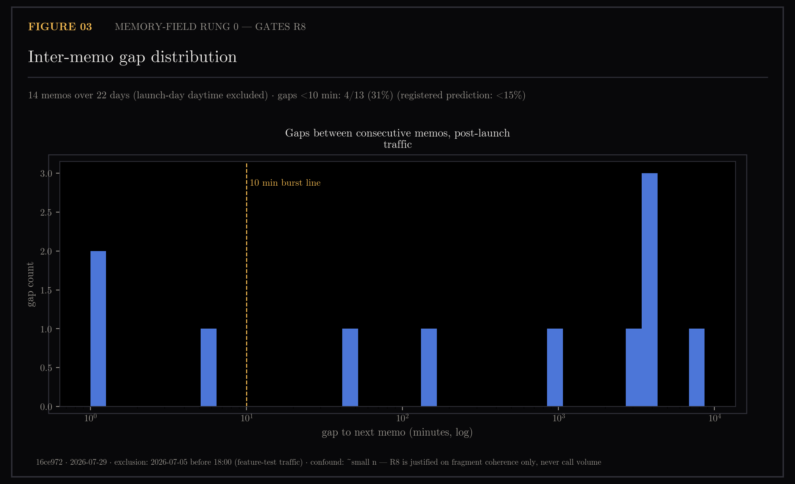
Memo bursts — inter-memo gaps with launch-day test traffic excluded; gates R8.

### Experiments (E-series)

#### e1-hybrid-retrieval.png
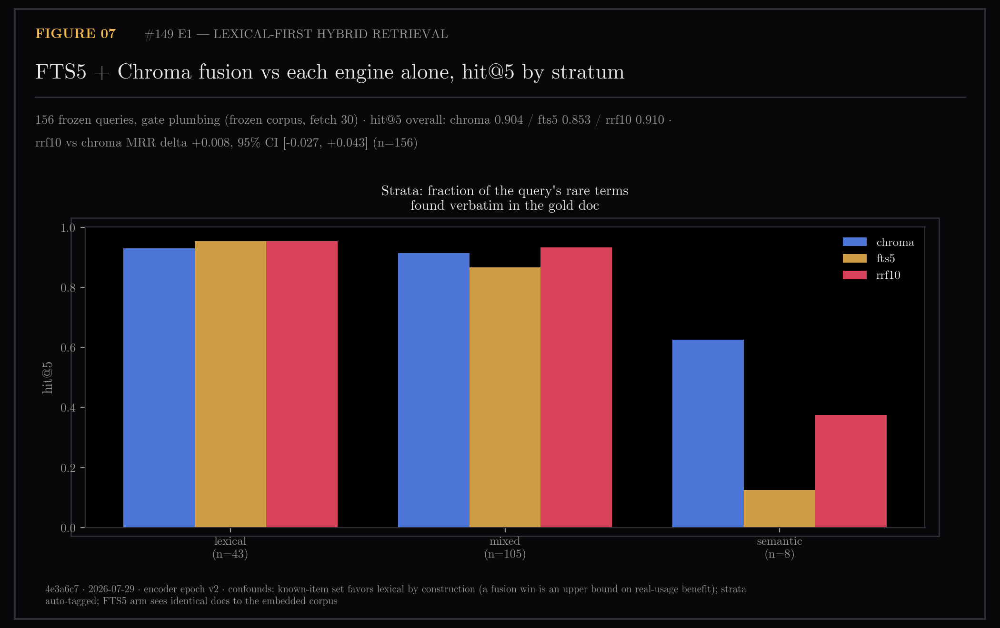
Retrieval quality comparison.

#### e2-progressive-disclosure.png
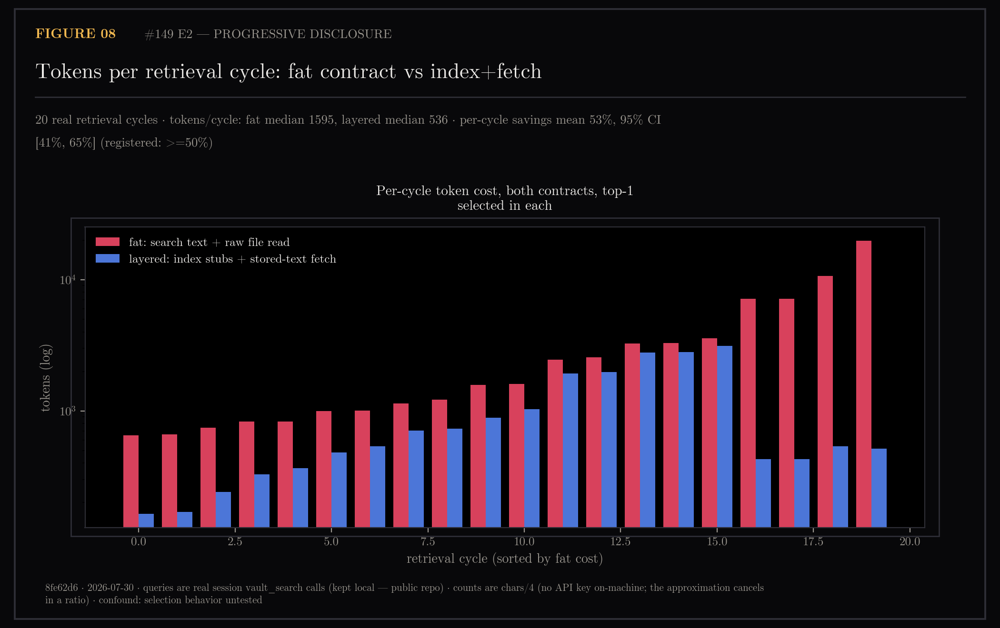
Progressive information reveal.

#### e3-tool-usage.png
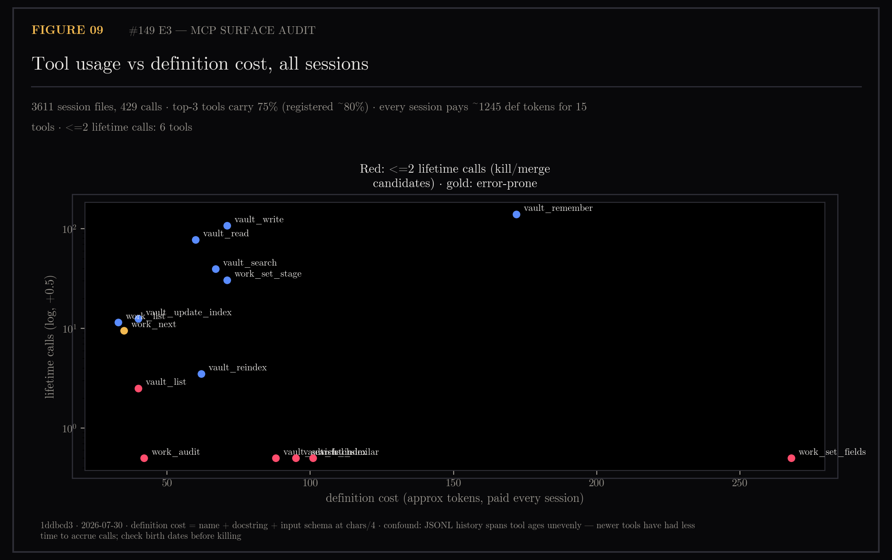
MCP tool utilization analysis.

#### e5-capture-baseline.png
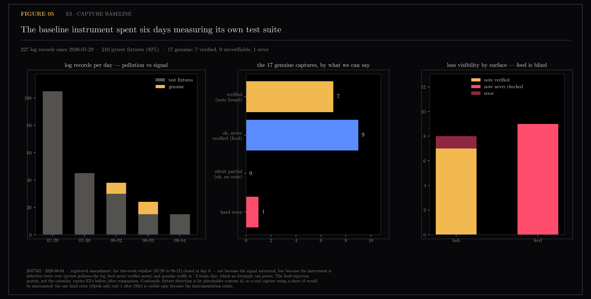
Baseline capture state machine and quality metrics.

#### e5-state-machine.png
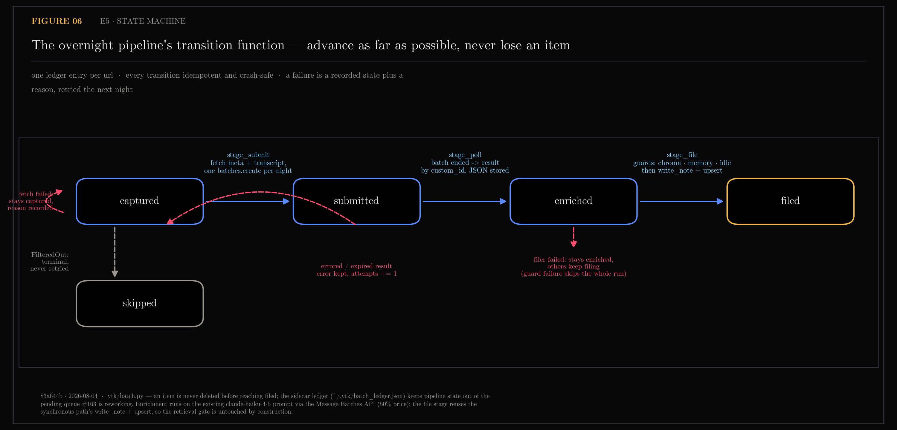
Capture pipeline state machine transitions and outcomes.

#### e6-session-start.png
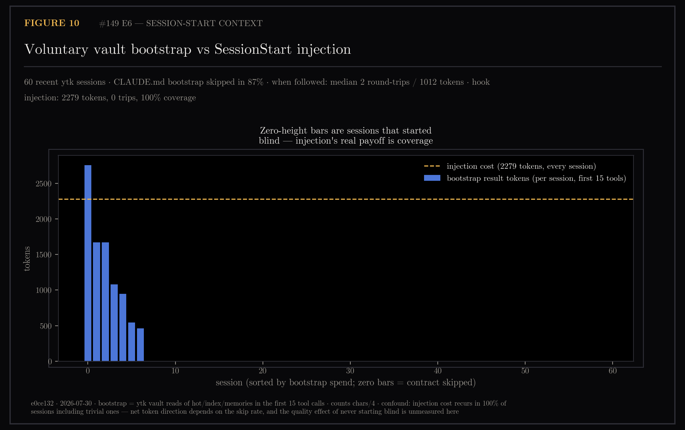
Session initialization timing and performance.

### Refinement (R-series)

#### r2-decay-sweep.png
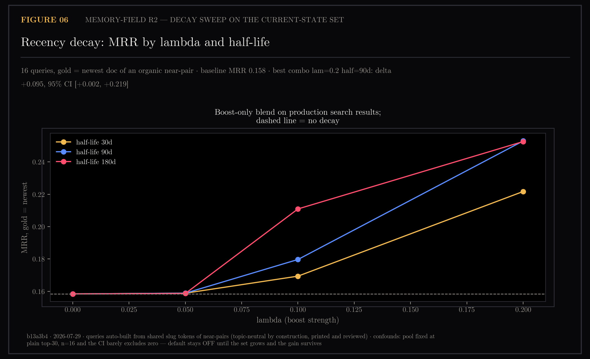
Parameter optimization for decay-based features.

#### r3-design-sim.png
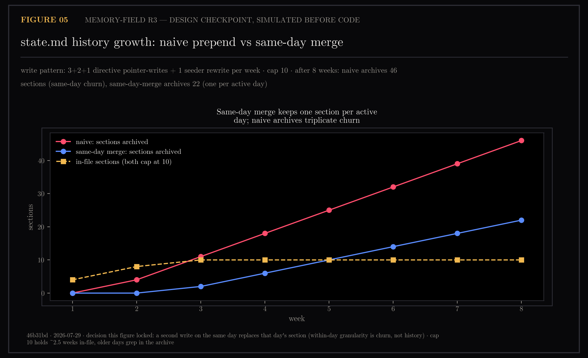
Simulated outcomes for design alternatives.

#### r3-supersede.mp4
Design supersede comparison video. [View video](r3-supersede.mp4)

#### r5-timestamp-fix.png
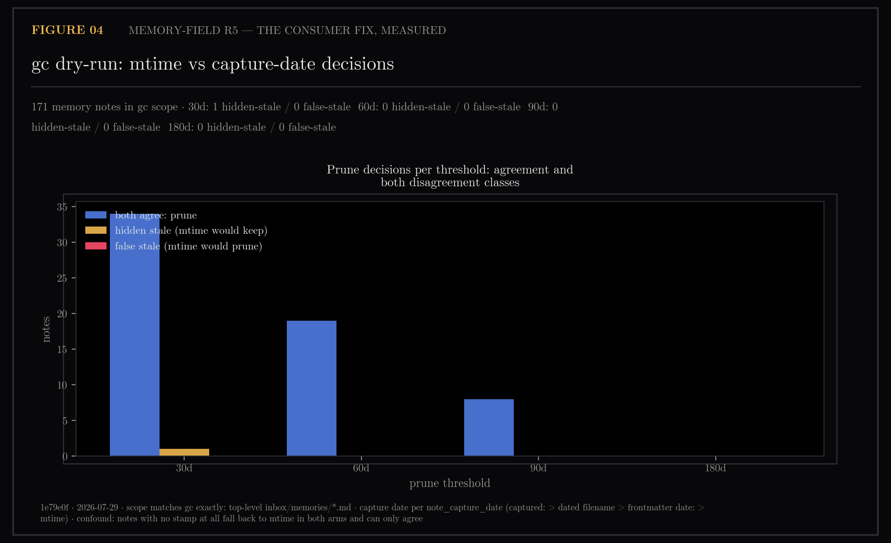
Validation of timestamp correction mechanism.

## Notes

Rung 0 of #150 — the free audits, requiring no builds or data generation beyond
what the production pipeline already provides. Provides baselines for measuring
capture pipeline quality, memory deduplication, and temporal consistency.

**Confounds are named in the caption, not discovered by a reader.** The launch-day
memo traffic (2026-07-05 before 18:00 UTC) was feature testing, not real capture;
the workflow critic caught that the obvious "burst" was this window (#150 A3).

Commit and date stamps in figure footers. All figures produced from live
production data at render time.

## Provenance Note

The commit SHAs stamped in this directory's figure footers (and quoted in
the #149/#150 issue comments) predate a `git filter-repo` rewrite on
2026-07-30, which removed `.claude/settings.json` — local hook config that
had been tracked since before the `.gitignore` rule existed — from all
history and force-pushed master.

Every pre-rewrite SHA therefore no longer resolves. The figures themselves
are unchanged and remain the artifacts of record; to locate a figure's
source commit, match its commit *message* (unchanged by the rewrite) in
`git log` rather than the stamped hash. Figures rendered after this date
stamp post-rewrite SHAs and resolve normally.

## Files

- `a1-dup-density.png` — duplicate density audit
- `a2-mtime-divergence.png` — timestamp integrity audit
- `a3-memo-bursts.png` — capture burst analysis
- `e1-hybrid-retrieval.png` — retrieval experiment
- `e2-progressive-disclosure.png` — disclosure experiment
- `e3-tool-usage.png` — tool usage patterns
- `e5-capture-baseline.png` — baseline capture quality
- `e5-capture-baseline.json` — baseline metrics
- `e5-state-machine.png` — state machine diagram
- `e6-session-start.png` — session initialization
- `r2-decay-sweep.png` — decay parameter sweep
- `r3-design-sim.png` — design simulation
- `r3-supersede.mp4` — design comparison video
- `r5-timestamp-fix.png` — timestamp fix validation
