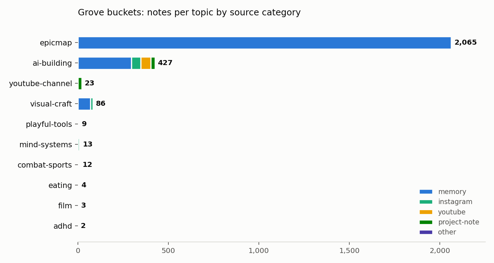
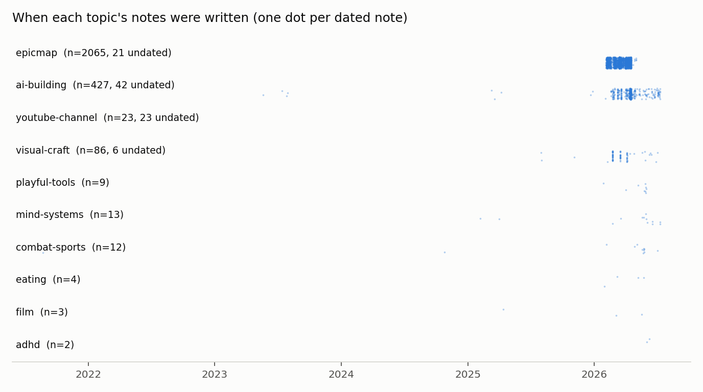
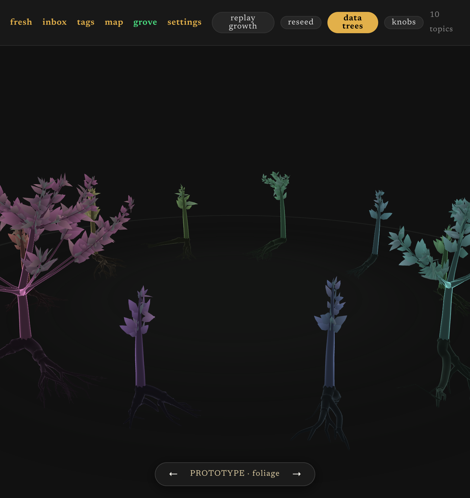
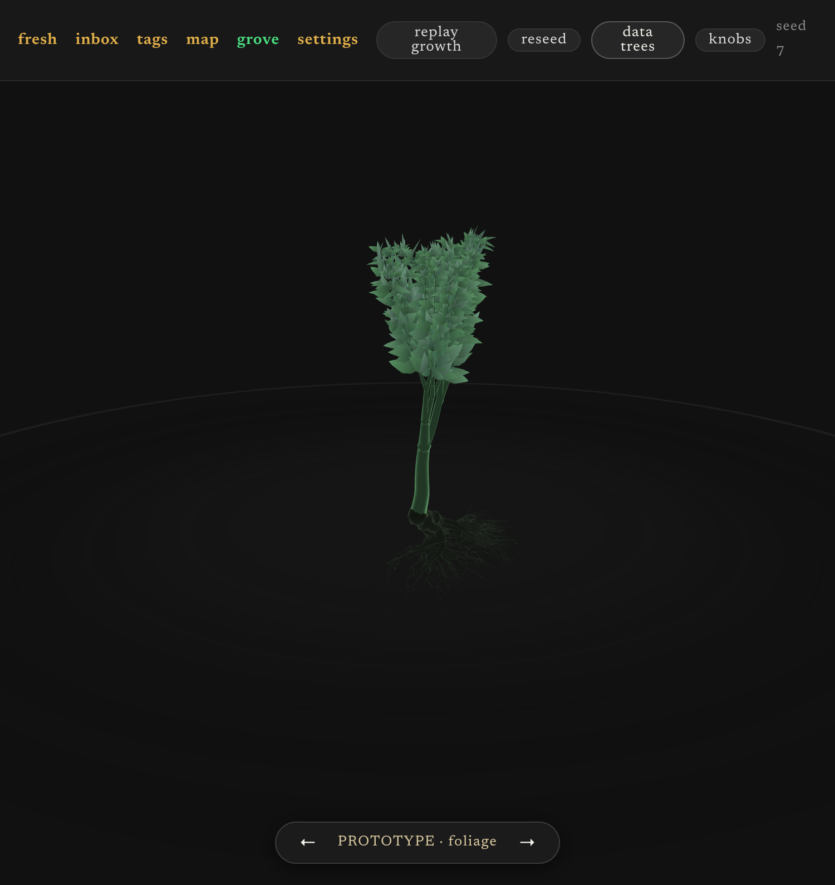

# Grove lab E2 report: the data-native tree

2026-07-12. Session goal: replace the grove's decorated random BFS with
topology derived from the vault, experiment-first. Everything below is
measured, not asserted; scripts under `scripts/grove_lab/` regenerate all of
it from the live corpus.

## 1. The topic axis had to be authored, not derived

The map's domain axis (`ytk/mapdomains.py`) groups notes by directory
provenance. The recon showed why that fails as a tree axis: 6 of 9 domains
were directories (hackathon sprints, a 1,491-note `other`). Topics now come
from a user-authored bucket file, `~/.ytk/grove_buckets.yaml`: rule-based
(projects / themes / path prefixes), first bucket wins, unmatched notes
render nothing. The same flaw applies to `/map` and is memory-tracked for
its next rework.

Coverage: 4,445 notes after dedupe, 59% matched across 10 buckets. The
unmatched 41% is dominated by deliberate exclusions (995 unparsed seed-era
memories, 596 hackathon-sprint notes).

Caveat carried forward: for consumed content the date is the *upload* date,
not ingest date. Growth replay (E5) should use ingest dates when they exist.

## 2. Found along the way: chroma double-indexes 3.6% of the corpus

167 note keys resolve to 2+ chroma entries (168 phantom vectors). Instagram
worst-hit; youtube-channel was 43 rows for 23 notes, eating 8 for 4. Fixed
at resolve time (`buckets.dedupe_indices`); store-level fix is issue #71.
All numbers in this report are post-dedupe.

## 3. Scalar signal gates (E1, run as pre-flight)

Temporal split-half reliability across domains, native 384-dim space:

| signal | verdict | evidence |
|---|---|---|
| spread (mean pairwise cosine) | PASS | split-half rho +0.90 (p=.037, n=5 splittable) |
| dispersion (dist to centroid) | redundant | collinear with spread; one signal, not two |
| intrinsic dimension (TwoNN @ fixed n=90) | ungateable | only 3 domains have 90+ notes per half; IQR ±4.5 on the standout |
| burstiness (interevent CV) | KILLED | temporal rho +0.09; its random-split "pass" (+0.98) is an artifact — thinning a point process preserves interevent structure, so the control leaks |

Also: 4 of 9 directory-domains span <21 days (sprints) or have no dates —
a temporal gate would false-pass on them, which is why splittability is now
checked before gating. Size confound checks were clean but underpowered at
n=9 domains; that is "not detected," not "absent."

The honest E1 yield was one gated scalar — you cannot build nine
distinguishable trees from one number. That result is what justified going
straight at topology (E2): every bucket has a cluster hierarchy regardless
of dates, and shape carries more bits than a scalar.

## 4. Topology method shootout (the E2 kill-criterion test)

Cross-half transfer ARI (fit on half A, label half B by A's centroids,
compare with B's own clustering; chance-corrected; both directions
averaged). Random halves, mean of 2 runs:

| bucket | HDBSCAN native | agglo avg-cosine | HDBSCAN on UMAP-15 |
|---|---|---|---|
| epicmap | 0.081 | 0.164 | 0.182 |
| ai-building | 0.095 | **0.749** | 0.527 |
| visual-craft | 0.343 | **0.880** | 0.250 |

- HDBSCAN's condensed tree — the handoff's headline idea — fails its own
  kill criterion in native space: it cannot reproduce itself even on random
  halves (epicmap bootstrap 0.187 vs temporal 0.193 — pure estimator noise).
  Density estimation in 384 dims is the culprit.
- **Average-linkage agglomerative on cosine distances wins decisively** and
  stays in native space (standing decision 3 intact). Branch length =
  dendrogram persistence (formation-to-absorption height span), girth =
  note mass.
- **epicmap has no reproducible sub-structure at any granularity**
  (ARI 0.16-0.25 at k=3..12). 2,066 session summaries over 3 months are a
  homogeneous blob. Its branches are cached decoration and labeled as such.
  This also indicts the map's 23 epicmap "workstreams" (same method family).
- ai-building temporal (0.214) vs bootstrap (0.749) is a *drift* signature:
  the method is reproducible; the topic genuinely reorganized over its
  3-year span. For a cached tree, drift is growth — not failure.

Final per-bucket gates (temporal where the span allows, recorded in each
snapshot): visual-craft 0.816 PASS; ai-building 0.214 (drift); epicmap
0.278 (noise, decoration); everything else below the clustering floor
(saplings, honestly rendered as trunk + leaves).

## 5. The cache contract (standing decision)

Trees grow, never reshuffle. `~/.ytk/grove/{bucket}.tree.json`, stamped
with the embedding model (`thenlper/gte-small`); a model swap invalidates.
Default build attaches new notes to their nearest branch centroid (mass
grows up the ancestor chain); `--rebuild` re-derives but anchors node ids
to the previous snapshot by member-overlap Jaccard (the map's
`anchor_names` precedent — it survived tonight's HDBSCAN-to-linkage method
swap without renumbering). The snapshot diff is the future growth
animation. Known limitation: pure attach never *splits* a branch;
split-on-accumulated-mass is future work.

## 6. Renderer mapping

`/api/grove` (hub) serves render data only. `web/src/lib/grove/datatree.ts`
grows a `TreeNode` tree from topology: limb step count from normalized
persistence, fork azimuths golden-angle, **girth via the da Vinci area rule
applied to data** (child weight = parent x sqrt(mass share)), overall tree
scale from sqrt(bucket size). Knobs (stiffness, noise, up bias, taper...)
still shape character — data decides structure, knobs decide look. The
hand-tuned BFS mode stays one click away behind the `data trees` chip;
`bonsai-80163` untouched.

## 7. Open items

- E7 blind readback with the user: does the grove read without labels?
  (The real gate; everything above is machinery.)
- 995 unparsed seed-era memories: project names are in filename prose;
  recoverable via backfill or bucket seeds.
- Branch split-on-mass for the incremental path.
- Ingest dates for content (upload date is the wrong axis for replay).
- Chroma dedupe at the store level (#71).
- Shader track (cosine palettes, dissolve on gc, glow wires) untouched
  tonight by design: measurement before decoration.
